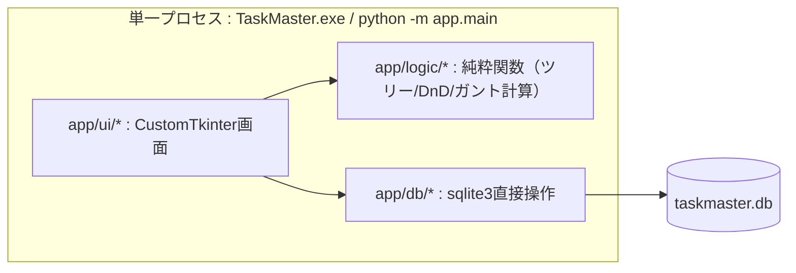
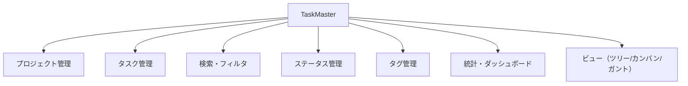
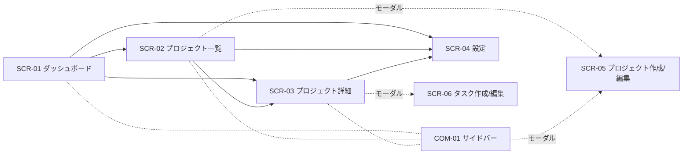
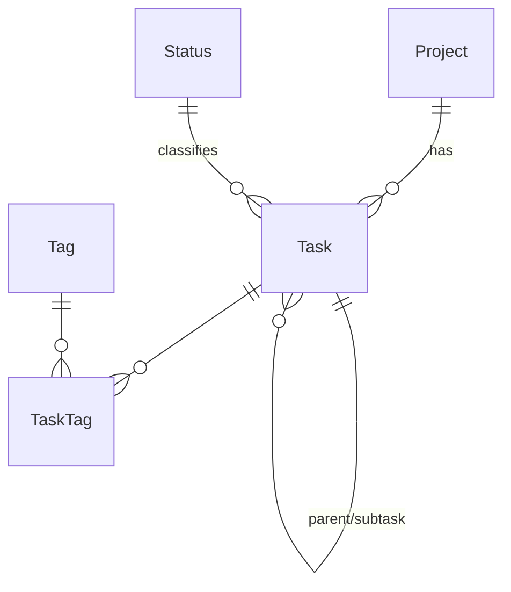

# 基本設計書 — TaskMaster

**バージョン: V2（Python + CustomTkinter デスクトップ版）**

本書は TaskMaster の基本設計（外部設計）を定義する。利用者・外部から見える振る舞い（画面・データ・エラー）を具体化する。内部実装の詳細（クラス構成・アルゴリズム）は詳細設計の範囲とし、本書では扱わない。記述はリポジトリの現行実装（`develop/v2`）に基づく。

V1（Express + Prisma + React によるWebアプリ、`develop/v1` ブランチに凍結）からの全面書き直し版であり、HTTP API を介したクライアント・サーバー構成ではなく、単一プロセスのデスクトップGUIアプリになった。本書は V2 の実装に合わせて書き直したものであり、V1時点の本書（`docs/design-documents` ブランチに残存、未マージ）とは章構成は近いが内容は別物である。

## 目次

- [1. はじめに](#1-はじめに)
- [2. システム方式設計](#2-システム方式設計)
- [3. 機能設計](#3-機能設計)
- [4. 画面設計](#4-画面設計)
- [5. データアクセス設計](#5-データアクセス設計)
- [6. データ設計](#6-データ設計)
- [7. 共通設計（方式）](#7-共通設計方式)
- [8. 非機能設計](#8-非機能設計)
- [9. 制約・課題](#9-制約課題)

---

## 1. はじめに

### 1.1 目的
要件を満たす外部仕様（画面・データ・エラー方式）を確定し、実装・テストの基準とする。

### 1.2 適用範囲
TaskMaster デスクトップアプリ（Python + CustomTkinter、単一プロセス）とデータストア（SQLite、`taskmaster.db`）。認証、外部サービス連携、帳票、バッチは対象外。

### 1.3 関連文書

| 文書 | 役割 |
|---|---|
| 本書 `docs/BASIC_DESIGN.md` | 基本設計（外部からどう見えるか） |
| `docs/TEST_DESIGN.md` | テスト方針・ケース（V1時点の内容のまま。V2向けの更新は未着手） |
| `docs/STATIC_ANALYSIS.md` | 静的解析の方針（V1時点の内容のまま。V2はruffのみ、詳細はCLAUDE.md参照） |
| `README.md` | 全体像・セットアップ・使い方 |
| `CLAUDE.md` | 開発者向けの実装メモ（ディレクトリ構成・既知の簡略化等） |

独立した要件定義書・画面設計書・システム方式設計書（V1時点にあった `REQUIREMENTS.md`/`SCREEN_DESIGN.md`/`SYSTEM_DESIGN.md`）は V2 では作成しておらず、本書に統合して記載する。

### 1.4 用語
- **プロジェクト**: タスクを束ねる単位。アーカイブ可能。
- **タスク**: プロジェクトに属す作業項目。`parentId` により無制限階層のサブタスクを持てる。
- **ステータス**: タスクの進行状態。ユーザーが設定画面で自由に追加・削除・並べ替えできる（固定の enum ではない）。
- **完了扱い(`is_done`)**: ステータスに付与するフラグ。完了率・期限超過判定はこのフラグを根拠にし、特定のステータス名をハードコードしない。
- **優先度**: `LOW`/`MEDIUM`/`HIGH`/`URGENT` の固定4値。
- **タグ**: タスクに複数付与できるラベル。
- **アーカイブ**: プロジェクトを一覧・統計から除外する状態（データは保持）。

---

## 2. システム方式設計

### 2.1 全体構成

V1（ブラウザで動くSPA + HTTP API）と異なり、V2はHTTP通信を持たない単一プロセスのデスクトップアプリである。UI層はデータ層・ロジック層の関数を直接呼び出す。

### 2.2 技術方式

| 層 | 技術 | 役割 |
|---|---|---|
| GUI | Python + CustomTkinter（一部 `ttk.Treeview` / `tkinter.Canvas` を併用） | 画面描画・操作 |
| 日付ピッカー | tkcalendar | タスクの開始日・期限入力 |
| データアクセス | 標準ライブラリ `sqlite3`（ORM不使用） | DB接続・CRUD |
| DB | SQLite（`taskmaster.db`、実行ファイルと同じフォルダに生成） | 永続化 |
| 配布 | Nuitka（`--onefile`） | 単一exe化。Node.js/Pythonのインストール不要 |

### 2.3 処理方式
- UI操作は `app/db/*.py` の関数を直接呼び出し、戻り値の dataclass（`app/models.py`）を画面へ反映する。呼び出しは同期的で、成功時はSQLiteへ即座にコミットされる（保存ボタンや明示的な確定操作は無く、フォームの「作成」「保存」を押した時点でDB書き込みが完了する）。
- 一覧の並び順は各行の `order`（整数）カラムで管理し、並べ替えは一括更新関数（`reorder_tasks`/`reorder_projects`/`reorder_statuses`）で1トランザクション内に反映する。
- 画面の再描画は「今の画面を作り直す」方式（`refresh()`）を基本とするが、頻繁な操作（ステータスの並べ替え等）ではウィジェットを破棄・再作成せず位置更新のみ行い、ちらつきを防ぐ。

---

## 3. 機能設計

### 3.1 機能構成

### 3.2 機能一覧

| 機能 | 概要 | 対応画面 | 対応モジュール |
|---|---|---|---|
| プロジェクト管理 | 作成・編集・アーカイブ/復元・削除 | SCR-02, SCR-05 | `app/db/projects.py` |
| タスク管理 | 作成・編集・移動（循環検出）・並べ替え・削除 | SCR-03, SCR-06 | `app/db/tasks.py` |
| 検索・フィルタ | キーワード・ステータス・優先度・タグでの絞り込み | SCR-03 | `app/ui/widgets/filter_bar.py` → `list_tasks()` |
| ステータス管理 | 追加・改名・色変更・並べ替え・削除（使用中/最後の1件は不可） | SCR-04 | `app/db/statuses.py` |
| タグ管理 | タスクフォームからの作成・付与のみ（一覧・削除UIは無し） | SCR-06 | `app/db/tags.py` |
| 統計・ダッシュボード | 総数・完了率・期限超過・直近期限・ステータス別/優先度別内訳 | SCR-01, SCR-03 | `app/db/stats.py` |
| ビュー | ツリー/カンバン/ガントの切替表示・D&D操作 | SCR-03 | `app/logic/tree.py`, `dnd.py`, `gantt.py` |

---

## 4. 画面設計

### 4.1 画面一覧

| 画面ID | 画面名 | 種別 |
|---|---|---|
| SCR-01 | ダッシュボード | 画面（サイドバー「📊 ダッシュボード」） |
| SCR-02 | プロジェクト一覧 | 画面（サイドバー「📁 プロジェクト一覧」） |
| SCR-03 | プロジェクト詳細 | 画面（プロジェクト名クリックで遷移） |
| SCR-04 | 設定（ステータス遷移） | 画面（サイドバー「⚙️ 設定」） |
| SCR-05 | プロジェクト作成/編集 | モーダル |
| SCR-06 | タスク作成/編集 | モーダル |
| COM-01 | サイドバー | 共通部品（ロゴ・ナビゲーション・プロジェクト一覧・編集/削除） |
| COM-02 | 確認ダイアログ | 共通部品（削除確認） |

V1にあった画面パス（`/`, `/projects` 等のURL）の概念は無い。画面遷移はサイドバー操作、またはプロジェクトカード/行のクリックのみで行う（ブラウザの戻る/進む・ブックマークに相当する機能は無い）。

### 4.2 画面遷移図

### 4.3 SCR-01 ダッシュボード
**概要**: 全プロジェクト横断（非アーカイブ）の統計と、注意すべきタスクを俯瞰する。

| 項目 | 説明 |
|---|---|
| 統計カード（6枚） | プロジェクト数／直近7日の完了数／タスク総数／完了率／期限超過／7日以内に期限 |
| 期限超過のタスク一覧 | 未完了かつ期限が過去。最大8件、期限が近い順。プロジェクト名列→タスク名列→期限の順で表形式表示 |
| 期限が近いタスク一覧 | 未完了かつ期限が未来。最大8件、期限が近い順。列構成は上記と同じ |
| ステータス別内訳 | ステータスごとの件数を横棒グラフで表示 |
| 優先度別内訳 | 優先度（緊急→高→中→低の順）ごとの件数を横棒グラフで表示 |
| プロジェクト一覧 | 色・名前・タスク件数。クリックで SCR-03 へ |

### 4.4 SCR-02 プロジェクト一覧
**概要**: プロジェクトの一覧・追加・編集・アーカイブ/復元・削除。

| 項目 | 説明 |
|---|---|
| 「+ 新しいプロジェクト」ボタン | SCR-05 を開く |
| 「アーカイブ済みも表示」チェック | オンで全件、オフで非アーカイブのみ表示 |
| プロジェクト行 | 色・名前（クリックでSCR-03へ）・アーカイブ済みバッジ・説明・タスク件数 |
| 編集/アーカイブ・復元/削除ボタン | 各行に配置。削除は確認ダイアログ（配下タスクも削除される旨を明示）を経由 |

### 4.5 SCR-03 プロジェクト詳細
**概要**: 1プロジェクトのタスクをツリー/カンバン/ガントで表示・編集する。

| 項目 | 説明 |
|---|---|
| ビュー切替（セグメントボタン） | ツリー／カンバン／ガント |
| フィルタバー | キーワード検索・ステータス・優先度・タグ（複合可）、「クリア」で一括解除 |
| 「統計を表示/隠す」ボタン | トグルで、このプロジェクトに絞った統計カード＋内訳バーの表示/非表示 |
| 「+ 新しいタスク」ボタン | 現在表示中のビューに対して SCR-06（作成モード）を開く |
| ツリービュー | `ttk.Treeview` による無制限階層表示。展開/折りたたみはネイティブ機能。行のドラッグで同一階層内の並べ替え。右クリックメニューでサブタスク追加・編集・ステータス変更・削除。期限超過は赤字、完了ステータスはグレー表示 |
| カンバンビュー | ステータスごとの列にカードを表示。カードをドラッグすると、別列へのドロップでステータス変更、同一列内でのドロップで並べ替え。ドラッグ中はカードのタイトルを表示する浮遊プレビューがカーソルに追従する。カードのダブルクリックで編集 |
| ガントビュー | `tkinter.Canvas` に直接描画。開始日〜期限をステータス色のバーで表示。月・日ヘッダー（土日を色分け）、今日の縦線。バー中央のドラッグで開始日・期限を平行移動、バー端（左右6px以内）のドラッグで片側のみ変更（期間の伸縮）。実質的な移動が無いクリックは編集モーダルを開く |

**フィルタ適用時の挙動**: フィルタ条件はツリー/カンバン/ガントの全ビューに等しく適用される。ツリービューは絞り込み後のタスク一覧に対して改めて親子構造を組み立てるため、親が絞り込みで除外された場合はそのタスクがルートとして表示される（自然な平坦化）。

### 4.6 SCR-04 設定（ステータス遷移）
**概要**: ステータスの追加・編集・並べ替え・削除。画面上部に「ステータス遷移を設定します。新しいステータスを追加できます。既存ステータスの削除や順番の入れ替えもできます。」という説明文を表示する。

| 項目 | 説明 |
|---|---|
| ステータス行 | 並べ替え（▲▼）・色（クリックでOS標準の色選択ダイアログ）・ラベル（インライン編集、Enterまたはフォーカス移動で確定）・「完了として扱う」チェック・削除ボタン |
| 追加行 | 色選択＋ラベル入力＋「追加」ボタン（Enterでも追加可） |
| 削除エラー表示 | 使用中のタスクがある場合・最後の1件を消そうとした場合に赤字でエラーメッセージを表示し、削除を拒否する |

初回起動時（ステータスが1件も無い状態）は、未着手／進行中／完了／取下げの4件を自動投入する（既存データがある場合は投入しない、非破壊的）。

### 4.7 SCR-05 プロジェクト作成/編集（モーダル）

| 項目 | 説明・制約 |
|---|---|
| 名前 | 必須 |
| 説明 | 任意 |
| 色 | 固定7色パレットから選択（既定は先頭の色） |

### 4.8 SCR-06 タスク作成/編集（モーダル）

| 項目 | 説明・制約 |
|---|---|
| タイトル | 必須。空/空白のみは送信不可 |
| 説明 | 任意 |
| ステータス | セレクト。省略時は並び順が最初のステータス |
| 優先度 | セレクト（LOW/MEDIUM/HIGH/URGENT） |
| 開始日/期限 | カレンダーピッカー（tkcalendar）。「設定する」チェックで有効/無効を切替。カレンダー選択・テキスト入力（yyyy-mm-dd、Enter/フォーカス移動で確定）のどちらでもチェックが自動でオンになる |
| 親タスク | セレクト（深さに応じたインデント付き一覧）。自分自身やその配下は選択肢から除外。変更は循環検出付きの移動処理を経由する |
| タグ | 既存タグはボタン状に並び、クリックで選択/解除。新規タグはその場で名前を入力し「追加」すると作成と同時に選択される（タグの色変更・削除・一覧管理UIは無し） |

### 4.9 入力チェック方針
- 画面側では最低限のチェック（タイトル空/空白の送信抑止）のみ行う。
- データ層（`app/db/*.py`）が業務ルール（親タスク存在確認・ステータス存在確認・循環参照検出・ステータス削除ガード・タグ名一意制約）を検証し、違反時は例外（`ValidationError`/`ConflictError`/`CycleError`/`NotFoundError`、`app/db/errors.py`）を送出する。画面側はこれを捕捉してダイアログ等で表示する（現状、タスク保存失敗時の画面表示は未実装 — 既知の残タスク）。

---

## 5. データアクセス設計

V1のREST API（`/api/*`）に相当する、UI層からのデータ操作の窓口。HTTP通信は無く、すべて同一プロセス内のPython関数呼び出しである。

### 5.1 共通仕様
- 戻り値は `app/models.py` の dataclass（`Project`/`Task`/`Status`/`Tag`）。
- 失敗時は例外を送出する（HTTPステータスコードに相当する区分は無い）: 未検出=`NotFoundError`、入力/業務チェック違反=`ValidationError`、一意制約・削除制約違反=`ConflictError`、循環参照=`CycleError`。

### 5.2 モジュール一覧

| モジュール | 主な関数 | 概要 |
|---|---|---|
| `app/db/projects.py` | `list_projects`, `create_project`, `update_project`, `delete_project`, `reorder_projects` | プロジェクトCRUD・並べ替え |
| `app/db/tasks.py` | `list_tasks`, `create_task`, `update_task`, `move_task`, `reorder_tasks`, `delete_task`, `is_descendant_or_self` | タスクCRUD・移動（循環検出）・並べ替え |
| `app/db/statuses.py` | `list_statuses`, `create_status`, `update_status`, `delete_status`, `reorder_statuses` | ステータス管理・削除ガード |
| `app/db/tags.py` | `list_tags`, `create_tag`, `delete_tag` | タグ管理 |
| `app/db/stats.py` | `get_stats` | 統計集計 |

### 5.3 仕様サンプル：`create_task`
**シグネチャ**: `create_task(conn, title, project_id, description=None, parent_id=None, status=None, priority="MEDIUM", start_date=None, due_date=None, tag_ids=None) -> Task`

| 引数 | 必須 | 制約 |
|---|---|---|
| title | ○ | 空文字不可（画面側チェック） |
| project_id | ○ | 既存プロジェクト |
| parent_id | − | 既存タスク。存在しない場合 `ValidationError("Parent task not found")` |
| status | − | 既存Status id。省略時は並び順最小のステータス。ステータスが1件も無い場合 `ValidationError("No statuses defined")` |
| tag_ids | − | 既存Tag idの配列 |

**処理概要**: parent/status存在確認 → 同一階層内での `order` 採番（同一 `project_id`+`parent_id` の最大値+1）→ Task＋TaskTag作成 → 作成結果を返却。

### 5.4 仕様サンプル：`get_stats`
**シグネチャ**: `get_stats(conn, project_id=None) -> dict`

| キー | 型 | 説明 |
|---|---|---|
| total | int | タスク総数 |
| byStatus | dict | Status id → 件数（全ステータス0埋め） |
| byPriority | dict | 優先度 → 件数（4値0埋め） |
| overdue | int | 未完了かつ期限が過去 |
| dueSoon | int | 未完了かつ3日以内 |
| completedLast7Days | int | 完了扱いかつ直近7日更新 |
| completionRate | float | 完了扱い件数÷総数（%、小数第1位、総数0のとき0） |

**処理概要**: Statusを取得し `is_done` の集合を作る → 対象（`project_id`指定時はそのプロジェクト、未指定時は非アーカイブ横断）で集計。完了・期限判定は `is_done` を根拠にする。

---

## 6. データ設計

### 6.1 ER図

### 6.2 テーブル定義（SQLite、DDL: `app/db/schema.sql`）

**Project**

| カラム | 型 | NULL | 既定 | 説明 |
|---|---|---|---|---|
| id | TEXT | × | 自動（`uuid4().hex`） | PK |
| name | TEXT | × | − | プロジェクト名 |
| description | TEXT | ○ | − | 説明 |
| color | TEXT | × | #6366f1 | 表示色 |
| archived | INTEGER(bool) | × | 0 | アーカイブ状態 |
| order | INTEGER | × | 0 | 並び順 |
| createdAt/updatedAt | TEXT(ISO8601) | × | 自動 | 更新はアプリケーション側で明示的にセット（SQLiteに自動更新トリガーは無い） |

**Status**

| カラム | 型 | NULL | 既定 | 説明 |
|---|---|---|---|---|
| id | TEXT | × | 自動※ | PK（初期4件は固定文字列id、追加分は自動生成） |
| label | TEXT | × | − | 表示名 |
| color | TEXT | × | #64748b | 表示色 |
| order | INTEGER | × | 0 | 並び順 |
| isDone | INTEGER(bool) | × | 0 | 完了扱いフラグ |

**Task**

| カラム | 型 | NULL | 既定 | 説明 |
|---|---|---|---|---|
| id | TEXT | × | 自動 | PK |
| title | TEXT | × | − | タスク名 |
| description | TEXT | ○ | − | 詳細 |
| status | TEXT(FK→Status) | × | "TODO" | `ON DELETE RESTRICT` |
| priority | TEXT | × | "MEDIUM" | 区分値 |
| startDate/dueDate | TEXT | ○ | − | 期間 |
| order | INTEGER | × | 0 | 同階層の並び順 |
| projectId | TEXT(FK→Project) | × | − | `ON DELETE CASCADE` |
| parentId | TEXT(FK→Task) | ○ | − | 自己参照、`ON DELETE CASCADE` |

index: projectId / parentId / status / priority / dueDate

**Tag**

| カラム | 型 | NULL | 既定 | 説明 |
|---|---|---|---|---|
| id | TEXT | × | 自動 | PK |
| name | TEXT | × | − | 一意 |
| color | TEXT | × | #94a3b8 | 表示色 |

**TaskTag**（中間）

| カラム | 型 | 説明 |
|---|---|---|
| taskId | TEXT(FK→Task) | `ON DELETE CASCADE` |
| tagId | TEXT(FK→Tag) | `ON DELETE CASCADE` |
| （PK） | (taskId, tagId) | 複合主キー |

### 6.3 コード定義（区分値）

| 区分 | 値 | 備考 |
|---|---|---|
| priority | LOW / MEDIUM / HIGH / URGENT | `app/constants.py` |
| status | DB管理（固定値でない） | 初回起動時に投入: TODO(未着手) / IN_PROGRESS(進行中) / DONE(完了, isDone=1) / WITHDRAWN(取下げ, isDone=1) |

---

## 7. 共通設計（方式）

### 7.1 バリデーション方式
- 画面側の最低限のチェック（タイトル空文字チェック等）＋データ層での業務ルール検証の二段構え。
- V1のzodのような共通スキーマ検証ライブラリは使用していない。各 `app/db/*.py` 関数内で個別に検証する。

### 7.2 エラーハンドリング方式

| 事象 | 例外 | 例 |
|---|---|---|
| 入力/業務チェックエラー | `ValidationError` | Invalid status / Parent task not found / No statuses defined |
| リソース未検出 | `NotFoundError` | 存在しないid |
| 一意・削除制約 | `ConflictError` | タグ名重複、使用中/最後のステータス削除 |
| 循環参照 | `CycleError` | 自分自身/子孫への移動 |

画面側は主要な操作（プロジェクト削除・ステータス削除・タスク移動）でこれらの例外を捕捉し確認ダイアログやエラーラベルへ反映しているが、タスク保存失敗時のエラー表示は未実装（§9参照）。

### 7.3 削除・連鎖方式

| 対象 | 方式 |
|---|---|
| Project 削除 | 配下 Task を Cascade 削除 |
| Task 削除 | 子孫 Task を Cascade 削除 |
| Status 削除 | Restrict（使用中は不可）＋「最後の1件」不可 |
| Tag 削除 | TaskTag を Cascade 解除（削除UIそのものは未提供） |

### 7.4 並び順（order）方式
- Project/Task/Status は `order`（整数）で並びを持つ。
- 並べ替えは明示的な `{id, order}[]` を受け取り、1トランザクションで一括再採番する。

### 7.5 親子移動・循環参照方式
- `move_task` は対象の子孫（自分自身含む）を辿って新しい親が子孫でないかを確認し、循環になる場合は `CycleError` を送出して拒否する。
- タスク編集フォームでの親変更は、通常の更新処理とは分離し、必ずこの循環検出付きの移動処理を経由する（V1では編集フォーム経由の親変更が循環検出をすり抜けていたが、V2では構造的にすり抜けられないようにした）。

---

## 8. 非機能設計

| 区分 | 設計方針 |
|---|---|
| 性能 | 集計・絞り込み対象カラムにインデックス付与。個人〜小規模データ量で即応 |
| 品質 | pytest によるユニット（純粋関数）＋統合（データ層、一時SQLiteファイル）テスト。GUIの自動テストは無し（Tkinterに成熟したE2Eツールが無いため、手動確認） |
| 静的解析 | ruff のみ（型チェック・整形は未導入。詳細はCLAUDE.md参照） |
| 保守性 | ロジックを純関数へ切り出し単体テスト可能に（`app/logic/tree.py`/`dnd.py`/`gantt.py`） |
| 国際化 | UI 表示は日本語で統一。フォントは日本語グリフを持つ「Yu Gothic UI」に統一（Segoe UI等の欧文フォントは日本語代替表示が環境依存になるため不採用） |
| 完了判定 | `Status.isDone` を根拠にしラベルをハードコードしない |
| セキュリティ | ローカル単一ユーザー前提のデスクトップアプリのため認証・通信の考慮は対象外 |
| 配布 | Nuitkaで単一exe化。データファイル(`taskmaster.db`)はexeと同じフォルダに実行時生成し、exeには含めない |
| 可用性 | ローカル実行のみ。サーバー公開・多重アクセスは対象外 |

---

## 9. 制約・課題

| 項目 | 内容 |
|---|---|
| 認証 | 未対応。単一ユーザー・単一データストア前提 |
| タグ管理UI | 一覧・色変更・削除の画面が無い（V1から引き継いだ制約） |
| 保存失敗時のエラー表示 | タスクフォームの保存失敗（業務ルール違反等）を画面に表示する対応が未実装 |
| GUI自動テスト | Tkinterの成熟したE2Eツールが無く、`app/ui/*` の自動テストは無い（手動確認のみ） |
| ドラッグ&ドロップの簡略化 | ガントチャートはラベル列が横スクロール時に固定されない（旧Web版は固定表示だった） |
| DBスケール | SQLiteは単一プロセス前提。複数人での同時利用は想定していない |
| 日付基準 | 期限超過・ガント範囲はローカル時刻（実行PCの時刻）基準で計算 |
| タスクの登録・編集画面の項目配置 | 現状は縦一列の並び。改善要望あり（対応方針は未確定、着手前に具体案を確認する） |

---

> 本書は外部設計を対象とする。内部構造（コンポーネント分割・関数設計）や具体的実装は詳細設計／ソースコードを参照。
