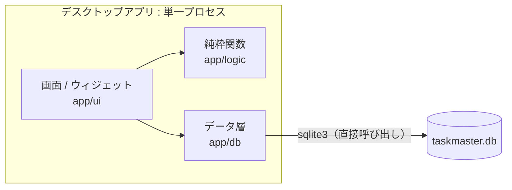
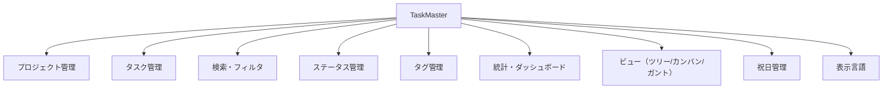
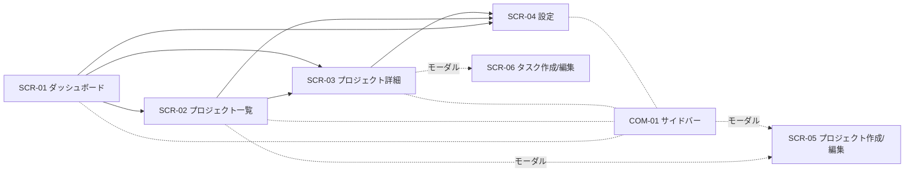
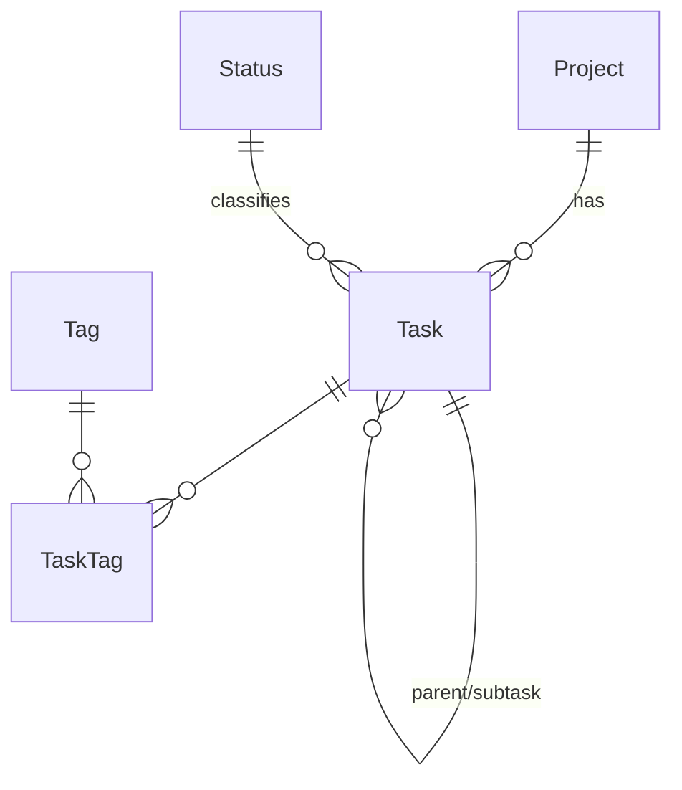

# 基本設計書 — TaskMaster（V2 デスクトップ版）

本書は TaskMaster V2 の基本設計（外部設計）を定義する。利用者・外部から見える振る舞い（画面・インターフェース・データ・エラー）を具体化する。内部実装の詳細（クラス構成・アルゴリズム）は詳細設計の範囲とし、本書では扱わない。記述はリポジトリの現行実装に基づく。

V1（Web アプリ、`develop/v1`）と章構成・表の書式・ID 体系をそろえている。V1 との対応関係は、章番号・画面 ID（SCR-/COM-）・機能 ID（F）・インターフェース ID（V1 は `API-`、V2 は `IF-` で、末尾の記号が対応する）で追える。

## 目次

- [1. はじめに](#1-はじめに)
- [2. システム方式設計](#2-システム方式設計)
- [3. 機能設計](#3-機能設計)
- [4. 画面設計](#4-画面設計)
- [5. インターフェース設計（データ層）](#5-インターフェース設計データ層)
- [6. データ設計](#6-データ設計)
- [7. 共通設計（方式）](#7-共通設計方式)
- [8. 非機能設計](#8-非機能設計)
- [9. 制約・課題](#9-制約課題)

---

## 1. はじめに

### 1.1 目的
要件を満たす外部仕様（画面・インターフェース・データ・エラー方式）を確定し、実装・テストの基準とする。

### 1.2 適用範囲
TaskMaster V2 のデスクトップアプリ本体（画面・データ層・SQLite ファイル）。認証、外部サービス連携、帳票、バッチは対象外。

### 1.3 関連文書

| 文書 | 役割 |
|---|---|
| 本書 `docs/BASIC_DESIGN.md` | 基本設計（外部からどう見えるか） |
| `docs/OPERATION_SPEC.md` | 操作仕様（クリック・ドラッグ・マウスオーバー。V1/V2 共通） |
| `docs/SYSTEM_DESIGN.md` | システム方式設計（アーキテクチャ・ディレクトリ構成・ビルドと配布・運用） |
| `README.md` | 概要・起動方法・使い方・配布と保存場所 |
| `CLAUDE.md` | 開発者向けの実装メモ |

### 1.4 用語
- **プロジェクト**: タスクを束ねる単位。アーカイブ可能。
- **タスク**: プロジェクトに属す作業項目。無制限階層のサブタスクを持てる。
- **サブタスク**: 親タスクを持つタスク。
- **ステータス**: タスクの進行状態。ユーザーが設定画面で自由に追加・削除・並べ替えできる（固定の区分ではない）。
- **完了扱い**（`isDone`）: ステータスに付与できるフラグ。完了率・期限超過判定はこのフラグを根拠にする（特定のステータス名で判定しない）。
- **優先度**: 低／中／高／緊急の固定4段階。
- **タグ**: タスクに複数付与できるラベル。
- **アーカイブ**: プロジェクトを一覧・統計から除外する状態（データは保持される）。
- **祝日**: 設定画面で登録する、日付と名称の組。ガントチャートで色分けされる。
- **期限超過**: 未完了で、期限日が本日より前（当日は含まない）。
- **期限が近い**: 未完了で、期限日が本日〜3日後（4日間）。

---

## 2. システム方式設計

本章は外部設計の前提となる方式の**概要**のみを示す。アーキテクチャの詳細（レイヤー責務）、ディレクトリ構成、ビルドと配布、運用は `docs/SYSTEM_DESIGN.md` に定義する。

### 2.1 全体構成

- ブラウザ・サーバー・HTTP 通信は存在しない。画面はデータ層の関数を直接呼び出す。
- データは `taskmaster.db`（SQLite ファイル）に保存する。配布 exe を使う場合は exe と同じフォルダ、開発時はリポジトリ直下。

### 2.2 技術方式

| 層 | 技術 | 役割 |
|---|---|---|
| 言語 | Python 3.11+ | 全体 |
| GUI | CustomTkinter（一部 `ttk.Treeview` / `tkinter.Canvas` を併用） | 画面描画 |
| ルーティング | `AppWindow.navigate()`（アプリ内の画面切替） | 画面遷移 |
| D&D | Tkinter のマウスイベント＋純粋関数（`app/logic/dnd.py`） | 並べ替え・ステータス変更 |
| 検証 | データ層での業務ルール検証（例外を送出） | 入力チェック |
| DB アクセス | 標準ライブラリ `sqlite3` を直接使用（ORM なし） | 永続化 |
| DB | SQLite | 永続化 |
| テスト | pytest（純粋関数のユニット＋SQLite 統合） | 品質 |
| 静的解析 | ruff | 品質 |
| exe 化 | Nuitka（`--onefile`、C コンパイラは zig） | 配布 |

### 2.3 処理方式
- 画面はデータ層の関数を直接呼び、更新後は該当ビューを `refresh()` で再構築して画面と DB の整合を保つ。
- 一覧の並び順は各行の `order`（整数）で管理し、並べ替えは一括更新関数で反映する。
- ツリー構築、D&D の決定、ガントの座標計算、期限判定は `app/logic` の純粋関数に切り出す。

---

## 3. 機能設計

### 3.1 機能構成

### 3.2 機能一覧

| 機能ID | 機能 | 概要 | 対応画面 | 対応IF |
|---|---|---|---|---|
| F1 | プロジェクト管理 | 作成・編集・アーカイブ/復元・並べ替え・削除 | SCR-02, SCR-05, COM-01 | IF-P* |
| F2 | タスク管理 | 作成・編集・親の付け替え・並べ替え・削除 | SCR-03, SCR-06 | IF-T* |
| F3 | 検索・フィルタ | キーワード・ステータス・優先度・タグでの絞り込み | SCR-03 | IF-T1 |
| F4 | ステータス管理 | 追加・改名・色変更・完了扱い・並べ替え・削除（使用中/最後の1件は不可） | SCR-04 | IF-S* |
| F5 | タグ管理 | 作成・改名・色変更・削除（設定画面）、タスクフォームからの作成・付与・削除 | SCR-04, SCR-06 | IF-G* |
| F6 | 統計・ダッシュボード | 総数・完了率・期限超過・期限が近い・ステータス別/優先度別内訳 | SCR-01, SCR-03 | IF-ST |
| F7 | ビュー | ツリー/カンバン/ガントの切替表示・ドラッグ操作 | SCR-03 | IF-T1, IF-T4〜T6 |
| F8 | 祝日管理 | 一覧・追加・改名・削除・CSV 一括登録（ガントの色分けに反映） | SCR-04, SCR-03 | IF-H* |
| F9 | 表示言語 | 日本語 / English の切替（即時反映・保存） | SCR-04 | IF-A* |

---

## 4. 画面設計

本章では画面の一覧・遷移・各画面の概要と項目を定義する。

### 4.1 画面一覧

| 画面ID | 画面名 | パス | 種別 |
|---|---|---|---|
| SCR-01 | ダッシュボード | —（サイドバーから切替） | ページ |
| SCR-02 | プロジェクト一覧 | — | ページ |
| SCR-03 | プロジェクト詳細 | — | ページ |
| SCR-04 | 設定（ステータス・祝日・タグ・言語） | — | ページ |
| SCR-05 | プロジェクト作成/編集 | （モーダル） | モーダル |
| SCR-06 | タスク作成/編集 | （モーダル） | モーダル |
| COM-01 | サイドバー | 共通 | 共通部品 |
| COM-02 | 確認ダイアログ | 共通 | 共通部品（削除・アーカイブ・復元の確認） |

V2 のページに URL（パス）は無い。ブックマーク・ブラウザの戻る/進むに相当する機能も無く、サイドバー操作とカード/行の操作で遷移する。

### 4.2 画面遷移

**画面遷移図**

**画面遷移表**

| No | 遷移元 | 操作 | 遷移先 | 備考 |
|---|---|---|---|---|
| 1 | 全画面 | サイドバー「ダッシュボード」 | SCR-01 | |
| 2 | 全画面 | サイドバー「プロジェクト一覧」 | SCR-02 | |
| 3 | 全画面 | サイドバー「設定」 | SCR-04 | |
| 4 | 全画面 | サイドバーのプロジェクト名 | SCR-03 | |
| 5 | SCR-01 | プロジェクトカード | SCR-03 | |
| 6 | SCR-02 | プロジェクト行（名前） | SCR-03 | |
| 7 | SCR-02 | 「+ 新しいプロジェクト」 | SCR-05（作成） | モーダル |
| 8 | SCR-02, COM-01 | 編集 | SCR-05（編集） | モーダル |
| 9 | SCR-03 | 「+ 新しいタスク」 | SCR-06（作成） | モーダル |
| 10 | SCR-03 | ツリー行・カンバンカードのクリック、ガントのバー/行名のダブルクリック | SCR-06（編集） | モーダル。ツリー・カンバンのダブルクリック、ガントのシングルクリックでは何も起きない（詳細は `docs/OPERATION_SPEC.md`） |
| 11 | SCR-03 | ツリー行の右クリック →「サブタスクを追加」 | SCR-06（作成・親指定） | モーダル（V1 は行末の「+サブ」ボタン） |
| 12 | SCR-02, COM-01, SCR-03, SCR-04 | 削除・アーカイブ/復元操作 | COM-02 | ダイアログ。確認後に実行 |

### 4.3 SCR-01 ダッシュボード
**概要**: 全プロジェクト横断（非アーカイブ）の統計と、注意すべきタスクを俯瞰する。

**画面項目**

| 項目ID | 項目 | 種別 | 説明 |
|---|---|---|---|
| I-0101 | 統計カード群 | 表示 | プロジェクト数／直近7日の完了数／タスク総数／完了率／期限超過／期限が近い（6枚） |
| I-0102 | ステータス別・優先度別内訳 | 表示 | 横棒グラフ。優先度は緊急→高→中→低の順 |
| I-0103 | 期限超過リスト | 表示 | 未完了かつ期限日が本日より前。最大8件、期限が近い順。プロジェクト名→タスク名→期限の順で表示 |
| I-0104 | 期限が近いリスト | 表示 | 未完了かつ期限日が本日〜3日後。最大8件、期限が近い順。列構成は上記と同じ |
| I-0105 | プロジェクトカード | リンク | 色・名前・タスク件数。クリックで SCR-03 へ |

**利用IF**: IF-ST, IF-P1, IF-T1

### 4.4 SCR-02 プロジェクト一覧
**概要**: プロジェクトの一覧・追加・編集・アーカイブ/復元・削除。

**画面項目**

| 項目ID | 項目 | 種別 | 説明 |
|---|---|---|---|
| I-0201 | プロジェクト追加ボタン | ボタン | 「+ 新しいプロジェクト」。SCR-05 を開く |
| I-0202 | アーカイブ表示トグル | チェック | 「アーカイブ済みも表示」。オンで全件、オフで非アーカイブのみ |
| I-0203 | プロジェクト行 | リンク | 色・名前・アーカイブ済みバッジ・説明・タスク件数。名前クリックで SCR-03 |
| I-0204 | 編集/アーカイブ・復元/削除ボタン | ボタン | 各行に配置。アーカイブ・復元・削除は COM-02 を経由（削除は配下タスクも削除される旨を明示） |

**利用IF**: IF-P1, IF-P4, IF-P6

### 4.5 SCR-03 プロジェクト詳細
**概要**: 1プロジェクトのタスクをツリー/カンバン/ガントで表示・編集する。

**画面項目**

| 項目ID | 項目 | 種別 | 必須 | 説明・制約 |
|---|---|---|---|---|
| I-0301 | ビュー切替 | トグル | ○ | ツリー／カンバン／ガント |
| I-0302 | 検索キーワード | テキスト | − | タイトル/説明の部分一致 |
| I-0303 | ステータス絞り込み | セレクト | − | ステータス一覧＋「すべて」 |
| I-0304 | 優先度絞り込み | セレクト | − | 低/中/高/緊急＋「すべて」 |
| I-0305 | タグ絞り込み | セレクト | − | タグ一覧＋「すべて」。「クリア」で一括解除 |
| I-0306 | タスク追加ボタン | ボタン | − | 「+ 新しいタスク」。SCR-06（作成）を開く |
| I-0307 | 統計表示トグル | ボタン | − | 「統計を表示/隠す」。このプロジェクトに絞った統計カード＋内訳バー |

**ビューごとの仕様**

| ビュー | 仕様 |
|---|---|
| ツリー | 無制限階層で表示し、展開/折りたたみができる。期限超過は赤字、完了扱いのタスクはグレー表示。タスクが 0 件でも列の縦罫線を表示する |
| カンバン | ステータスごとの列にカードを表示。ドラッグ中はカード全体（タイトル・優先度・タグ・期限）がカーソルに付いてくる |
| ガント | 開始日〜期限をステータス色のバーで表示。月・日ヘッダー（土日・祝日を色分け）、今日の位置に縦線。開始日のみ／期限のみは1日分、両方未設定はバー非表示。ラベル列は横スクロールしても左端に固定される |

**イベント/アクション**

| イベント | 処理概要 |
|---|---|
| ビュー切替 | 選択ビューを再描画。フィルタは全ビューに適用される |
| フィルタ適用 | ツリーで親が絞り込みにより非表示になった子は最上位として表示（ツリー構造は維持しない） |
| クリック | ツリー行・カンバンカードのシングルクリックで SCR-06（編集）を開く（ダブルクリックでは何もしない） |
| ダブルクリック | ガントのバー/行名で SCR-06（編集）を開く（シングルクリックでは何もしない） |
| マウスオーバー | ツリー行=行を強調、カンバンカード=枠を強調、ガント=バーの色・行の強調・ツールチップ（`docs/OPERATION_SPEC.md`） |
| 右クリック（ツリー行） | メニュー：サブタスクを追加・編集・ステータス変更・削除 |
| D&D（ツリー） | 行をドラッグして並べ替え・親の付け替え（行の上端/下端=兄弟として挿入、中央=子にする。自分の配下へは不可） → IF-T6 |
| D&D（カンバン） | 別列へ=ステータス変更＋並べ替え／同一列内=並べ替え → IF-T4, IF-T6 |
| D&D（ガント・バー） | バー中央のドラッグで開始日・期限を平行移動、バー端のドラッグで片側のみ変更（期間の伸縮）→ IF-T4 |
| D&D（ガント・行名） | 行名のドラッグで並べ替えと親の付け替え（行の上端/下端=兄弟として挿入、中央=子にする。自分の配下へは不可）→ IF-T6 |

**利用IF**: IF-T1, IF-S1, IF-G1, IF-H1, IF-T4〜T6

### 4.6 SCR-04 設定（ステータス・祝日・タグ・言語）
**概要**: ステータス・祝日・タグ・表示言語を管理する。

**画面項目**

| 項目ID | 項目 | 種別 | 説明・制約 |
|---|---|---|---|
| I-0401 | ステータス行 | 表示/編集 | 並べ替え（▲▼）・色（クリックで色選択）・ラベル（インライン編集）・「完了として扱う」チェック |
| I-0402 | ステータス追加行 | ボタン | 色選択＋ラベル入力＋「追加」 → IF-S2 |
| I-0403 | ステータス削除ボタン | ボタン | 使用中/最後の1件は拒否しエラーを表示（IF-S4） |
| I-0410 | 祝日一覧 | 表示/編集 | 日付の昇順。名称のインライン編集・削除ボタン |
| I-0411 | 祝日追加行 | ボタン | 日付（カレンダー選択または直接入力）＋名称＋「追加」 → IF-H2 |
| I-0412 | CSV読込ボタン | ボタン | 「CSVから読み込む」。列順は「日付, 名称」。日付が一致する既存行は名称を上書き → IF-H4, H5 |
| I-0420 | タグ一覧 | 表示/編集 | 名前順。色（クリックで色選択）・名前（インライン編集）・削除ボタン |
| I-0421 | タグ追加行 | ボタン | 色選択＋名前入力＋「追加」 → IF-G2 |
| I-0422 | タグ削除確認 | ダイアログ | 付与されているタスク件数を表示して削除（タスクは残り、付与のみ解除） |
| I-0423 | タグ重複名エラー | 表示 | 既存と同じ名前の作成・改名を拒否しエラーを表示 |
| I-0430 | 言語選択 | セレクト | 日本語 / English。即時に全画面へ反映し、DB に保存（IF-A2） |

初回起動時（ステータスが 1 件も無い状態）は、未着手／進行中／完了／取下げの 4 件を自動投入する（既存データがある場合は投入しない）。

**利用IF**: IF-S*, IF-H*, IF-G*, IF-A*

### 4.7 SCR-05 プロジェクト作成/編集（モーダル）

| 項目ID | 項目 | 種別 | 必須 | 制約 |
|---|---|---|---|---|
| I-0501 | 名前 | テキスト | ○ | 空/空白のみは送信不可 |
| I-0502 | 説明 | テキストエリア | − | |
| I-0503 | 色 | カラー | − | 固定7色パレットから選択（既定 `#6366f1`） |
| I-0504 | 保存/キャンセル | ボタン | − | 保存で作成/更新 IF を呼ぶ |

### 4.8 SCR-06 タスク作成/編集（モーダル）

| 項目ID | 項目 | 種別 | 必須 | 制約 |
|---|---|---|---|---|
| I-0601 | タイトル | テキスト | ○ | 空/空白のみは送信不可 |
| I-0602 | 説明 | テキストエリア | − | |
| I-0603 | ステータス | セレクト | − | 省略時は並び順が最初のステータス |
| I-0604 | 優先度 | セレクト | − | 低/中/高/緊急 |
| I-0605 | 開始日/期限 | 日付 | − | カレンダー選択または直接入力（YYYY-MM-DD）。「設定する」チェックで有効/無効。入力するとチェックが自動でオン |
| I-0606 | 親タスク | セレクト | − | 階層がわかるようインデント表示。自分自身とその配下は選べない |
| I-0607 | タグ | 複数選択 | − | 既存タグはボタン状で選択/解除。新規タグはその場で入力して「追加」。タグの右クリックでそのタグ自体を削除（全タスクから外れる） |
| I-0608 | 続けて作成 | チェック | − | 作成モードのみ。保存後もモーダルを開いたままにする |
| I-0609 | 保存/キャンセル | ボタン | − | 保存で作成/更新 IF を呼ぶ |

### 4.9 入力チェック方針
- 画面側で最低限のチェック（タイトル空/空白の送信抑止）を行い、確定的な検証・業務ルール（親タスク存在・ステータス存在・循環参照・ステータス削除ガード・タグ名一意など）はデータ層が例外として検出する（二重防御）。
- 業務ルール違反は例外（§7.2）として受け、画面は理由を表示して操作を拒否する。表示方法の統一方針は §7.2 を参照。

---

## 5. インターフェース設計（データ層）

V1 の外部インターフェース（HTTP API）に相当する、画面とデータの境界。V2 は HTTP を介さず、`app/db/*.py` の関数を直接呼び出す。IF-ID の末尾は V1 の API-ID と対応する。

### 5.1 共通仕様
- 形式：Python 関数（`sqlite3.Connection` を第1引数に取る）。戻り値は `app/models.py` のデータクラスまたは件数など。
- 失敗は業務例外で通知する：検証=`ValidationError`、未検出=`NotFoundError`、制約違反（一意・削除制約）=`ConflictError`、循環参照=`CycleError`（`app/db/errors.py`）。
- 更新日時（`updatedAt`）は各更新処理が明示的に設定する。日付は文字列（ISO 8601 / `YYYY-MM-DD`）で保持する。

### 5.2 IF一覧

| IF-ID | 関数 | 概要 |
|---|---|---|
| IF-P1 | `list_projects(include_archived)` | 一覧（既定は非アーカイブ、`include_archived=True` で全件） |
| IF-P2 | `create_project(...)` | 作成 |
| IF-P3 | `get_project(id)` | 単体取得 |
| IF-P4 | `update_project(...)` | 更新（アーカイブ切替含む） |
| IF-P5 | `reorder_projects(ids)` | 並べ替え |
| IF-P6 | `delete_project(id)` | 削除（タスク連鎖削除） |
| IF-T1 | `list_tasks(project_id, status, priority, tag_id, search, parent_id)` | 一覧 |
| IF-T2 | `create_task(...)` | 作成 |
| IF-T3 | `get_task(id)` | 単体取得 |
| IF-T4 | `update_task(...)` | 更新 |
| IF-T5 | `move_task(...)` | 親・プロジェクト・順序の付け替え（循環参照拒否） |
| IF-T6 | `reorder_tasks(items)` | 並べ替え（1トランザクション） |
| IF-T7 | `delete_task(id)` | 削除（子孫連鎖削除） |
| IF-S1〜5 | `list_statuses` / `create_status` / `update_status` / `delete_status` / `reorder_statuses` | ステータス管理 |
| IF-G1〜3 | `list_tags` / `create_tag` / `delete_tag` | タグ管理（V1 と共通） |
| IF-G4〜5 | `update_tag` / `count_tagged_tasks` | タグの改名・色変更、付与件数（V2 で追加） |
| IF-H1〜5 | `list_holidays` / `upsert_holiday` / `delete_holiday` / `parse_holiday_csv` / `bulk_upsert_holidays` | 祝日管理（V2 のみ） |
| IF-A1〜2 | `get_setting` / `set_setting` | アプリ設定（言語など。V2 のみ） |
| IF-ST | `get_stats(project_id, today)` | 統計（`project_id` 指定＝当該、未指定＝非アーカイブ横断） |
| IF-DB | `connect` / `ensure_default_statuses` | 接続・スキーマ作成・初期ステータス投入（V1 の `API-HC` に相当する起動時処理） |

### 5.3 IF仕様サンプル：IF-T2 タスク作成
**関数**: `create_task(conn, title, project_id, ...)`

**引数**

| 引数 | 型 | 必須 | 制約 |
|---|---|---|---|
| title | str | ○ | |
| project_id | str | ○ | 既存プロジェクト |
| description | str | − | |
| priority | str | − | LOW/MEDIUM/HIGH/URGENT（既定 MEDIUM） |
| status | str | − | 既存 Status id。省略時は order 最小 |
| start_date / due_date | str\|None | − | `YYYY-MM-DD` |
| parent_id | str | − | 既存タスク |
| tag_ids | list[str] | − | 既存 Tag id の配列 |

**結果**

| ケース | 結果 | 内容 |
|---|---|---|
| 成功 | 戻り値 | 作成した Task（tags 付き、order=同階層 max+1） |
| status 不正 | `ValidationError` | 「Invalid status」 |
| parent 不正 | `ValidationError` | 「Parent task not found」 |
| ステータス未定義 | `ValidationError` | 「No statuses defined」 |

**処理概要**: status/parent の存在確認 → order 採番 → Task＋TaskTag 作成 → 整形して返却。

### 5.4 IF仕様サンプル：IF-ST 統計取得
**関数**: `get_stats(conn, project_id=None, today=None)`

**戻り値（dict）**

| 項目 | 型 | 説明 |
|---|---|---|
| total | int | タスク総数 |
| byStatus | dict | Status id → 件数（全ステータス 0 埋め） |
| byPriority | dict | 優先度 → 件数（4値 0 埋め） |
| overdue | int | 未完了かつ期限日が本日より前 |
| dueSoon | int | 未完了かつ期限日が本日〜3日後 |
| completedLast7Days | int | 完了扱いかつ直近7日に更新 |
| completionRate | float | 完了扱い件数÷総数（%、小数第1位） |

**処理概要**: Status を取得して `isDone` の集合を作る → 対象（`project_id` 指定 or 非アーカイブ）で集計。完了・期限の判定は `isDone` と日付（`today` 省略時はローカルの本日）を根拠にする。

---

## 6. データ設計

### 6.1 ER図

`Holiday` と `AppSetting` はどのテーブルにも従属しない独立したテーブルである。DDL は `app/db/schema.sql`。

### 6.2 テーブル定義

**Project**

| カラム | 型 | NULL | 既定 | 説明 |
|---|---|---|---|---|
| id | TEXT | × | 自動 | PK |
| name | TEXT | × | − | プロジェクト名 |
| description | TEXT | ○ | − | 説明 |
| color | TEXT | × | #6366f1 | 表示色 |
| archived | INTEGER(bool) | × | 0 | アーカイブ状態 |
| order | INTEGER | × | 0 | 並び順 |
| createdAt/updatedAt | TEXT(ISO8601) | × | 自動 | 監査時刻（更新はアプリ側で管理） |

**Status**

| カラム | 型 | NULL | 既定 | 説明 |
|---|---|---|---|---|
| id | TEXT | × | 自動※ | PK（初期の4件は文字列 id、追加は自動 id） |
| label | TEXT | × | − | 表示名 |
| color | TEXT | × | #64748b | 表示色 |
| order | INTEGER | × | 0 | 並び順（カンバンの列順） |
| isDone | INTEGER(bool) | × | 0 | 完了扱いフラグ |

**Task**

| カラム | 型 | NULL | 既定 | 説明 |
|---|---|---|---|---|
| id | TEXT | × | 自動 | PK |
| title | TEXT | × | − | タイトル |
| description | TEXT | ○ | − | 詳細 |
| status | TEXT(FK→Status) | × | "TODO" | ON DELETE RESTRICT |
| priority | TEXT | × | "MEDIUM" | 区分値 |
| startDate/dueDate | TEXT | ○ | − | 期間（ガントのバーに使用） |
| order | INTEGER | × | 0 | 同階層の並び順 |
| projectId | TEXT(FK→Project) | × | − | ON DELETE CASCADE |
| parentId | TEXT(FK→Task) | ○ | − | 自己参照、ON DELETE CASCADE |

index: projectId / parentId / status / priority / dueDate

**Tag**

| カラム | 型 | NULL | 既定 | 説明 |
|---|---|---|---|---|
| id | TEXT | × | 自動 | PK |
| name | TEXT | × | − | 一意 |
| color | TEXT | × | #94a3b8 | 表示色 |

**TaskTag**（中間）

| カラム | 型 | 説明 |
|---|---|---|
| taskId | TEXT(FK→Task) | ON DELETE CASCADE |
| tagId | TEXT(FK→Tag) | ON DELETE CASCADE |
| （PK） | (taskId, tagId) | 複合主キー |

**Holiday**（V2 のみ）

| カラム | 型 | NULL | 説明 |
|---|---|---|---|
| id | TEXT | × | PK |
| date | TEXT | × | `YYYY-MM-DD`。一意（CSV 一括登録で既存行を上書きするため） |
| name | TEXT | × | 名称 |

**AppSetting**（V2 のみ）

| カラム | 型 | 説明 |
|---|---|---|
| key | TEXT | PK（例：`language`） |
| value | TEXT | 設定値 |

### 6.3 コード定義（区分値）

| 区分 | 値 | 備考 |
|---|---|---|
| priority | LOW / MEDIUM / HIGH / URGENT | `app/constants.py` |
| status | DB 管理（固定値でない） | 初期投入：TODO（未着手）/ IN_PROGRESS（進行中）/ DONE（完了）/ WITHDRAWN（取下げ）。完了・取下げは isDone=1 |
| language | ja / en | `AppSetting.language` |

---

## 7. 共通設計（方式）

### 7.1 バリデーション方式
- 画面側で最低限の入力チェックを行い、業務ルール（存在確認・一意・循環参照・削除ガード）はデータ層の関数が検証して業務例外を送出する。

### 7.2 エラーハンドリング方式

発生の仕組み（V1 は HTTP ステータス、V2 は Python 例外）は異なるが、メッセージの文言と表示方法は V1/V2 で共通にする。

**発生の仕組み（V2）**

| 事象 | 例外 | 例 |
|---|---|---|
| 業務チェックエラー | `ValidationError` | 親タスクが見つかりません / 指定のステータスが存在しません / CSV の文字コード判定不可 |
| リソース未検出 | `NotFoundError` | 存在しない id |
| 一意・削除制約 | `ConflictError` | タグ名重複、使用中/最後のステータス削除 |
| 循環参照 | `CycleError` | 自分自身またはその配下を親にする |

いずれも `AppError`（`app/db/errors.py`）を継承する。メッセージは下表の共通メッセージ（日本語）で、`{count}` などのパラメータ付きはテンプレートと値を分けて持ち（`localized()`）、画面側が現在の言語に翻訳して表示する。

**表示方法（V1/V2 共通）**

| 場面 | 表示方法 | 実装 |
|---|---|---|
| 入力フォーム（SCR-05/06）の保存失敗 | モーダルを閉じず、保存ボタンの上に赤字で表示 | `TaskFormDialog` / `ProjectFormDialog` の `on_save` で保存し、失敗をフォーム内の赤字ラベルに表示 |
| 必須項目が未入力のまま保存・追加 | 保存・追加は行わず、入力欄の下に赤字で「{項目名}を入力してください」を表示する（入力フォームは入力欄を赤枠にもし、入力し直すと消える。設定画面は節の直下に表示） | `TaskFormDialog` / `ProjectFormDialog` の項目別エラー、設定画面の各節の赤字ラベル |
| 設定画面（SCR-04）の操作失敗 | 操作した節（ステータス/祝日/タグ）の直下に赤字で表示 | 設定画面の各節の赤字ラベル（`error_label` など） |
| 一覧・ビュー上の操作失敗（削除・並べ替え・移動など） | エラーダイアログ（タイトル「エラー」、OK のみ） | `AppWindow.report_callback_exception` が、捕まえなかった例外をダイアログで表示 |
| 削除・アーカイブ・復元の事前確認 | 確認ダイアログ（COM-02）。確定ボタンの文言は操作に合わせる（削除する／アーカイブする／復元する） | 同左 |
| 想定外のエラー（通信・DB など） | エラーダイアログ「予期しないエラーが発生しました。もう一度お試しください」 | 同上（業務例外以外は共通の文言。詳細は標準エラー出力に残す） |

**共通メッセージ一覧**

| 事象 | 日本語 | English | V1 | V2 |
|---|---|---|---|---|
| プロジェクトが無い | プロジェクトが見つかりません | Project not found | 404 | NotFoundError |
| タスクが無い | タスクが見つかりません | Task not found | 404 | NotFoundError |
| ステータスが無い | ステータスが見つかりません | Status not found | 404 | NotFoundError |
| タグが無い | タグが見つかりません | Tag not found | 404 | NotFoundError |
| 祝日が無い | 祝日が見つかりません | Holiday not found | —（機能なし） | NotFoundError |
| 親タスクが無い | 親タスクが見つかりません | Parent task not found | 400 | ValidationError |
| ステータス不正 | 指定のステータスが存在しません | Invalid status | 400 | ValidationError |
| ステータス未定義 | ステータスが1件もありません | No statuses defined | 400 | ValidationError |
| 入力値不正（文字数・型） | 入力内容を確認してください（項目名と条件を併記） | Please check your input | 400（zod）。画面の入力欄にも文字数の上限（`maxlength`）を設定し、上限を超える入力はできない | 画面の入力欄に上限を設定し、データ層（`ValidationError`）でも検査する |
| 必須項目が未入力 | {項目名}を入力してください | {field} is required. | 画面側チェック | 画面側チェック |
| CSV の文字コード不明 | CSVの文字コードを判定できませんでした | Could not determine the CSV file's character encoding. | —（機能なし） | ValidationError |
| タグ名重複 | タグが既に存在します | Tag already exists | 409 | ConflictError |
| 使用中ステータスの削除 | このステータスは {count} 件のタスクで使用中のため削除できません | This status is used by {count} tasks and cannot be deleted | 409 | ConflictError |
| 最後のステータスの削除 | 最後のステータスは削除できません | The last status cannot be deleted | 409 | ConflictError |
| 循環参照 | タスクを自分自身またはその配下には移動できません | A task cannot be moved under itself or its own subtasks | 400 | CycleError |

### 7.3 削除・連鎖方式

| 対象 | 方式 |
|---|---|
| Project 削除 | 配下 Task を CASCADE 削除 |
| Task 削除 | 子孫 Task を CASCADE 削除 |
| Status 削除 | RESTRICT（使用中は不可）＋「最後の1件」不可 |
| Tag 削除 | TaskTag を CASCADE 解除（タスクは残る） |

### 7.4 並び順（order）方式
- Project/Task/Status は `order`（整数）で並びを持つ。並べ替えは明示的な `{id, order}`（または `ids`）を受け取り、1トランザクションで一括再採番する。タスクの順序は同一階層（同じプロジェクト・同じ親）の中で管理する。

### 7.5 親子移動・循環参照方式
- `move_task` は、対象の子孫（自分自身を含む）を辿って新しい親が子孫でないかを確認し、循環になる場合は `CycleError` で拒否する。

### 7.6 国際化方式
- 画面の文言は日本語の原文をキーにした辞書（`app/i18n.py`、英語は `app/locales/en.py`）で翻訳する。辞書に無い文言は原文のまま表示する。
- 言語は `AppSetting.language` に保存し、設定画面での切替は全画面へ即時に反映する。ユーザーが入力したデータ（ステータス名・タグ名・プロジェクト名など）は翻訳しない。

### 7.7 日付判定方式
- 期限超過・期限が近いは日付（`YYYY-MM-DD`）単位で判定する。「本日」は実行 PC のローカル日付。期限が近い＝本日〜3日後（4日間）、期限超過＝期限日が本日より前（当日は超過としない）。

### 7.8 日付の表示形式
- 期限・開始日・祝日の日付は、表示言語に合わせて表示する。日本語は `2026年10月05日`（YYYY年MM月DD日）、英語は `2026-10-05`（YYYY-MM-DD）。保存形式は変えず、表示だけを切り替える。日付の入力欄（カレンダー・ブラウザの日付入力）は、各部品の標準の形式のままとする。

### 7.9 表示項目と省略表示（V1/V2 共通）

| 項目 | 仕様 |
|---|---|
| ツリーの表示項目 | タスク名 → ステータス → 優先度 → 開始日 → 期限 → タグ の順（V1 は行内のセレクトとバッジ、V2 は表の列で、部品の見た目は異なる） |
| タグの表示 | タグの色のピル（「#」は付けない）。一覧・カードには最大2件まで、名前は4文字を超えたら「...」。収まらない分は「...」のピルにまとめる（V1 はマウスオーバーで全タグ名を確認できる）。V2 のツリーは、列の幅に合わせてカンマ区切りの文字を「...」で省略する |
| 長い名前の省略 | プロジェクト名・タスク名・説明は、表示できる幅に収まらない分を「...」で省略する（サイドバー、プロジェクト一覧、ダッシュボード、プロジェクト画面のヘッダー、ツリー、カンバンのカード、ガントの行名）。省略した全体は、V1 はマウスオーバー、V2 はガントの行名のツールチップで確認できる。長い名前でサイドバーの幅やボタンの配置が崩れないこと |
| ガント | ラベル列は横スクロールしても左端に固定する。日付ヘッダーと本体の行の両方で、土日・祝日を色分けする |
| 外観 | V1 はブラウザ/OS の設定（ライト/ダーク）に追従する。V2 はライトに固定する（ツリー・ガント・紙のタブの色がライト用のため） |

---

## 8. 非機能設計

本章は非機能要件と実現方式の**要約**である。方式の詳細は `docs/SYSTEM_DESIGN.md` に定義する。

| 区分 | 設計方針 |
|---|---|
| 性能 | 集計・絞り込み対象カラムにインデックスを付与。個人〜小規模データ量で即応 |
| 品質 | pytest によるユニット（純粋関数）と統合（SQLite）テストを維持。GUI の自動テストは無し |
| 品質 | ruff による静的解析 |
| 保守性 | ロジックを純粋関数へ切り出し単体テスト可能に（tree/dnd/gantt/due） |
| 国際化 | UI 表示は日本語 / English（設定画面で切替）。ユーザー入力データは翻訳しない |
| 完了判定 | `Status.isDone` を根拠にし、ステータス名をハードコードしない |
| セキュリティ | ローカル単一ユーザー前提。認証・通信の考慮は対象外 |
| データの保存 | `taskmaster.db` を exe と同じフォルダ（開発時はリポジトリ直下）に生成。配布物には含まれない |
| 可用性 | ローカル実行のみ。サーバー公開・複数人の同時利用は対象外 |
| 対応 OS | Windows、Mac |

---

## 9. 制約・課題

| 項目 | 内容 |
|---|---|
| 認証 | 未対応。単一ユーザー・単一データストア前提 |
| GUI 自動テスト | 画面操作の自動テストは無く、手動確認のみ |
| データ量 | 個人〜小規模データ量を想定。複数人での同時利用は想定していない |
| 日付基準 | 期限超過・期限が近い・ガント範囲はローカル日付（実行 PC）基準で計算 |
| タスク登録・編集画面の項目配置 | 現状は縦一列の並びで改善要望あり（対応方針は未確定、着手前に具体案を確認する） |
| 対応 OS | Windows、Mac（Mac 版は GitHub Actions でビルド。実機での動作確認は、これから） |

---

> 本書は外部設計を対象とする。内部構造（モジュール分割・関数設計）や具体的実装は `docs/SYSTEM_DESIGN.md`・`CLAUDE.md`・ソースコードを参照。
