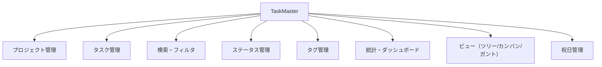
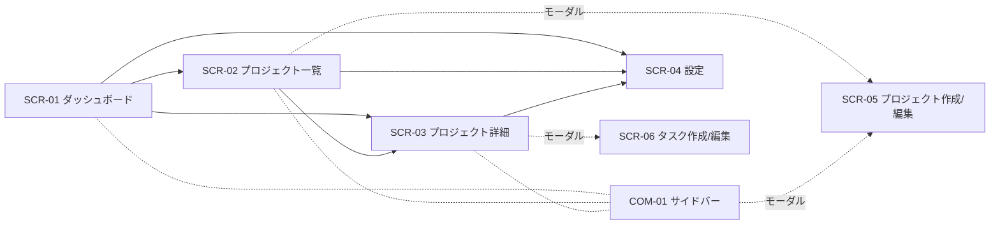
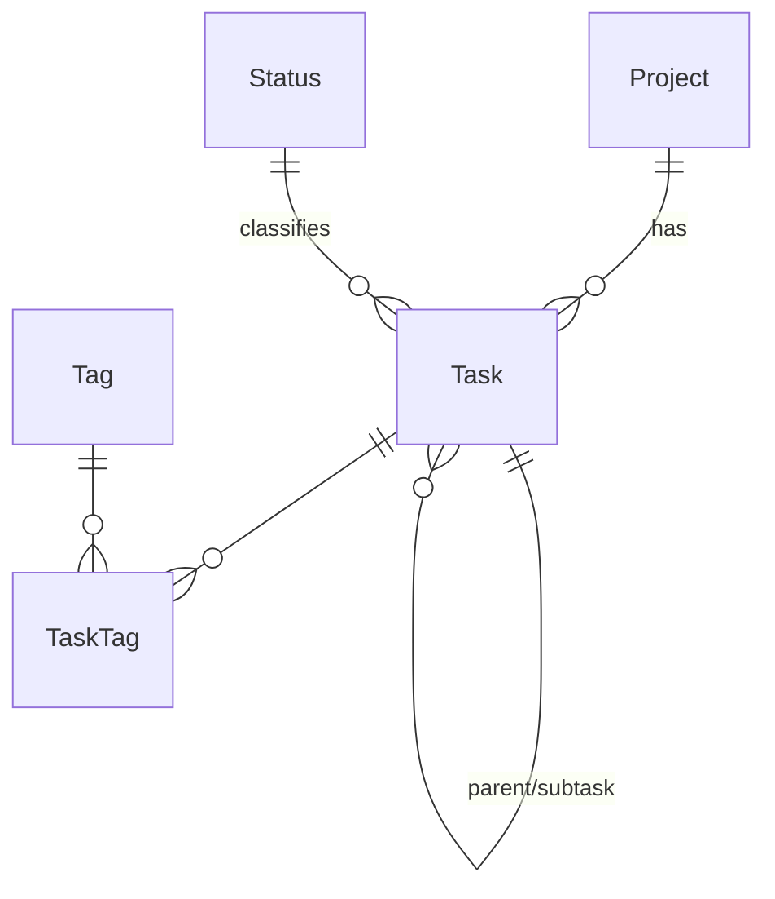

# 基本設計書 — TaskMaster

**バージョン: V2（デスクトップ版）**

本書は TaskMaster の基本設計（外部設計）を定義する。利用者から見える振る舞い（画面・操作・データ・エラー）を対象とし、内部実装（クラス構成・関数・アルゴリズム・使用ライブラリの詳細な使い方）は原則として扱わない。実装の前提として先に決めておく必要がある技術選定（採用ライブラリ等）のみ最小限記載する。

V1（Webアプリ、`develop/v1` ブランチに凍結）からの全面書き直し版であり、ブラウザ上で動くWebアプリではなく、単体で起動するデスクトップアプリになった。

## 目次

- [1. はじめに](#1-はじめに)
- [2. 前提となる技術選定](#2-前提となる技術選定)
- [3. 機能設計](#3-機能設計)
- [4. 画面設計](#4-画面設計)
- [5. データ設計](#5-データ設計)
- [6. 共通仕様](#6-共通仕様)
- [7. 非機能仕様](#7-非機能仕様)
- [8. 制約・課題](#8-制約課題)

---

## 1. はじめに

### 1.1 目的
利用者から見える仕様（画面・操作・データ・エラー）を確定し、実装・テストの基準とする。

### 1.2 適用範囲
TaskMaster デスクトップアプリ本体。認証、外部サービス連携、帳票、バッチは対象外。

### 1.3 関連文書

| 文書 | 役割 |
|---|---|
| 本書 `docs/BASIC_DESIGN.md` | 基本設計（仕様） |
| `README.md` | セットアップ・使い方（簡易マニュアル） |
| `CLAUDE.md` | 開発者向けの実装メモ |

### 1.4 用語
- **プロジェクト**: タスクを束ねる単位。アーカイブ可能。
- **タスク**: プロジェクトに属す作業項目。無制限階層のサブタスクを持てる。
- **ステータス**: タスクの進行状態。ユーザーが設定画面で自由に追加・削除・並べ替えできる（固定の区分ではない）。
- **完了扱い**: ステータスに付与できるフラグ。完了率・期限超過判定はこのフラグを根拠にする（特定のステータス名で判定しない）。
- **優先度**: 低／中／高／緊急の固定4段階。
- **タグ**: タスクに複数付与できるラベル。
- **アーカイブ**: プロジェクトを一覧・統計から除外する状態（データは保持される）。
- **祝日**: 設定画面で登録する、日付と名称の組。

---

## 2. 前提となる技術選定

開発を始めるにあたり先に決めておく必要がある採用技術のみ記載する。選定理由や使い方の詳細はCLAUDE.mdを参照。

| 区分 | 採用技術 |
|---|---|
| 実行形態 | 単体で起動するデスクトップアプリ（ブラウザ・サーバー不要） |
| データの保存先 | ローカルのファイル（アプリ本体と同じ場所に保存され、ネットワーク通信は行わない） |
| 配布形態 | 単一の実行ファイル。別途ランタイムのインストールは不要 |

---

## 3. 機能設計

### 3.1 機能構成

### 3.2 機能一覧

| 機能 | 概要 | 対応画面 |
|---|---|---|
| プロジェクト管理 | 作成・編集・アーカイブ/復元・削除 | SCR-02, SCR-05 |
| タスク管理 | 作成・編集・親の付け替え・並べ替え・削除 | SCR-03, SCR-06 |
| 検索・フィルタ | キーワード・ステータス・優先度・タグでの絞り込み | SCR-03 |
| ステータス管理 | 追加・改名・色変更・並べ替え・削除（使用中/最後の1件は不可） | SCR-04 |
| タグ管理 | タスクフォームからの作成・付与のみ（一覧・削除UIは無し） | SCR-06 |
| 統計・ダッシュボード | 総数・完了率・期限超過・直近期限・ステータス別/優先度別内訳 | SCR-01, SCR-03 |
| ビュー | ツリー/カンバン/ガントの切替表示・ドラッグ操作 | SCR-03 |
| 祝日管理 | 一覧・追加・改名・削除・CSV一括登録 | SCR-04 |

---

## 4. 画面設計

### 4.1 画面一覧

| 画面ID | 画面名 | 種別 |
|---|---|---|
| SCR-01 | ダッシュボード | 画面（サイドバー「📊 ダッシュボード」） |
| SCR-02 | プロジェクト一覧 | 画面（サイドバー「📁 プロジェクト一覧」） |
| SCR-03 | プロジェクト詳細 | 画面（プロジェクト名クリックで遷移） |
| SCR-04 | 設定（ステータス遷移・祝日） | 画面（サイドバー「⚙️ 設定」） |
| SCR-05 | プロジェクト作成/編集 | モーダル |
| SCR-06 | タスク作成/編集 | モーダル |
| COM-01 | サイドバー | 共通部品（ロゴ・ナビゲーション・プロジェクト一覧・編集/削除） |
| COM-02 | 確認ダイアログ | 共通部品（削除確認） |

画面遷移はサイドバー操作、またはプロジェクトカード/行のクリックのみで行う（URL・ブックマーク・ブラウザの戻る/進むに相当する機能は無い）。

### 4.2 画面遷移図

### 4.3 SCR-01 ダッシュボード
**概要**: 全プロジェクト横断（非アーカイブ）の統計と、注意すべきタスクを俯瞰する。

| 項目 | 説明 |
|---|---|
| 統計カード（6枚） | プロジェクト数／直近7日の完了数／タスク総数／完了率／期限超過／7日以内に期限 |
| 期限超過のタスク一覧 | 未完了かつ期限が過去。最大8件、期限が近い順。プロジェクト名→タスク名→期限の順で表示 |
| 期限が近いタスク一覧 | 未完了かつ期限が未来。最大8件、期限が近い順。列構成は上記と同じ |
| ステータス別内訳 | ステータスごとの件数を横棒グラフで表示 |
| 優先度別内訳 | 優先度（緊急→高→中→低の順）ごとの件数を横棒グラフで表示 |
| プロジェクト一覧 | 色・名前・タスク件数。クリックで SCR-03 へ |

### 4.4 SCR-02 プロジェクト一覧
**概要**: プロジェクトの一覧・追加・編集・アーカイブ/復元・削除。

| 項目 | 説明 |
|---|---|
| 「+ 新しいプロジェクト」ボタン | SCR-05 を開く |
| 「アーカイブ済みも表示」チェック | オンで全件、オフで非アーカイブのみ表示 |
| プロジェクト行 | 色・名前（クリックでSCR-03へ）・アーカイブ済みバッジ・説明・タスク件数 |
| 編集/アーカイブ・復元/削除ボタン | 各行に配置。削除は確認ダイアログ（配下タスクも削除される旨を明示）を経由 |

### 4.5 SCR-03 プロジェクト詳細
**概要**: 1プロジェクトのタスクをツリー/カンバン/ガントで表示・編集する。

| 項目 | 説明 |
|---|---|
| ビュー切替 | ツリー／カンバン／ガント |
| フィルタバー | キーワード検索・ステータス・優先度・タグ（複合可）、「クリア」で一括解除 |
| 「統計を表示/隠す」ボタン | トグルで、このプロジェクトに絞った統計カード＋内訳バーの表示/非表示 |
| 「+ 新しいタスク」ボタン | 現在表示中のビューに対して SCR-06（作成モード）を開く |
| ツリービュー | 無制限階層で表示し、展開/折りたたみができる。ドラッグで同一階層内の並べ替え。右クリックでサブタスク追加・編集・ステータス変更・削除。期限超過は赤字、完了扱いのタスクはグレー表示 |
| カンバンビュー | ステータスごとの列にカードを表示。カードをドラッグして別列へ移すとステータス変更、同一列内で移すと並べ替え。ドラッグ中はカードが指に付いてくるように動く。カードのダブルクリックで編集 |
| ガントビュー | 開始日〜期限をステータス色のバーで表示。月・日ヘッダー（土日を色分け）、今日の位置に縦線。バー中央のドラッグで開始日・期限を平行移動、バー端のドラッグで片側のみ変更（期間の伸縮）。バーや行のクリックで編集モーダルを開く |

**フィルタ適用時の挙動**: フィルタ条件はツリー/カンバン/ガントの全ビューに等しく適用される。ツリービューで親が絞り込みにより非表示になった場合、その子タスクは最上位として表示される。

### 4.6 SCR-04 設定（ステータス遷移・祝日）
**概要**: ステータスと祝日を管理する。

**ステータス遷移**（画面上部に説明文「ステータス遷移を設定します。新しいステータスを追加できます。既存ステータスの削除や順番の入れ替えもできます。」を表示）

| 項目 | 説明 |
|---|---|
| ステータス行 | 並べ替え（▲▼）・色（クリックで色選択）・ラベル（インライン編集）・「完了として扱う」チェック・削除ボタン |
| 追加行 | 色選択＋ラベル入力＋「追加」ボタン |
| 削除エラー表示 | 使用中のタスクがある場合・最後の1件を消そうとした場合はエラーメッセージを表示し、削除を拒否する |

初回起動時（ステータスが1件も無い状態）は、未着手／進行中／完了／取下げの4件を自動投入する（既存データがある場合は投入しない）。

**祝日**

| 項目 | 説明 |
|---|---|
| 一覧 | 日付・名称の列で、日付の昇順に表示 |
| 行 | 名称のインライン編集・削除ボタン |
| 追加行 | 日付（カレンダーから選択、またはテキストで直接入力）＋名称入力＋「追加」ボタン |
| CSVから読み込む | ファイル選択画面からCSVファイルを選び、一括で登録する。列順は「日付, 名称」。既存の行と日付が一致する場合は名称を上書きする |

### 4.7 SCR-05 プロジェクト作成/編集（モーダル）

| 項目 | 説明・制約 |
|---|---|
| 名前 | 必須 |
| 説明 | 任意 |
| 色 | 固定7色パレットから選択 |

### 4.8 SCR-06 タスク作成/編集（モーダル）

| 項目 | 説明・制約 |
|---|---|
| タイトル | 必須。空/空白のみは送信不可 |
| 説明 | 任意 |
| ステータス | セレクト。省略時は並び順が最初のステータス |
| 優先度 | セレクト（低／中／高／緊急） |
| 開始日/期限 | カレンダーから選択、またはテキストで直接入力。「設定する」チェックで有効/無効を切替。日付を選択・入力するとチェックが自動でオンになる |
| 親タスク | セレクト（階層がわかるようインデント表示）。自分自身やその配下は選択肢から除外し、選んでも移動できない |
| タグ | 既存タグはボタン状に並び、クリックで選択/解除。新規タグはその場で名前を入力し「追加」すると作成と同時に選択される（タグの色変更・削除・一覧管理UIは無し） |

### 4.9 入力チェック方針
- 画面上の最低限のチェック（タイトル空/空白の送信抑止等）に加え、親タスク存在確認・ステータス存在確認・循環参照検出・ステータス削除ガード・タグ名一意制約などの業務ルール違反はエラーとして扱い、該当する操作を拒否する。
- 現状、タスク保存時のエラーメッセージ表示は画面上に未実装（§8参照）。

---

## 5. データ設計

### 5.1 ER図

祝日はどのエンティティにも従属しない独立した一覧（日付・名称の組）である。

### 5.2 エンティティ概要

**プロジェクト**: 名前・説明・色・並び順・アーカイブ状態を持つ。

**タスク**: タイトル・説明・ステータス・優先度・開始日・期限・並び順を持ち、1つのプロジェクトに属す。自分自身を親として持つことができ、無制限階層のサブタスクを構成する。複数のタグを付与できる。

**ステータス**: 表示名・色・並び順・完了扱いフラグを持つ。タスクから参照される。

**タグ**: 名前（一意）・色を持つ。複数のタスクに付与できる。

**祝日**: 日付（一意）・名称を持つ。

### 5.3 業務ルール
- プロジェクトを削除すると、配下のタスクもすべて削除される。
- タスクを削除すると、その配下のサブタスクもすべて削除される。
- ステータスは、それを使用しているタスクが1件でもある場合、または残り1件しか無い場合は削除できない。
- タグを削除すると、タスクへの付与は解除されるが、タスク自体は残る。
- タスクの並び順は同一階層（同じプロジェクト・同じ親）の中で管理する。
- タスクの親を変更する際は、そのタスク自身やその配下を新しい親に指定することはできない（循環の防止）。
- 祝日はCSVで一括登録でき、既存の行と日付が一致する場合は名称を上書きする（日付が重複して登録されることはない）。

### 5.4 区分値

| 区分 | 値 |
|---|---|
| 優先度 | 低 / 中 / 高 / 緊急 の固定4値 |
| ステータス | 固定値ではなく、ユーザーが自由に追加・削除・並べ替えできる |

---

## 6. 共通仕様

### 6.1 エラーの扱い方針
- 入力・業務ルール違反、対象が見つからない、名前の重複、削除できない状態、循環参照といった事象はすべてエラーとして扱い、該当する操作を行わずに利用者へ理由を提示する（一覧からの削除やステータス削除等、主要な操作では実装済み。タスク保存失敗時の画面表示は§8の制約を参照）。

### 6.2 削除時の連鎖
| 対象 | 挙動 |
|---|---|
| プロジェクト削除 | 配下のタスクも削除される |
| タスク削除 | 配下のサブタスクも削除される |
| ステータス削除 | 使用中、または最後の1件の場合は削除不可 |
| タグ削除 | タスクへの付与のみ解除（タスクは残る） |

### 6.3 並び順
- プロジェクト・タスク・ステータスは、それぞれの一覧内での並び順を保持し、並べ替え操作で明示的に更新できる。

### 6.4 親子関係・循環参照
- タスクの親を変更する際、対象タスク自身やその配下を新しい親に指定することはできない。

---

## 7. 非機能仕様

| 区分 | 仕様 |
|---|---|
| 対応言語 | UI表示は日本語のみ |
| 完了判定 | ステータスに付与された「完了として扱う」フラグを根拠にし、特定のステータス名では判定しない |
| セキュリティ | ローカル単一ユーザー前提。認証・通信の考慮は対象外 |
| データの保存 | アプリ本体と同じ場所にデータファイルを生成する。データファイルは配布物に含まれない |
| 可用性 | ローカル実行のみ。サーバー公開・複数人での同時利用は対象外 |

---

## 8. 制約・課題

| 項目 | 内容 |
|---|---|
| 認証 | 未対応。単一ユーザー・単一データストア前提 |
| タグ管理UI | 一覧・色変更・削除の画面が無い（V1から引き継いだ制約） |
| 保存失敗時のエラー表示 | タスクフォームの保存失敗（業務ルール違反等）を画面に表示する対応が未実装 |
| GUI自動テスト | 画面操作の自動テストは無く、手動確認のみ |
| ガントチャートの表示 | ラベル列が横スクロール時に固定されない（旧Web版は固定表示だった） |
| データ量 | 個人〜小規模データ量を想定。複数人での同時利用は想定していない |
| 日付基準 | 期限超過・ガント範囲はローカル時刻（実行PCの時刻）基準で計算 |
| タスクの登録・編集画面の項目配置 | 現状は縦一列の並び。改善要望あり（対応方針は未確定、着手前に具体案を確認する） |

---

> 本書は基本設計（仕様）を対象とする。実装の詳細はCLAUDE.mdおよびソースコードを参照。
