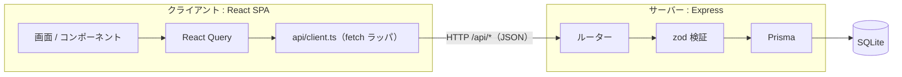
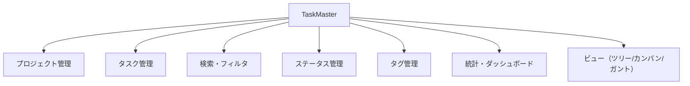
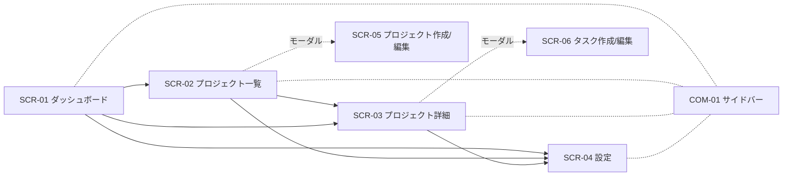
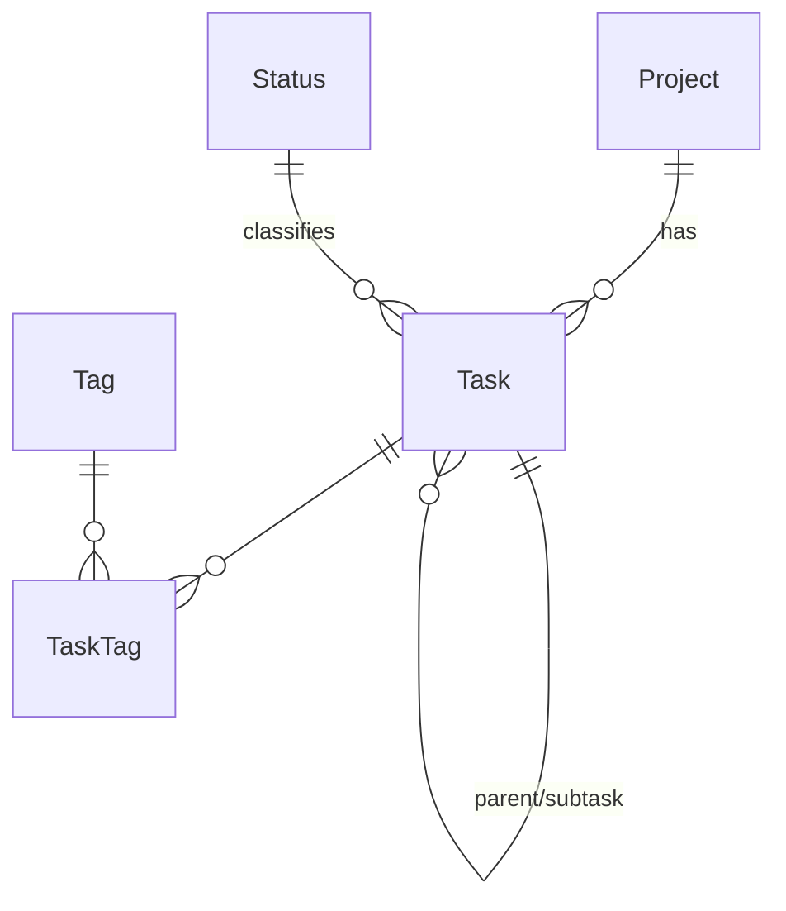

# 基本設計書 — TaskMaster

本書は TaskMaster の基本設計（外部設計）を定義する。要件定義書（`docs/REQUIREMENTS.md`）で定めた要件を、利用者・外部から見える振る舞い（画面・API・データ・エラー）として具体化する。内部実装の詳細（クラス構成・アルゴリズム）は詳細設計の範囲とし、本書では扱わない。記述はリポジトリの現行実装に基づく。

## 目次

- [1. はじめに](#1-はじめに)
- [2. システム方式設計](#2-システム方式設計)
- [3. 機能設計](#3-機能設計)
- [4. 画面設計](#4-画面設計)
- [5. 外部インターフェース設計（API）](#5-外部インターフェース設計api)
- [6. データ設計](#6-データ設計)
- [7. 共通設計（方式）](#7-共通設計方式)
- [8. 非機能設計](#8-非機能設計)
- [9. 制約・課題](#9-制約課題)

---

## 1. はじめに

### 1.1 目的
要件を満たす外部仕様（画面・API・データ・エラー方式）を確定し、実装・テストの基準とする。

### 1.2 適用範囲
TaskMaster のクライアント（React SPA）・サーバー（Express API）・データストア（SQLite）。認証、外部サービス連携、帳票、バッチは対象外。

### 1.3 関連文書

| 文書 | 役割 |
|---|---|
| `docs/REQUIREMENTS.md` | 要件定義（何を作るか。FR-/NFR- ID の親） |
| 本書 `docs/BASIC_DESIGN.md` | 基本設計（外部からどう見えるか） |
| `docs/SCREEN_DESIGN.md` | 画面設計詳細（レイアウト・入出力項目一覧・画面アクション定義） |
| `docs/SYSTEM_DESIGN.md` | システム方式・非機能設計（アーキテクチャ／インフラ／セキュリティ／性能／運用。フェーズ1・2の段階設計） |
| `docs/TEST_DESIGN.md` | テスト方針・ケース |
| `docs/STATIC_ANALYSIS.md` | 静的解析の方針 |
| `README.md` | 全体像・セットアップ |

### 1.4 用語
要件定義書 §3 に準拠（プロジェクト／タスク／サブタスク／ステータス／完了扱い(`isDone`)／優先度／タグ／アーカイブ）。

---

## 2. システム方式設計

本章は外部設計の前提となる方式の**概要**のみを示す。アーキテクチャの詳細（レイヤー責務・方式決定の理由）、インフラ・ネットワーク、セキュリティ、性能・拡張性、運用・可用性、およびフェーズ1（ローカル）／フェーズ2（本番公開）の段階設計は `docs/SYSTEM_DESIGN.md` に定義する。

### 2.1 全体構成

- 開発時：クライアント（Vite, 5173）が `/api/*` をサーバー（3001）へプロキシ。
- 本番時：Vite プロキシは存在しないため、リバースプロキシで静的配信＋`/api` 転送を用意する（フェーズ2 の構成は `docs/SYSTEM_DESIGN.md` §1.4・§2.2 を参照）。

### 2.2 技術方式

| 層 | 技術 | 役割 |
|---|---|---|
| クライアント | React + TypeScript + Vite + Tailwind | 画面描画 |
| 状態管理 | TanStack React Query | サーバー状態のキャッシュ・再取得 |
| ルーティング | react-router-dom | 画面遷移 |
| D&D | @dnd-kit | 並べ替え・ステータス変更 |
| サーバー | Express + TypeScript | REST API |
| 検証 | zod | API 境界での入力検証 |
| ORM | Prisma | DB アクセス |
| DB | SQLite | 永続化 |

### 2.3 処理方式
- サーバー状態は全て React Query 経由で取得・更新し、更新後は関連クエリを invalidate して再取得する（画面とDBの整合を保つ）。
- 全てのAPIリクエストは `api/client.ts` の共通 fetch ラッパを通す（エラー整形を一元化）。
- 一覧の並び順は各行の `order`（整数）で管理し、並べ替えは一括更新APIで反映する。

---

## 3. 機能設計

### 3.1 機能構成

### 3.2 機能一覧

| 機能ID | 機能 | 対応要件 | 対応画面 | 対応API |
|---|---|---|---|---|
| F1 | プロジェクト管理 | FR-P1〜P7 | SCR-02, SCR-05 | API-P* |
| F2 | タスク管理 | FR-T1〜T7 | SCR-03, SCR-06 | API-T* |
| F3 | 検索・フィルタ | FR-F1〜F3 | SCR-03 | API-T1(GET) |
| F4 | ステータス管理 | FR-S1〜S5 | SCR-04 | API-S* |
| F5 | タグ管理 | FR-G1〜G3 | SCR-06 | API-G* |
| F6 | 統計・ダッシュボード | FR-D1〜D7 | SCR-01 | API-ST |
| F7 | ビュー | FR-V1〜V3 | SCR-03 | API-T1(GET) |

---

## 4. 画面設計

本章では画面の一覧・遷移・各画面の概要を定義する。**各画面のレイアウト・入出力項目一覧・画面アクション定義は、分量が大きいため `docs/SCREEN_DESIGN.md`（画面設計書）に分割**して記述する（画面ID・項目IDは両文書で共通）。

### 4.1 画面一覧

| 画面ID | 画面名 | パス | 種別 |
|---|---|---|---|
| SCR-01 | ダッシュボード | `/` | ページ |
| SCR-02 | プロジェクト一覧 | `/projects` | ページ |
| SCR-03 | プロジェクト詳細 | `/projects/:id` | ページ |
| SCR-04 | 設定（ステータス） | `/settings` | ページ |
| SCR-05 | プロジェクト作成/編集 | （モーダル） | モーダル |
| SCR-06 | タスク作成/編集 | （モーダル） | モーダル |
| COM-01 | サイドバー | 共通 | 共通部品 |
| COM-02 | 確認ダイアログ | 共通 | 共通部品（削除確認） |

### 4.2 画面遷移図

### 4.3 SCR-01 ダッシュボード
**概要**: 全プロジェクト横断（非アーカイブ）の統計と、注意すべきタスクを俯瞰する。

**画面項目**

| 項目ID | 項目 | 種別 | 説明 |
|---|---|---|---|
| I-0101 | 統計カード群 | 表示 | 総数・完了率・期限超過・直近期限・直近7日完了・プロジェクト数（FR-D1〜D6） |
| I-0102 | 優先度別件数 | 表示 | 緊急→高→中→低の降順（FR-D7） |
| I-0103 | 期限超過リスト | 表示 | 未完了かつ期限が過去のタスク |
| I-0104 | 直近期限リスト | 表示 | 未完了かつ3日以内のタスク |
| I-0105 | プロジェクトカード | リンク | クリックで SCR-03 へ |

**取得API**: `GET /api/stats`, `GET /api/projects`

### 4.4 SCR-02 プロジェクト一覧
**概要**: プロジェクトの一覧・追加・アーカイブ／復元。

**画面項目**

| 項目ID | 項目 | 種別 | 説明 |
|---|---|---|---|
| I-0201 | プロジェクト追加ボタン | ボタン | SCR-05 を開く |
| I-0202 | アーカイブ表示トグル | チェック | `includeArchived` の切替 |
| I-0203 | プロジェクト行 | リンク | 名称・タスク件数・アーカイブ状態。クリックで SCR-03 |
| I-0204 | アーカイブ/復元ボタン | ボタン | `PATCH /api/projects/:id {archived}` |

**取得/更新API**: `GET /api/projects`, `PATCH /api/projects/:id`

### 4.5 SCR-03 プロジェクト詳細
**概要**: 1プロジェクトのタスクをツリー/カンバン/ガントで表示・編集する。

**画面項目**

| 項目ID | 項目 | 種別 | 必須 | 説明・制約 |
|---|---|---|---|---|
| I-0301 | ビュー切替 | トグル | ○ | ツリー／カンバン／ガント（FR-V1〜V3） |
| I-0302 | 検索キーワード | テキスト | − | title/description 部分一致（FR-F1） |
| I-0303 | ステータス絞り込み | セレクト | − | Status一覧＋「すべて」 |
| I-0304 | 優先度絞り込み | セレクト | − | LOW/MEDIUM/HIGH/URGENT＋「すべて」 |
| I-0305 | タグ絞り込み | セレクト | − | Tag一覧 |
| I-0306 | タスク追加ボタン | ボタン | − | SCR-06 を開く |

**イベント/アクション**

| イベント | 処理概要 |
|---|---|
| ビュー切替 | 選択ビューを再描画。フィルタ未指定時のみツリー構造を維持（FR-F3） |
| D&D（ツリー） | 同一階層内で並べ替え → `PATCH /api/tasks/reorder` |
| D&D（カンバン） | 別列=ステータス変更＋並べ替え／同一列=並べ替え → `PATCH /api/tasks/:id` ＋ reorder |
| タスク/バークリック | SCR-06（編集）を開く |

**取得/更新API**: `GET /api/tasks`, `GET /api/statuses`, `GET /api/tags`, `PATCH /api/tasks/*`

### 4.6 SCR-04 設定（ステータス）
**概要**: ステータスの追加・編集・並べ替え・削除。

**画面項目**

| 項目ID | 項目 | 種別 | 説明・制約 |
|---|---|---|---|
| I-0401 | ステータス行 | 表示/編集 | ラベル・色・完了扱い(isDone)・並べ替えハンドル |
| I-0402 | 追加ボタン | ボタン | `POST /api/statuses` |
| I-0403 | 削除ボタン | ボタン | 使用中/最後の1件は 409（FR-S3/S4） |

**取得/更新API**: `GET/POST/PATCH/DELETE /api/statuses`, `PATCH /api/statuses/reorder`

### 4.7 SCR-05 プロジェクト作成/編集（モーダル）

| 項目ID | 項目 | 種別 | 必須 | 制約 |
|---|---|---|---|---|
| I-0501 | 名称 | テキスト | ○ | 1〜200文字 |
| I-0502 | 説明 | テキストエリア | − | ≤2000文字 |
| I-0503 | 色 | カラー | − | 既定 `#6366f1` |
| I-0504 | 保存/キャンセル | ボタン | − | 保存で作成/更新API |

### 4.8 SCR-06 タスク作成/編集（モーダル）

| 項目ID | 項目 | 種別 | 必須 | 制約 |
|---|---|---|---|---|
| I-0601 | タイトル | テキスト | ○ | 1〜300文字。空/空白のみは送信不可 |
| I-0602 | 説明 | テキストエリア | − | ≤5000文字 |
| I-0603 | ステータス | セレクト | − | 省略時は order 最小 |
| I-0604 | 優先度 | セレクト | − | LOW/MEDIUM/HIGH/URGENT |
| I-0605 | 開始日/期限 | 日付 | − | YYYY-MM-DD（内部で ISO8601 化） |
| I-0606 | 親タスク | セレクト | − | 深さ注釈付き一覧。循環参照は不可 |
| I-0607 | タグ | 複数選択 | − | 既存Tagの付与 |
| I-0608 | 保存/キャンセル | ボタン | − | 保存で作成/更新API |

### 4.9 入力チェック方針
- クライアントで最低限のチェック（タイトル空/空白の送信抑止）を行い、確定的な検証はサーバーの zod に委ねる（二重防御）。
- サーバー検証エラーは 400 として受け、画面はエラー内容を表示する。

---

## 5. 外部インターフェース設計（API）

### 5.1 共通仕様
- 形式：REST / JSON、ベースパス `/api`。
- 成功：取得/作成=200/201、削除=204。失敗：検証=400、未検出=404、制約違反（一意・削除制約）=409。
- ボディは `express.json()` で解析。CORS 有効。

### 5.2 API一覧

| API-ID | メソッド・パス | 概要 |
|---|---|---|
| API-P1 | GET `/api/projects` | 一覧（既定は非アーカイブ、`?includeArchived=true`で全件） |
| API-P2 | POST `/api/projects` | 作成 |
| API-P3 | GET `/api/projects/:id` | 単体取得 |
| API-P4 | PATCH `/api/projects/:id` | 更新（アーカイブ切替含む） |
| API-P5 | PATCH `/api/projects/reorder` | 並べ替え |
| API-P6 | DELETE `/api/projects/:id` | 削除（タスク連鎖削除） |
| API-T1 | GET `/api/tasks` | 一覧（`projectId`/`status`/`priority`/`parentId`/`search`） |
| API-T2 | POST `/api/tasks` | 作成 |
| API-T3 | GET `/api/tasks/:id` | 単体取得 |
| API-T4 | PATCH `/api/tasks/:id` | 更新 |
| API-T5 | PATCH `/api/tasks/:id/move` | 親の付け替え（循環参照拒否） |
| API-T6 | PATCH `/api/tasks/reorder` | 並べ替え（1トランザクション） |
| API-T7 | DELETE `/api/tasks/:id` | 削除（子孫連鎖削除） |
| API-S1〜5 | GET/POST/PATCH/DELETE `/api/statuses`, PATCH `/api/statuses/reorder` | ステータス管理 |
| API-G1〜3 | GET/POST `/api/tags`, DELETE `/api/tags/:id` | タグ管理 |
| API-ST | GET `/api/stats` | 統計（`?projectId`指定＝当該、未指定＝非アーカイブ横断） |
| API-H | GET `/api/health` | 死活確認 `{ok:true}` |

### 5.3 API仕様サンプル：API-T2 タスク作成
**メソッド/パス**: `POST /api/tasks`

**リクエスト（body）**

| 項目 | 型 | 必須 | 制約 |
|---|---|---|---|
| title | string | ○ | 1〜300文字 |
| projectId | string | ○ | 既存プロジェクト |
| description | string | − | ≤5000文字 |
| priority | enum | − | LOW/MEDIUM/HIGH/URGENT（既定 MEDIUM） |
| status | string | − | 既存 Status id。省略時 order 最小 |
| startDate/dueDate | string\|null | − | ISO8601 datetime |
| parentId | string | − | 既存タスク。循環参照不可 |
| tagIds | string[] | − | 既存 Tag id の配列 |

**レスポンス/ステータス**

| ケース | ステータス | 内容 |
|---|---|---|
| 成功 | 201 | 作成タスク（tags 配列整形、order=同階層max+1） |
| 検証エラー | 400 | zod 検証失敗 |
| status 不正 | 400 | "Invalid status" |
| parent 不正 | 400 | "Parent task not found" |

**処理概要**: zod検証 → status/parent 存在確認 → order 採番 → Task＋TaskTag 作成 → 整形返却。

### 5.4 API仕様サンプル：API-ST 統計取得
**メソッド/パス**: `GET /api/stats`（任意クエリ `projectId`）

**レスポンス（body）**

| 項目 | 型 | 説明 |
|---|---|---|
| total | number | タスク総数 |
| byStatus | object | Status id → 件数（全ステータス0埋め） |
| byPriority | object | 優先度 → 件数（4値0埋め） |
| overdue | number | 未完了かつ期限が過去 |
| dueSoon | number | 未完了かつ3日以内 |
| completedLast7Days | number | 完了扱いかつ直近7日更新 |
| completionRate | number | 完了扱い件数÷総数（%、小数第1位） |

**処理概要**: Status を取得し `isDone` の集合を作る → 対象（projectId 指定 or 非アーカイブ）で集計。完了・期限判定は `isDone` を根拠にする（NFR-6）。

---

## 6. データ設計

### 6.1 ER図

### 6.2 テーブル定義

**Project**

| カラム | 型 | NULL | 既定 | 説明 |
|---|---|---|---|---|
| id | String(cuid) | × | 自動 | PK |
| name | String | × | − | 1〜200文字 |
| description | String | ○ | − | ≤2000文字 |
| color | String | × | #6366f1 | 表示色 |
| archived | Boolean | × | false | アーカイブ状態 |
| order | Int | × | 0 | 並び順 |
| createdAt/updatedAt | DateTime | × | 自動 | 監査時刻 |

**Status**

| カラム | 型 | NULL | 既定 | 説明 |
|---|---|---|---|---|
| id | String | × | 自動※ | PK（初期3件は文字列id、追加はcuid） |
| label | String | × | − | 1〜50文字 |
| color | String | × | #64748b | 表示色 |
| order | Int | × | 0 | 並び順 |
| isDone | Boolean | × | false | 完了扱いフラグ |

**Task**

| カラム | 型 | NULL | 既定 | 説明 |
|---|---|---|---|---|
| id | String(cuid) | × | 自動 | PK |
| title | String | × | − | 1〜300文字 |
| description | String | ○ | − | ≤5000文字 |
| status | String(FK→Status) | × | "TODO" | onDelete: Restrict |
| priority | String | × | "MEDIUM" | 区分値 |
| startDate/dueDate | DateTime | ○ | − | 期間 |
| order | Int | × | 0 | 同階層の並び順 |
| projectId | String(FK→Project) | × | − | onDelete: Cascade |
| parentId | String(FK→Task) | ○ | − | 自己参照, onDelete: Cascade |

index: projectId / parentId / status / priority / dueDate

**Tag**

| カラム | 型 | NULL | 既定 | 説明 |
|---|---|---|---|---|
| id | String(cuid) | × | 自動 | PK |
| name | String | × | − | 一意, 1〜50文字 |
| color | String | × | #94a3b8 | 表示色 |

**TaskTag**（中間）

| カラム | 型 | 説明 |
|---|---|---|
| taskId | String(FK→Task) | onDelete: Cascade |
| tagId | String(FK→Tag) | onDelete: Cascade |
| （PK） | (taskId, tagId) | 複合主キー |

### 6.3 コード定義（区分値）

| 区分 | 値 | 備考 |
|---|---|---|
| priority | LOW / MEDIUM / HIGH / URGENT | `server/src/constants.ts`。zod で検証 |
| status | DB管理（固定値でない） | 初期投入: TODO / IN_PROGRESS / DONE ＋ 取下げ。完了・取下げは isDone=true |

---

## 7. 共通設計（方式）

### 7.1 バリデーション方式
- 全APIの入力は zod スキーマ（`server/src/schemas.ts`）で境界検証する。スキーマはルーターとテストで共有する。
- 文字数・型・enum・nullable を境界で検証し、失敗は 400 を返す。

### 7.2 エラーハンドリング方式

| 事象 | ステータス | 例 |
|---|---|---|
| 入力検証エラー | 400 | 文字数超過、型不正、enum外 |
| 業務チェックエラー | 400 | Invalid status / Parent not found / 循環参照 |
| リソース未検出 | 404 | 存在しない id |
| 一意・削除制約 | 409 | タグ名重複、使用中/最後のステータス削除 |

- クライアントは共通 fetch ラッパでエラーを整形し、画面に表示する。

### 7.3 削除・連鎖方式

| 対象 | 方式 |
|---|---|
| Project 削除 | 配下 Task を Cascade 削除 |
| Task 削除 | 子孫 Task を Cascade 削除 |
| Status 削除 | Restrict（使用中は不可）＋「最後の1件」不可 |
| Tag 削除 | TaskTag を Cascade 解除 |

### 7.4 並び順（order）方式
- Project/Task/Status は `order`（整数）で並びを持つ。
- 並べ替えは明示的な `{id, order}[]`（または `ids`）を受け取り、1トランザクションで一括再採番する。

### 7.5 親子移動・循環参照方式
- `PATCH /api/tasks/:id/move` は、対象の子孫（自分自身含む）を辿って新しい親が子孫でないかを確認し、循環になる場合は 400 で拒否する。

---

## 8. 非機能設計

本章は非機能要件（NFR）と実現方式の対応の**要約**である。方式の詳細（セキュリティ対策・性能目標・負荷分散・運用・可用性・フェーズ2計画）は `docs/SYSTEM_DESIGN.md` §3〜§5 に定義する。

| 区分 | 設計方針 | 対応要件 |
|---|---|---|
| 性能 | 集計・絞り込み対象カラムにインデックス付与。個人〜小規模データ量で即応 | NFR-1 |
| 品質 | 単体/統合/E2E の三層テストを維持（`docs/TEST_DESIGN.md`） | NFR-2 |
| 品質 | ESLint（型情報つき+セキュリティ+React Hooks）を CI ゲート化 | NFR-3 |
| 保守性 | ロジックを純関数へ切り出し単体テスト可能に（tree/dnd/gantt/schemas） | NFR-4 |
| 国際化 | UI 表示は日本語で統一 | NFR-5 |
| 完了判定 | `status.isDone` を根拠にしラベルをハードコードしない | NFR-6 |
| セキュリティ | API 境界で zod 検証。認証はスコープ外 | NFR-7 |
| 可用性 | 本番はリバースプロキシ配下で静的配信＋API（構成未確定） | NFR-8 |

---

## 9. 制約・課題

| 項目 | 内容 |
|---|---|
| 認証 | 未対応。単一データストア共有前提 |
| デプロイ構成 | フェーズ2 の方式（CDN＋LB＋PostgreSQL 等）は `docs/SYSTEM_DESIGN.md` に定義済み。具体のデプロイ先（PaaS / Docker / VPS）の選定が未確定 |
| DBスケール | SQLite は単一プロセス前提。高負荷時は PostgreSQL 等を再検討 |
| 日付基準 | 期限超過・ガント範囲はローカル時刻基準で計算 |

---

> 本書は外部設計を対象とする。内部構造（コンポーネント分割・関数設計）や具体的実装は詳細設計／ソースコードを参照。
