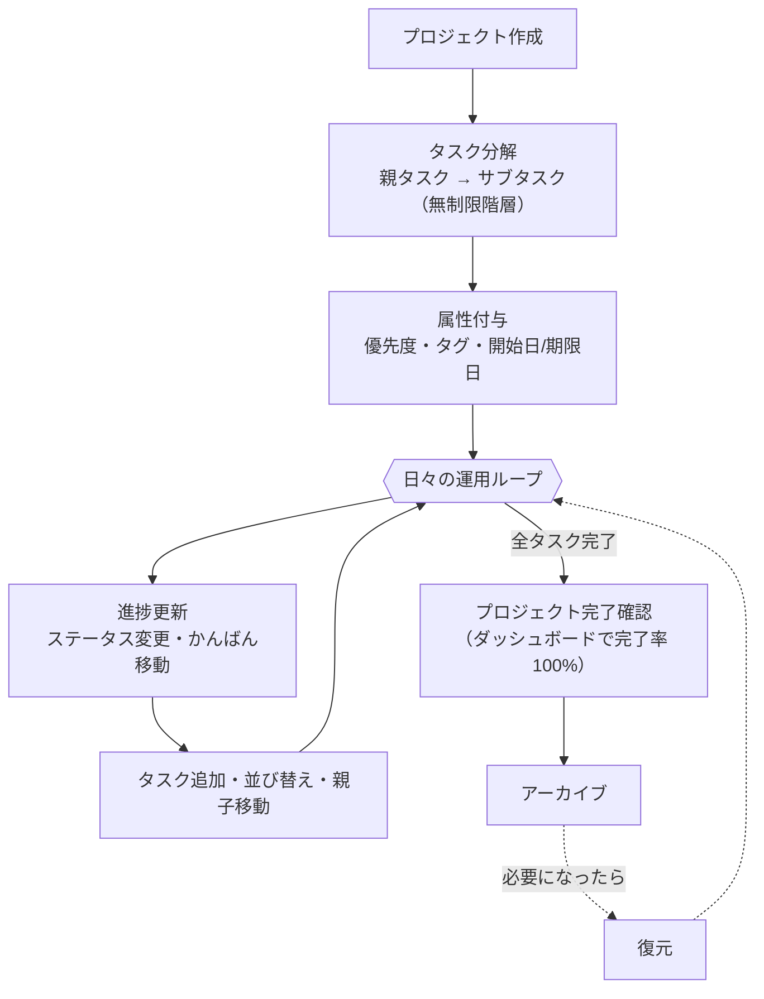
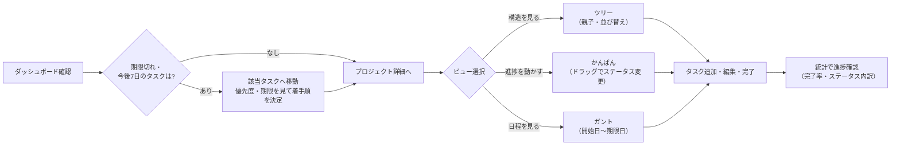
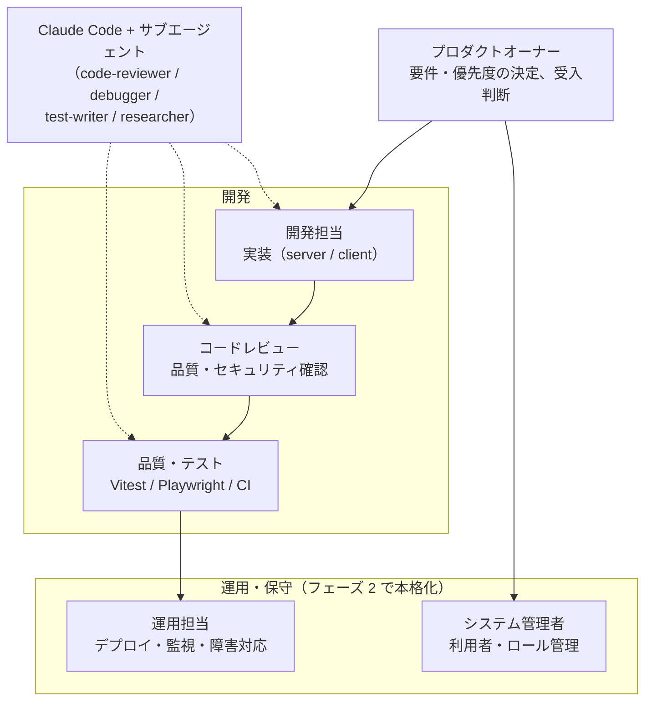

# 要件定義書 — TaskMaster

本書は TaskMaster の要件を定義する。記述はリポジトリの実装（`server/prisma/schema.prisma`・`server/src/routes/*`・`client/src`）に基づく現状仕様であり、実装済み機能と今後の課題を区別して記載する。

## 目次

- [1. 概要](#1-概要)
- [2. スコープ](#2-スコープ)
- [3. 用語定義](#3-用語定義)
- [4. 想定利用者・利用シーン](#4-想定利用者利用シーン)
- [5. 業務フロー](#5-業務フロー)
- [6. 機能要件](#6-機能要件)
- [7. 画面要件](#7-画面要件)
- [8. データ要件](#8-データ要件)
- [9. インターフェース要件（API）](#9-インターフェース要件api)
- [10. 非機能要件](#10-非機能要件)
- [11. 技術要件](#11-技術要件)
- [12. 制約・前提](#12-制約前提)
- [13. 今後の課題（未実装・検討中）](#13-今後の課題未実装検討中)
- [14. プロジェクト体制](#14-プロジェクト体制)

---

## 1. 概要

### 1.1 目的
プロジェクト単位でタスクを階層的に管理し、進捗・期限・優先度を可視化するタスク管理アプリケーション。個人〜小規模チームが、複数プロジェクトのタスクを一元的に把握・整理することを目的とする。

### 1.2 特徴
- **無制限の階層**：タスクはサブタスクを持て、深さの制限がない。
- **ユーザー定義のステータス**：状態（TODO / 進行中 / 完了 / 取下げ 等）を利用者が追加・編集・並べ替えできる。
- **3つのビュー**：ツリー / カンバン / ガントチャートを切り替えて同じデータを閲覧できる。
- **ドラッグ&ドロップ**：並べ替え・ステータス変更を直感的に操作できる。
- **ダッシュボード**：全プロジェクト横断の統計（完了率・期限超過・直近期限）を表示する。
- **日本語 UI**：全ての画面表示は日本語。

---

## 2. スコープ

### 2.1 対象（本アプリで扱う）
- プロジェクトの作成・編集・アーカイブ・並べ替え・削除
- タスク／サブタスクの CRUD、移動、並べ替え、フィルタ・検索
- ステータスのユーザー管理（CRUD・並べ替え・削除制約）
- タグの付与・管理（例：「急ぎ」「家事」「仕事」「要確認」などの横断ラベル）
- 統計ダッシュボード
- ツリー / カンバン / ガントの表示

### 2.2 対象外（現時点で扱わない）
- ユーザー認証・アカウント・権限管理（マルチユーザー非対応。単一のデータストアを共有）
- リアルタイム共同編集・通知・コメント
- 添付ファイル・外部サービス連携
- 監査ログ・変更履歴

---

## 3. 用語定義

| 用語 | 定義 |
|---|---|
| プロジェクト | タスクを束ねる最上位の入れ物。アーカイブ可能。 |
| タスク | 作業項目。プロジェクトに属し、サブタスク（子タスク）を無制限に持てる。 |
| サブタスク | 親タスクを持つタスク。自己参照で表現する。 |
| ステータス | タスクの状態。利用者が定義でき、各ステータスは「完了扱い(`isDone`)」フラグを持つ。 |
| 完了扱い | `isDone=true` のステータス。完了率・期限超過判定の基準になる（"DONE" 文字列は基準にしない）。 |
| 優先度 | LOW / MEDIUM / HIGH / URGENT の4段階。 |
| タグ | タスクに付与する横断的なラベル。ステータス（工程）や優先度と違い、プロジェクトをまたいで自由な観点で分類するために使う。1つのタスクに複数付与できる。 |
| アーカイブ | プロジェクトを一覧・統計の既定表示から除外する状態。データは削除しない。 |

---

## 4. 想定利用者・利用シーン

| 利用者 | 主な利用シーン |
|---|---|
| 個人ユーザー | 複数の私的プロジェクトのタスクを階層で整理し、期限と優先度で管理する。 |
| 小規模チーム | 共有のタスク一覧をカンバンで運用し、ステータスを自チームの運用に合わせて定義する。 |
| 管理・俯瞰役 | ダッシュボードで全プロジェクトの完了率・期限超過を俯瞰する。 |

---

## 5. 業務フロー

利用者の業務の流れを定義する。図は Mermaid で記述している（GitHub 上で描画される）。

### 5.1 プロジェクトライフサイクル（全体フロー）

プロジェクトの立ち上げから完了・アーカイブまでの業務の流れ。

- アーカイブされたプロジェクトは一覧・タスク横断・統計から除外される（アーカイブ込み表示で閲覧可能）
- 削除は連鎖削除（プロジェクト → タスク → サブタスク・タグ紐付け）となるため、業務上は**削除よりアーカイブを推奨**する

### 5.2 日次の利用フロー（利用者の 1 日）

### 5.3 業務イベントと機能要件の対応

| 業務イベント | 業務の内容 | 関連機能要件 |
|---|---|---|
| プロジェクトを始める | プロジェクトを作成し色・説明を設定 | 6.1 プロジェクト管理 |
| 作業を分解する | 親タスクの下にサブタスクを階層で作成 | 6.2 タスク・サブタスク管理 |
| 着手順を決める | 同一階層内でタスクを並び替え | 6.2 タスク・サブタスク管理 |
| 進捗を動かす | かんばんのドラッグ等でステータス変更 | 6.2 / 6.4 / 6.7 |
| 構造を変える | タスクを別の親の下へ移動（循環は拒否） | 6.2 タスク・サブタスク管理 |
| 対象を絞る | キーワード・ステータス・優先度・タグで検索 | 6.3 検索・フィルタ |
| 日程を確認する | ガントで開始日〜期限日を俯瞰 | 6.7 ビュー |
| 進捗を報告する | ダッシュボードの完了率・期限超過を確認 | 6.6 統計・ダッシュボード |
| 区切りをつける | プロジェクトをアーカイブ（統計から除外） | 6.1 プロジェクト管理 |
| 進め方を変える | ステータス定義を追加・並べ替え | 6.4 ステータス管理 |

---

## 6. 機能要件

各要件に ID（FR-xx）を付与する。「状態」は実装状況（✅ 実装済 / △ 一部 / ⬜ 未）。

### 6.1 プロジェクト管理

| ID | 要件 | 状態 |
|---|---|---|
| FR-P1 | プロジェクトを名称・説明・色で作成できる | ✅ |
| FR-P2 | プロジェクトを編集できる | ✅ |
| FR-P3 | プロジェクトをアーカイブ／復元できる | ✅ |
| FR-P4 | アーカイブ済みは一覧・グローバル統計の既定表示から除外される（`includeArchived` で表示可） | ✅ |
| FR-P5 | プロジェクトを並べ替えできる（`order` を一括更新） | ✅ |
| FR-P6 | プロジェクトを削除でき、配下タスクも連鎖削除される | ✅ |
| FR-P7 | 各プロジェクトのタスク件数を表示する | ✅ |

> ※ `order` は表示上の並び順を表す整数（並び順番号）。1 件を動かすと他の行の順番も繰り下がる／繰り上がるため、並べ替え時は関係する全行の `order` を 1 トランザクションでまとめて書き換え、途中失敗による順序の破損を防ぐ。

### 6.2 タスク・サブタスク管理

| ID | 要件 | 状態 |
|---|---|---|
| FR-T1 | タスクを作成できる（タイトル必須、説明・優先度・開始日・期限・親・タグ・ステータス任意） | ✅ |
| FR-T2 | サブタスクを無制限の深さで作成できる | ✅ |
| FR-T3 | タスクを編集・削除できる（削除時は子孫も連鎖削除） | ✅ |
| FR-T4 | タスクを別の親へ移動できる。循環参照（自分自身や子孫を親にする）は拒否する | ✅ |
| FR-T5 | 同一階層内でタスクを並べ替えできる（ドラッグ&ドロップ、`order` 一括更新） | ✅ |
| FR-T6 | ステータス省略時は `order` 最小のステータスを自動採用する | ✅ |
| FR-T7 | 存在しないステータス／親を指定した場合は 400 で拒否する | ✅ |
| FR-T8 | エラー応答（400/404/409）を受けた画面は、エラーメッセージを表示して利用者に理由を伝え、入力内容・画面状態を保持したまま操作を継続できる（**業務を止めない**）。かんばん等の楽観更新は失敗時に元の表示へ自動で巻き戻す | △ |

> ※ `order` は表示上の並び順を表す整数（並び順番号）。同一階層（同じ親を持つタスク群）の中での順番を表し、並べ替え時は関係する全行を 1 トランザクションで一括更新する（§6.1 の注記と同様）。

> FR-T8 の実装状況: 楽観更新の自動巻き戻し（かんばん・並べ替え）とステータス設定画面のエラーメッセージ表示は実装済み。タスク作成・編集フォームでの保存失敗時のメッセージ表示は未実装（現状は巻き戻しのみで、利用者に失敗理由が提示されない）。フェーズ 1 の残課題とする（§13）。

### 6.3 検索・フィルタ

| ID | 要件 | 状態 |
|---|---|---|
| FR-F1 | タイトル・説明の部分一致で検索できる | ✅ |
| FR-F2 | ステータス・優先度・タグで絞り込みできる（AND 条件） | ✅ |
| FR-F3 | フィルタ未指定時はツリー構造を維持、フィルタ適用時はフラットな一致リストに切り替える | ✅ |

### 6.4 ステータス管理

| ID | 要件 | 状態 |
|---|---|---|
| FR-S1 | ステータスを追加・編集（ラベル・色・完了扱い）できる | ✅ |
| FR-S2 | ステータスを並べ替えできる | ✅ |
| FR-S3 | 使用中のステータスは削除できない（使用件数を提示） | ✅ |
| FR-S4 | 最後の1件のステータスは削除できない | ✅ |
| FR-S5 | 初期ステータスとして TODO / 進行中 / 完了 / 取下げ を用意する（完了・取下げは完了扱い） | ✅ |

### 6.5 タグ管理

| ID | 要件 | 状態 |
|---|---|---|
| FR-G1 | タグを作成できる（名称は一意）。タスク作成・編集フォーム内でその場で作成できる | ✅ |
| FR-G2 | タスクにタグを複数付与・差し替えできる | ✅ |
| FR-G3 | タグを削除でき、付与関係も連鎖解除される | △ |

> ※ FR-G3 の実装状況: API（`DELETE /api/tags/:id`）と連鎖解除は実装済みだが、**削除を行う画面が存在しない**（設定画面はステータスのみ管理）。不要になったタグを利用者が画面から整理する手段がなく、タグ管理 UI（一覧・削除）はフェーズ 1 の残課題とする（§13）。なおタグの名前変更は API 自体が未提供。

### 6.6 統計・ダッシュボード

| ID | 要件 | 状態 |
|---|---|---|
| FR-D1 | タスク総数・ステータス別件数・優先度別件数を集計する | ✅ |
| FR-D2 | 完了率を算出する（完了扱いステータスの件数 ÷ 総数） | ✅ |
| FR-D3 | 期限超過（未完了かつ期限が過去）件数を算出する | ✅ |
| FR-D4 | 直近期限（未完了かつ3日以内）件数を算出する | ✅ |
| FR-D5 | 直近7日間の完了件数を算出する | ✅ |
| FR-D6 | 非アーカイブのプロジェクト数を表示する | ✅ |
| FR-D7 | 優先度は緊急→高→中→低の降順で表示する | ✅ |

### 6.7 ビュー

| ID | 要件 | 状態 |
|---|---|---|
| FR-V1 | ツリービュー（階層表示＋階層内ドラッグ並べ替え） | ✅ |
| FR-V2 | カンバンビュー（ステータス列、ドラッグでステータス変更・並べ替え、変更は永続化） | ✅ |
| FR-V3 | ガントチャート（開始日〜期限を日グリッドのバーで表示。片方のみは1日分、両方未設定は非表示） | ✅ |

---

## 7. 画面要件

画面ごとの業務上の役割と主な機能を定義する（業務イベントとの対応は §5.3、レイアウト・項目の詳細は `docs/SCREEN_DESIGN.md` を参照）。

### 7.1 ダッシュボード（`/`）

**業務上の役割**: 利用者が 1 日の最初に開く「今日は何をすべきか」を判断するための画面（§5.2 日次フローの起点）。管理・俯瞰役が全プロジェクトの健全性を確認する場でもある。

| 機能 | 説明 | 関連要件 |
|---|---|---|
| グローバル統計 | 全プロジェクト横断（非アーカイブ）の総数・完了率・ステータス/優先度内訳・直近7日の完了数を表示し、全体の進み具合を一目で掴む | FR-D1〜D7 |
| 期限超過リスト | 未完了かつ期限が過去のタスクを列挙し、火消し対象を明確にする | FR-D3 |
| 直近期限リスト | 3 日以内に期限が来る未完了タスクを列挙し、先回りの着手を促す | FR-D4 |
| プロジェクトカード | 各プロジェクトの概況（タスク件数等）を並べ、詳細画面への入口とする | FR-P7 |

### 7.2 プロジェクト一覧（`/projects`）

**業務上の役割**: プロジェクトの立ち上げ（業務の起点）と、終わったプロジェクトの整理（区切り）を行う管理画面。

| 機能 | 説明 | 関連要件 |
|---|---|---|
| 一覧表示 | 進行中のプロジェクトを表示順どおりに並べる（既定はアーカイブ済みを除外、切替で表示可） | FR-P4 |
| 追加・編集 | 名称・説明・色を設定してプロジェクトを作成・変更する（モーダル） | FR-P1, FR-P2 |
| アーカイブ／復元 | 完了・休止したプロジェクトを一覧・統計から外す。削除と違いデータは残るため、業務上はこちらを推奨（§5.1） | FR-P3 |
| 並べ替え | ドラッグ&ドロップで重要な順・使う順に並べ替える | FR-P5 |
| 削除 | 不要なプロジェクトを配下タスクごと削除する（確認ダイアログあり） | FR-P6 |

### 7.3 プロジェクト詳細（`/projects/:id`）

**業務上の役割**: 日々の作業の中心画面。作業の分解（サブタスク化）から進捗更新までの運用ループ（§5.1）をすべてこの画面で行う。目的に応じて 3 つのビューを切り替える。

| 機能 | 説明 | 関連要件 |
|---|---|---|
| ツリービュー | 親子階層で「作業の構造」を見る。同一階層内のドラッグ並べ替えで着手順を整理する | FR-V1, FR-T5 |
| カンバンビュー | ステータス列で「進捗」を見る。カードのドラッグで進捗を動かす（ステータス変更・列内並べ替えを永続化） | FR-V2 |
| ガントチャート | 開始日〜期限日のバーで「日程」を見る。前後関係・負荷の偏りを確認する | FR-V3 |
| 検索・フィルタ | キーワード・ステータス・優先度・タグで対象を絞る。フィルタ適用中はツリーからフラット表示に切り替わる | FR-F1〜F3 |
| タスク CRUD | タスク・サブタスクの作成／編集／削除。編集モーダルの親ピッカーで別の親へ移動（構造の再編成、循環は拒否） | FR-T1〜T7 |
| プロジェクト統計 | 当該プロジェクトのみの完了率・内訳を表示する | FR-D1〜D2 |

### 7.4 設定（`/settings`）

**業務上の役割**: チーム・個人の「仕事の進め方」をアプリに合わせ込む画面。ここで定義したステータスが、かんばんの列・タスクの状態選択肢・完了率の計算基準になる。

| 機能 | 説明 | 関連要件 |
|---|---|---|
| ステータス追加・編集 | ラベル・色・完了扱い（isDone）を定義する。「完了扱い」は完了率・期限超過判定の基準となるため業務上重要 | FR-S1, FR-S5 |
| 並べ替え | 工程の順（＝かんばんの列順）を入れ替える | FR-S2 |
| 削除 | 不要なステータスを削除する。使用中・最後の 1 件は削除不可（誤操作からの保護） | FR-S3, FR-S4 |

### 7.5 共通（サイドバー・全画面共通事項）

| 項目 | 説明 |
|---|---|
| サイドバー | ダッシュボード／プロジェクト一覧／設定への常設ナビゲーション。プロジェクトへのショートカットを含む |
| 表示言語 | 全ての表示テキストは日本語とする |
| バッジ表示 | 優先度・ステータス・タグは色付きバッジで表示し、一覧上で状態を判別できるようにする |
| 確認ダイアログ | 削除など取り消せない操作の前には確認を挟む |
| エラー表示 | API エラー時は画面にエラーメッセージを表示し、入力内容・画面状態を保持して操作を継続できるようにする（業務を止めない）。楽観更新している画面（かんばん等）は失敗時に元の表示へ自動で巻き戻す（FR-T8） |

---

## 8. データ要件

### 8.1 エンティティ関連
- `Project 1 — N Task`（プロジェクト削除でタスクを連鎖削除）
- `Task` 自己参照 `parentId`（親削除で子孫を連鎖削除、無制限の深さ）
- `Task N — N Tag`（`TaskTag` 中間テーブル、両側連鎖削除）
- `Status 1 — N Task`（`Task.status` は FK。使用中ステータスの削除は制限＝Restrict）

### 8.2 主な属性

| エンティティ | 属性 | 備考 |
|---|---|---|
| Project | name, description?, color, archived, order, createdAt, updatedAt | color 既定 `#6366f1` |
| Status | label, color, order, isDone | `isDone` が完了扱いの基準 |
| Task | title, description?, status(FK), priority, startDate?, dueDate?, order, projectId, parentId?, createdAt, updatedAt | priority 既定 MEDIUM |
| Tag | name(unique), color | |
| TaskTag | taskId, tagId | 複合主キー |

> ※ `order` は表示上の並び順を表す整数（並び順番号）。Project（一覧の表示順）・Status（かんばんの列順）・Task（同一階層内の順番）がそれぞれ持つ。並べ替え操作では関係する全行の `order` を 1 トランザクションで一括更新する。

### 8.3 区分値
- 優先度：`LOW` / `MEDIUM` / `HIGH` / `URGENT`（`server/src/constants.ts` で定義、zod で境界検証）。
- ステータス：DB 管理（固定値ではない）。初期投入の TODO/IN_PROGRESS/DONE は id が同名の文字列、追加分は cuid。

### 8.4 データ制約
- プロジェクト名 1〜200 文字、説明 ≤2000 文字。
- タスクタイトル 1〜300 文字、説明 ≤5000 文字。
- タグ名 1〜50 文字、ステータスラベル 1〜50 文字。
- 開始日・期限は ISO8601 datetime または null。
- いずれも API 境界で zod により検証する。

---

## 9. インターフェース要件（API）

REST/JSON。ベースパス `/api`。主なエンドポイント（業務イベントとの対応は §5.3、機能要件の詳細は §6 を参照）：

### 9.1 プロジェクト（projects）

| メソッド・パス | 用途（業務・機能） | 関連要件 |
|---|---|---|
| GET `/api/projects` | プロジェクト一覧画面・サイドバー・ダッシュボードのプロジェクトカードに表示する一覧を取得する。既定ではアーカイブ済みを除外し「今動いているプロジェクト」だけを返す（`?includeArchived=true` で過去のプロジェクトも含めて取得） | FR-P4 |
| POST `/api/projects` | 新しいプロジェクトを立ち上げる（名称・説明・色を登録）。業務の起点となる操作 | FR-P1 |
| GET `/api/projects/:id` | プロジェクト詳細画面を開く際に、名称・色などの基本情報を取得する | — |
| PATCH `/api/projects/:id` | プロジェクトの名称・説明・色の変更に加え、`archived` の切替でアーカイブ（区切り）／復元を行う | FR-P2, FR-P3 |
| PATCH `/api/projects/reorder` | プロジェクト一覧の表示順をドラッグ&ドロップで入れ替えた結果を保存する（`order` を一括更新） | FR-P5 |
| DELETE `/api/projects/:id` | プロジェクトを完全に削除する。配下の全タスク・サブタスクも連鎖削除されるため、業務上はアーカイブを推奨（§5.1） | FR-P6 |

### 9.2 タスク（tasks）

| メソッド・パス | 用途（業務・機能） | 関連要件 |
|---|---|---|
| GET `/api/tasks` | ツリー／カンバン／ガントの各ビューに表示するタスク群を取得する。`projectId` でプロジェクト単位、`status`・`priority`・`tagId`・`search`（タイトル・説明の部分一致）で「対象を絞る」検索・フィルタに対応。`projectId` 未指定時はアーカイブ済みプロジェクトのタスクを除外して横断取得（ダッシュボードの期限超過・直近期限リスト用） | FR-F1〜F3 |
| POST `/api/tasks` | 作業項目を登録する。`parentId` を指定すると親タスクの下にサブタスクとして作成（作業の分解）。優先度・開始日/期限日・タグも同時に設定できる | FR-T1, FR-T2 |
| GET `/api/tasks/:id` | タスク編集モーダルを開く際に単体の詳細を取得する | — |
| PATCH `/api/tasks/:id` | タスクの内容変更全般：タイトル・説明の修正、ステータス変更（かんばんドラッグの「進捗を動かす」を含む）、優先度・期限の見直し、タグの付け替え | FR-T3 |
| PATCH `/api/tasks/:id/move` | タスクを別の親の下へ付け替える（作業構造の再編成）。自分自身や子孫を親に指定する循環参照はサーバーが拒否する | FR-T4 |
| PATCH `/api/tasks/reorder` | 同一階層内・かんばん列内で並び順を入れ替えた結果を保存する（着手順の整理）。全件を 1 トランザクションで更新し、途中失敗による順序破壊を防ぐ | FR-T5 |
| DELETE `/api/tasks/:id` | タスクを削除する。サブタスク（子孫）も連鎖削除される | FR-T3 |

### 9.3 ステータス（statuses）

| メソッド・パス | 用途（業務・機能） | 関連要件 |
|---|---|---|
| GET `/api/statuses` | かんばんの列構成・タスクフォームの選択肢・設定画面の一覧として、チームの進め方を表すステータス定義を取得する | — |
| POST `/api/statuses` | 自チームの運用に合わせた状態（例:「レビュー中」「取下げ」）を追加する | FR-S1 |
| PATCH `/api/statuses/:id` | ラベル・色・完了扱い（`isDone`）を変更する。`isDone` は完了率・期限超過判定の基準になるため業務上重要 | FR-S1 |
| PATCH `/api/statuses/reorder` | かんばんの列順＝業務の工程順を入れ替える | FR-S2 |
| DELETE `/api/statuses/:id` | 不要になったステータスを削除する。使用中（タスクが紐づく）や最後の 1 件は削除できない（409。誤削除からの業務データ保護） | FR-S3, FR-S4 |

### 9.4 タグ（tags）

| メソッド・パス | 用途（業務・機能） | 関連要件 |
|---|---|---|
| GET `/api/tags` | フィルタ・タスクフォームの選択肢として、横断ラベルの一覧を取得する | — |
| POST `/api/tags` | プロジェクトをまたぐ分類軸（例:「家事」「急ぎ」）を追加する。名称の重複は 409 | FR-G1 |
| DELETE `/api/tags/:id` | タグを廃止する。各タスクへの付与関係も連鎖解除される（タスク本体は残る） | FR-G3 |

### 9.5 統計・死活（stats / health）

| メソッド・パス | 用途（業務・機能） | 関連要件 |
|---|---|---|
| GET `/api/stats` | 進捗報告・俯瞰のための集計を取得する：総数・ステータス別/優先度別内訳・完了率・期限超過・直近期限（3日以内）・直近7日の完了数。`?projectId` 指定で単一プロジェクトの統計（プロジェクト詳細画面）、未指定で非アーカイブ横断の全体統計（ダッシュボード） | FR-D1〜D7 |
| GET `/api/health` | 死活確認（`{ok:true}` を返す）。フェーズ 2 ではロードバランサのヘルスチェックに流用する（`docs/SYSTEM_DESIGN.md` §4.4.3） | — |

### 9.6 共通仕様（エラー・ステータスコード）

- 検証エラー（zod）は 400、対象が存在しない場合は 404、一意制約・削除制約の違反は 409、削除成功は 204。

---

## 10. 非機能要件

| 区分 | ID | 要件 | 現状 |
|---|---|---|---|
| 性能 | NFR-1 | 一覧・統計は個人〜小規模データ量で即応する。集計はインデックス（projectId/parentId/status/priority/dueDate）を利用 | ✅ |
| 品質 | NFR-2 | ユニット/統合 133 件 + E2E 5 件のテストを維持し、全て green | ✅ |
| 品質 | NFR-3 | 静的解析（ESLint：型情報つき + セキュリティ + React Hooks）を CI ゲートとする | ✅（詳細は `docs/STATIC_ANALYSIS.md`） |
| 保守性 | NFR-4 | ロジックを純関数へ切り出し単体テスト可能にする（tree/dnd/gantt/zod schemas） | ✅ |
| 国際化 | NFR-5 | UI 表示は日本語で統一する | ✅ |
| 完了判定 | NFR-6 | 完了・期限判定は `status.isDone` を根拠とし、特定ラベルをハードコードしない | ✅ |
| セキュリティ | NFR-7 | 入力は API 境界で zod 検証する。認証は本バージョンのスコープ外 | △ |
| 可用性 | NFR-8 | 本番はリバースプロキシ配下で静的配信＋API を提供（デプロイ構成は未確定） | ⬜ |

---

## 11. 技術要件

| 層 | 技術 |
|---|---|
| サーバー | Node.js / Express + TypeScript / Prisma / SQLite（`server/dev.db`） |
| クライアント | React + TypeScript / Vite / Tailwind CSS / TanStack React Query / react-router-dom / @dnd-kit / date-fns |
| 検証 | zod（API 境界） |
| テスト | Vitest（単体・統合）/ Supertest（HTTP）/ Playwright（E2E） |
| 構成 | npm workspaces（`server` / `client`） |
| ポート | サーバー 3001 / クライアント 5173（開発時は Vite が `/api` を 3001 へプロキシ） |

---

## 12. 制約・前提

- **単一データストア共有**：認証がなく、全利用者が同一データを閲覧・編集する前提。
- **SQLite**：単一プロセス前提。マルチプロセス・高負荷の本番では PostgreSQL 等の再検討が必要。
- **開発プロキシ**：Vite の `/api` プロキシは開発専用。本番はリバースプロキシ（静的配信＋`/api` 転送）を別途用意する。
- **日付はローカル時刻基準**：期限超過・ガント範囲の計算はローカル時刻で行う。
- **破壊的シード**：`npm run seed` は `dev.db` を初期化する（テスト用 DB とは分離）。

---

## 13. 今後の課題（未実装・検討中）

| 項目 | 内容 |
|---|---|
| デプロイ構成 | 本番デプロイ先（PaaS / Docker / VPS）とリバースプロキシ・DB 永続化方針が未確定 |
| 認証・マルチユーザー | ユーザー管理・権限は未対応 |
| 一部テスト | `ProjectFormModal`・`ConfirmDialog`・`api/client.ts` の単体、`Dashboard`・ツリー並べ替えの E2E が未整備（`docs/TEST_DESIGN.md` §8 参照） |
| エラーメッセージ表示 | タスク作成・編集フォームの保存失敗時に画面へメッセージを表示する対応が未実装（FR-T8 △。現状は楽観更新の巻き戻しのみ） |
| タグ管理 UI | タグの一覧・削除を行う画面が未実装（FR-G3 △。API は実装済みだが呼び出す画面がなく、不要タグを整理できない）。名前変更は API 未提供。設定画面へのタグ管理セクション追加を想定 |
| DB スケール | SQLite → PostgreSQL 移行の要否 |

---

## 14. プロジェクト体制

本プロジェクトの推進体制を役割ベースで定義する（実際の担当者への割り当ては別途管理する。フェーズ 1 では 1 名が複数の役割を兼務し得る）。図中の破線は AI（Claude Code）による支援を表す。

| 役割 | 主な責務 | 対応する仕組み・文書 |
|---|---|---|
| プロダクトオーナー | 要件定義、優先度決定、受入判断 | 本書 |
| 開発担当 | server / client の実装、PR 作成 | `docs/BASIC_DESIGN.md`、`docs/SYSTEM_DESIGN.md` |
| コードレビュー | 変更のレビュー、セキュリティ観点確認 | code-reviewer サブエージェント（`docs/SYSTEM_DESIGN.md` §3.3） |
| 品質・テスト | テスト作成・維持、CI 品質ゲート管理 | `docs/TEST_DESIGN.md`、`docs/STATIC_ANALYSIS.md` |
| 運用担当（フェーズ 2） | デプロイ、監視、バックアップ、障害対応 | `docs/SYSTEM_DESIGN.md` §5 |
| システム管理者（フェーズ 2） | アプリ上の利用者・ロール管理、全体是正 | `docs/SYSTEM_DESIGN.md` §3.5 |

- **フェーズ 1** は開発中心（運用は個人利用のため軽微）。上表の運用系役割はフェーズ 2 で本格的に立ち上げる
- AI（Claude Code とサブエージェント）は開発・レビュー・テストを**支援**する位置づけで、最終的な判断・承認は人間の各役割が担う
- システム管理者ロールの権限範囲は `docs/SYSTEM_DESIGN.md` §3.5 を参照（インフラ/OS 管理や開発時の Claude 権限とは別概念）。開発プロセスの統制（AI 権限・静的解析・レビュー・CI）は同書 §3.3 を参照

---

> 関連ドキュメント：全体像は `README.md`、基本設計は `docs/BASIC_DESIGN.md`、画面設計詳細は `docs/SCREEN_DESIGN.md`、システム方式・非機能設計は `docs/SYSTEM_DESIGN.md`、テスト方針は `docs/TEST_DESIGN.md`、静的解析は `docs/STATIC_ANALYSIS.md` を参照。
