# 画面キャプチャ集 — TaskMaster

本書は**実画面のスクリーンショット集**であり、[画面設計書 `SCREEN_DESIGN.md`](SCREEN_DESIGN.md)（レイアウト・入出力項目・アクション定義）と対になる。設計書が「仕様（どう作るか）」、本書が「実物（どう見えるか）」を担当し、両者は画面ID（`SCR-xx`／`COM-xx`）で対応する。

- 画像はライトテーマ・シードデータ（`npm run seed`）・撮影日 2026-10-05 時点のもの。
- 撮影環境: ビューポート 1360×860 / 2倍解像度（Chromium）。
- 再撮影は dev サーバー起動後にリポジトリルートで `node scripts/capture-screens.mjs` を実行（`docs/images/*.png` を上書き）。UI変更時はこのスクリプトで一括更新する。

## 対応表（設計書 ↔ キャプチャ）

| 画面ID | 画面名 | キャプチャ | 設計書セクション |
|---|---|---|---|
| SCR-01 | ダッシュボード | 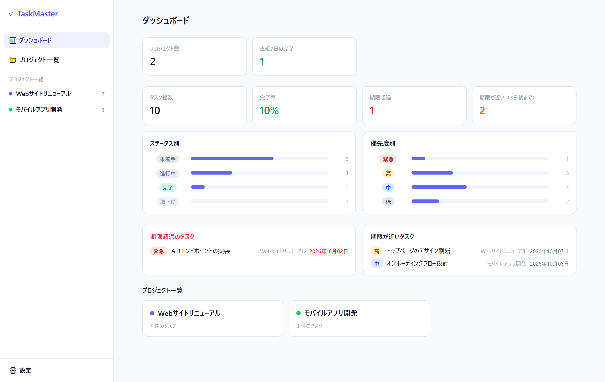 | [SCR-01](SCREEN_DESIGN.md#scr-01-ダッシュボード) |
| SCR-02 | プロジェクト一覧 | 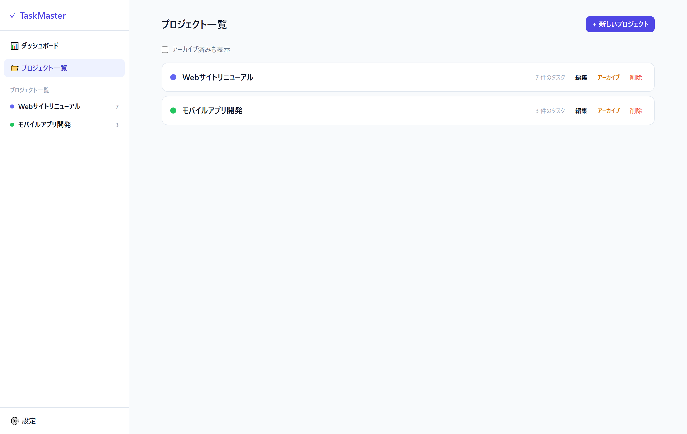 | [SCR-02](SCREEN_DESIGN.md#scr-02-プロジェクト一覧) |
| SCR-03 | プロジェクト詳細（ツリー／カンバン／ガント） | 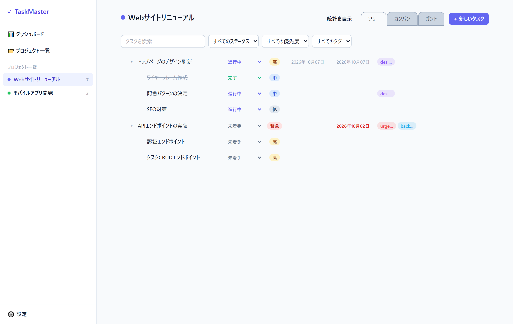 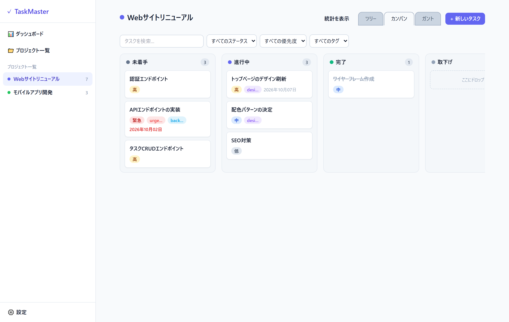 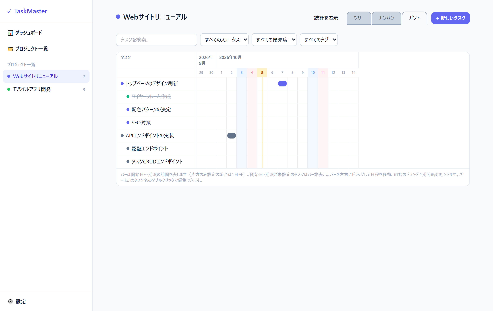 | [SCR-03](SCREEN_DESIGN.md#scr-03-プロジェクト詳細) |
| SCR-04 | 設定（ステータス・祝日・タグ・言語） | 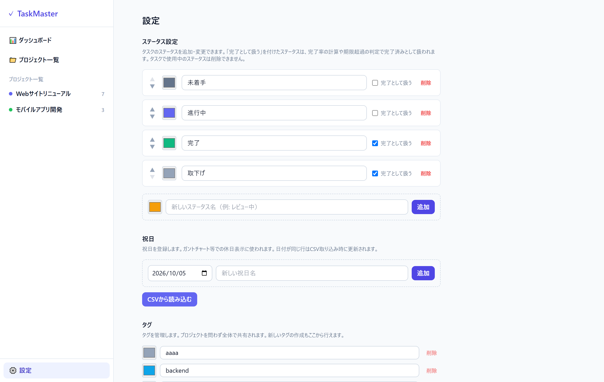 | [SCR-04](SCREEN_DESIGN.md#scr-04-設定ステータス祝日タグ言語) |
| SCR-05 | プロジェクト作成/編集モーダル | 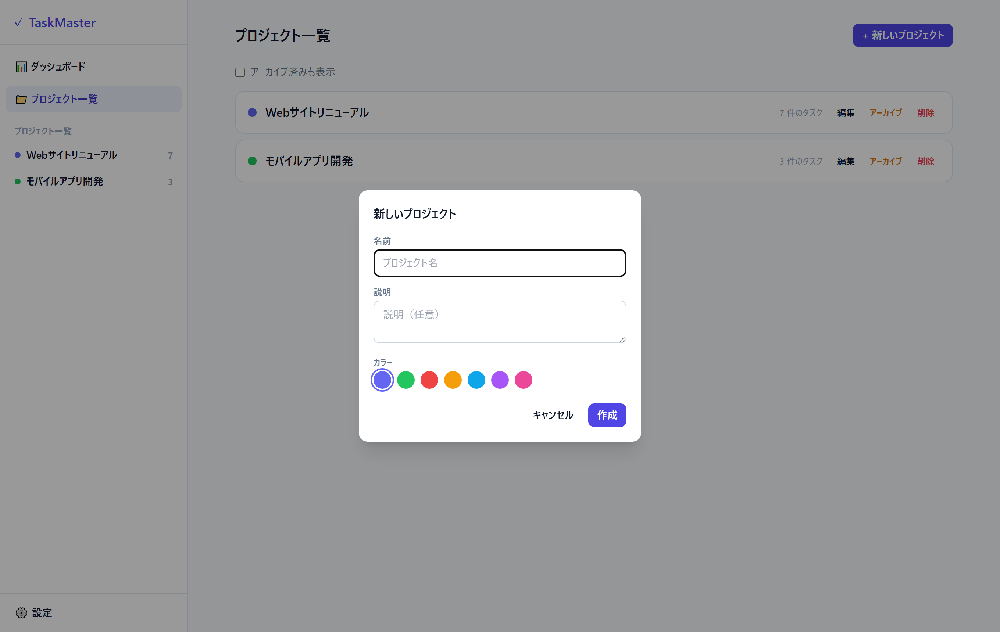 | [SCR-05](SCREEN_DESIGN.md#scr-05-プロジェクト作成編集モーダル) |
| SCR-06 | タスク作成/編集モーダル | 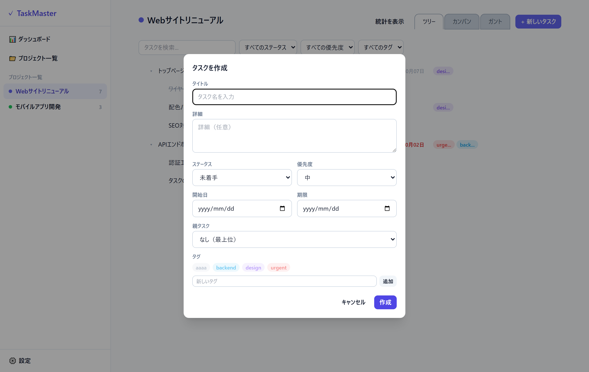 | [SCR-06](SCREEN_DESIGN.md#scr-06-タスク作成編集モーダル) |
| COM-01 | サイドバー | 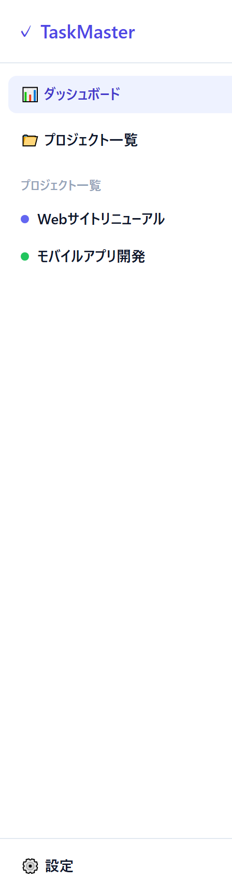 | [COM-01](SCREEN_DESIGN.md#com-01-サイドバー) |
| COM-02 | 確認ダイアログ | 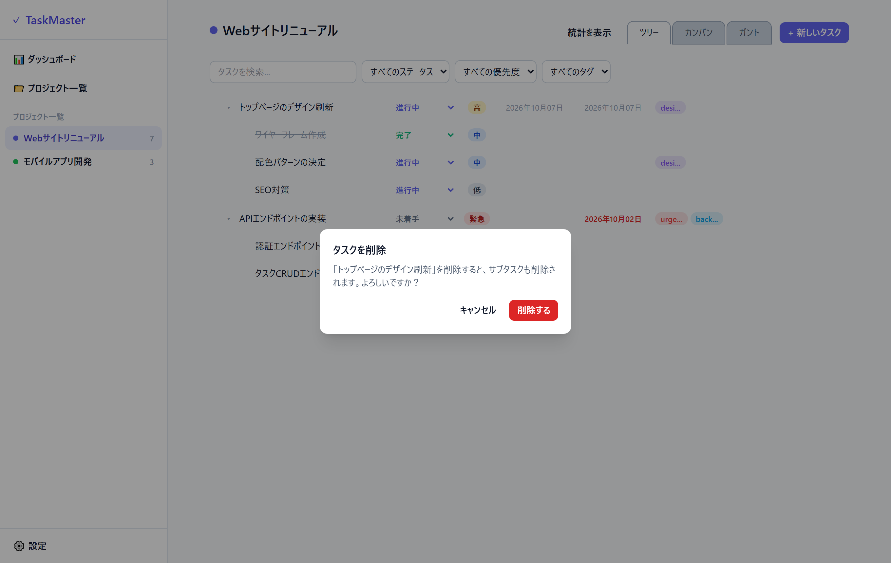 | [COM-02](SCREEN_DESIGN.md#com-02-確認ダイアログ) |
| COM-03 | エラーダイアログ | 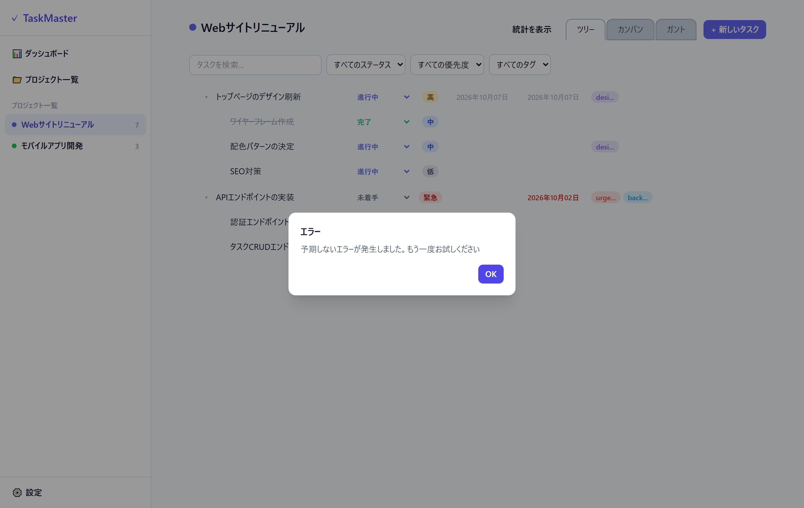 | [COM-03](SCREEN_DESIGN.md#com-03-エラーダイアログ) |

---

## SCR-01 ダッシュボード

パス `/`。全プロジェクト横断の統計カード（総数・完了率・期限超過・期限が近い（3日後まで） ほか）、ステータス別／優先度別バー、期限超過・期限が近いタスク、プロジェクト一覧。
設計: [SCREEN_DESIGN.md#scr-01](SCREEN_DESIGN.md#scr-01-ダッシュボード)

## SCR-02 プロジェクト一覧

パス `/projects`。プロジェクトの一覧・追加・編集・アーカイブ／復元・削除。
設計: [SCREEN_DESIGN.md#scr-02](SCREEN_DESIGN.md#scr-02-プロジェクト一覧)

## SCR-03 プロジェクト詳細（ツリー）

パス `/projects/:id`。既定のツリー表示。階層タスク・フィルタバー・紙のタブ（ツリー／カンバン／ガント）の切替。
設計: [SCREEN_DESIGN.md#scr-03](SCREEN_DESIGN.md#scr-03-プロジェクト詳細)

## SCR-03 プロジェクト詳細（カンバン）

ステータス列×カード。列間ドラッグでステータス変更、列内ドラッグで並べ替え。

## SCR-03 プロジェクト詳細（ガント）

日グリッド上に開始日〜期限のバー、今日の線、土日・祝日の色分け。バーのドラッグで日程の変更、ダブルクリックで編集。

## SCR-04 設定（ステータス・祝日・タグ・言語）

パス `/settings`。ステータス（追加・編集・並べ替え（▲▼）・削除、`isDone`（完了として扱う）の切替）、祝日（CSV 取り込みを含む）、タグ、表示言語。
設計: [SCREEN_DESIGN.md#scr-04](SCREEN_DESIGN.md#scr-04-設定ステータス祝日タグ言語)

## SCR-05 プロジェクト作成/編集モーダル

SCR-02 から開く。名前・説明・カラー（7色）。
設計: [SCREEN_DESIGN.md#scr-05](SCREEN_DESIGN.md#scr-05-プロジェクト作成編集モーダル)

## SCR-06 タスク作成/編集モーダル

SCR-03 から開く。タイトル・詳細・ステータス・優先度・開始日／期限・親タスク・タグ。
設計: [SCREEN_DESIGN.md#scr-06](SCREEN_DESIGN.md#scr-06-タスク作成編集モーダル)

## COM-01 サイドバー

全画面共通の左ナビ（ロゴ・ダッシュボード・プロジェクト一覧・設定、アーカイブしていないプロジェクトのリンク）。
設計: [SCREEN_DESIGN.md#com-01](SCREEN_DESIGN.md#com-01-サイドバー)

## COM-02 確認ダイアログ

削除・アーカイブ・復元（プロジェクト・タスク・タグ）の共通確認モーダル。連鎖削除の影響を明示。
設計: [SCREEN_DESIGN.md#com-02](SCREEN_DESIGN.md#com-02-確認ダイアログ)

## COM-03 エラーダイアログ

一覧・ビュー上の操作の失敗や、想定外のエラーを知らせる共通モーダル（図は、ステータス変更の保存に失敗した例）。
設計: [SCREEN_DESIGN.md#com-03](SCREEN_DESIGN.md#com-03-エラーダイアログ)

---

> レイアウト・入出力項目・アクション定義は [`docs/SCREEN_DESIGN.md`](SCREEN_DESIGN.md) を参照。
