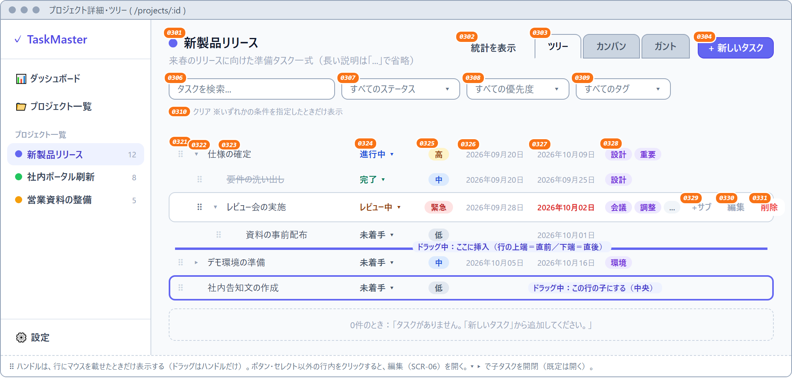
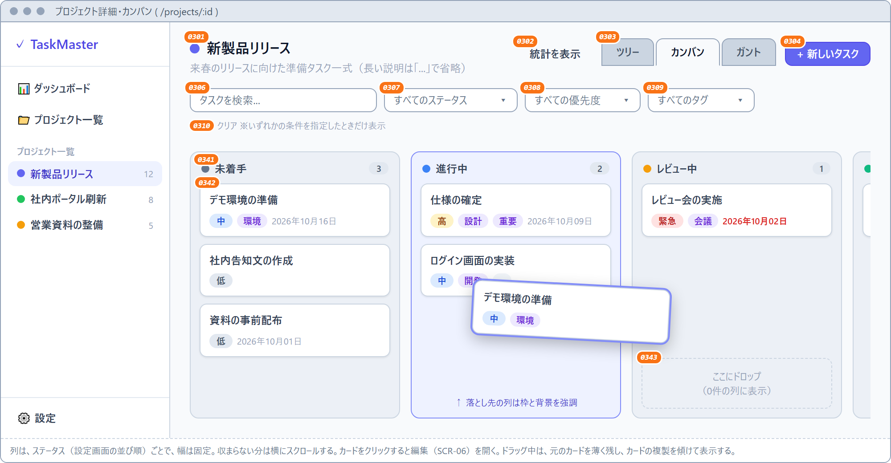
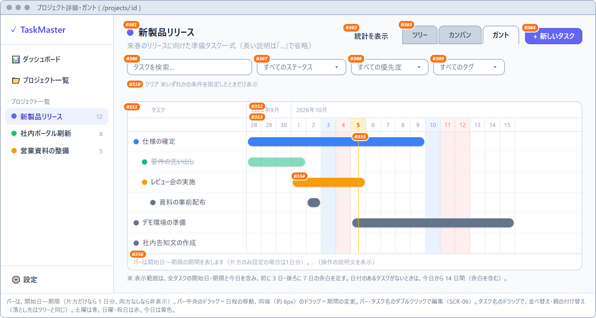
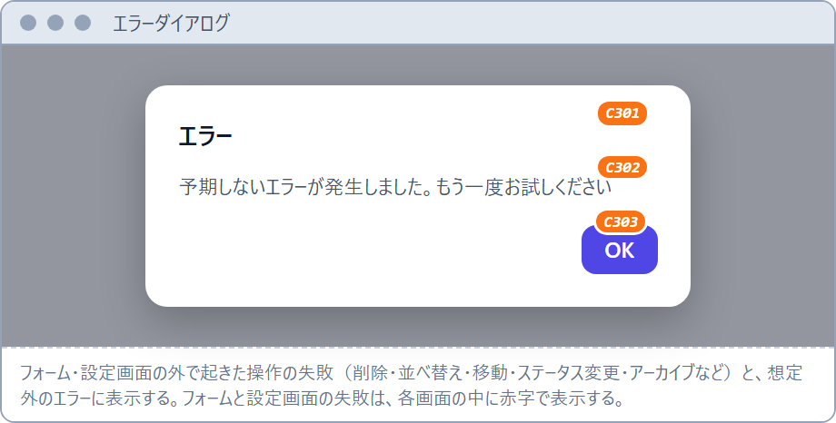

# 画面設計書（現状仕様） — TaskMaster

> **位置づけ**: 本書は、**実装済みのクライアント（`client/src/pages`・`client/src/components`）を読み取って起こした、現状の仕様書**である（実装より前に決めた設計ではない）。実装を変更したときは、本書も合わせて更新する。レイアウト図（`scripts/wireframes/*.html`）も、実装の見た目を写した略図である。

本書は基本設計書（`docs/BASIC_DESIGN.md`）§4 画面設計の詳細編として、各画面の**レイアウト・入出力項目一覧・アクション定義**を記述する。画面一覧・画面遷移図・入力チェック方針は基本設計書 §4 を参照。**実画面のスクリーンショット**は画面キャプチャ集（[`docs/SCREEN_CAPTURES.md`](SCREEN_CAPTURES.md)）を参照。画面ID（`SCR-xx`／`COM-xx`）で対応する。

## 目次

- [記法](#記法)
- [共通の表示ルール](#共通の表示ルール)
- [SCR-01 ダッシュボード](#scr-01-ダッシュボード)
- [SCR-02 プロジェクト一覧](#scr-02-プロジェクト一覧)
- [SCR-03 プロジェクト詳細](#scr-03-プロジェクト詳細)
- [SCR-04 設定（ステータス・祝日・タグ・言語）](#scr-04-設定ステータス祝日タグ言語)
- [SCR-05 プロジェクト作成/編集モーダル](#scr-05-プロジェクト作成編集モーダル)
- [SCR-06 タスク作成/編集モーダル](#scr-06-タスク作成編集モーダル)
- [COM-01 サイドバー](#com-01-サイドバー)
- [COM-02 確認ダイアログ](#com-02-確認ダイアログ)
- [COM-03 エラーダイアログ](#com-03-エラーダイアログ)

## 記法

- **入出力**: `出` = 表示のみ／`入` = 入力のみ／`入出` = 表示かつ変更可。
- **項目ID**: `I-<画面番号><連番>`、**アクションID**: `AC-<画面番号><連番>`。
- レイアウト図は構成を示すワイヤーフレームであり、寸法・配色の細部は Tailwind 実装に従う。**図の中の橙色の番号は、入出力項目一覧の項目ID（`I-` を除いた数字）**に対応する（例: 図の `0101` ＝ `I-0101`）。
- レイアウト図の原本は `scripts/wireframes/*.html`（共通部品は `common.css`・`common.js`）で、PNG 画像として埋め込む。原本を編集したら `node scripts/render-wireframes.mjs` で `docs/images/wf-*.png` を再生成する。
- データ源の API は基本設計書 §5 の API-ID を併記する。

## 共通の表示ルール

| 項目 | ルール |
|---|---|
| 日付の表示 | 表示言語に従う。日本語は `2026年10月05日`、英語は `2026-10-05`。保存されている日付部分（先頭10文字）をそのまま使うので、タイムゾーンで表示がずれない |
| 期限超過の判定 | 期限日が**今日より前**（今日が期限のものは含まない）かつ未完了。期限を赤字・太字で表示する |
| 期限が近い判定 | 期限日が**本日〜3日後（4日間）**かつ未完了 |
| 未完了 | ステータスの「完了として扱う」（`isDone`）が OFF のもの。完了のタスクは、タイトルに取り消し線を付ける |
| 長い名前の省略 | プロジェクト名・タスク名・説明は、1行に収まらない分を「...」で省略し、マウスを載せると全文を表示する |
| タグの表示 | 一覧・カード上は、先頭から最大2件、名前は4文字まで（超えたら「...」）。隠れたタグがあるときは「...」のピルを添え、マウスオーバーで全タグ名を表示する |
| 入力欄の文字数 | 入力欄に上限（`maxlength`）を設定し、超える入力はできない（`client/src/constants/limits.ts`。サーバーの zod と同じ値） |
| エラーの表示 | フォーム（SCR-05/06）と設定画面（SCR-04）の失敗は、画面の中に赤字で表示する。それ以外の操作の失敗は、COM-03 に表示する（詳細は基本設計書 §7.2） |
| 表示言語 | 日本語／English。設定画面で切り替え、全画面に即時に反映する |

---

## SCR-01 ダッシュボード

パス `/`。全プロジェクト横断（アーカイブしていないもの）の統計と、注意すべきタスクを俯瞰する。

### 画面レイアウト

### 入出力項目一覧

| 項目ID | 項目名 | 入出力 | 種別 | 内容・制約 | データ源 |
|---|---|---|---|---|---|
| I-0101 | プロジェクト数 | 出 | カード | アーカイブしていないプロジェクトの件数 | API-P1 |
| I-0102 | 直近7日の完了 | 出 | カード | `completedLast7Days`。緑字 | API-ST |
| I-0103 | タスク総数 | 出 | カード | `total` | API-ST |
| I-0104 | 完了率 | 出 | カード | `completionRate`（%表示）。緑字 | API-ST |
| I-0105 | 期限超過 | 出 | カード | `overdue`。1件以上で赤字 | API-ST |
| I-0106 | 期限が近い（3日後まで） | 出 | カード | `dueSoon`（本日〜3日後の未完了件数）。琥珀色 | API-ST |
| I-0107 | ステータス別 | 出 | バー表示 | ステータス（設定の並び順）ごとの件数と、全体に対する割合のバー | API-ST, API-S1 |
| I-0108 | 優先度別 | 出 | バー表示 | 緊急 → 高 → 中 → 低の順 | API-ST |
| I-0109 | 期限超過のタスク | 出 | リスト | 未完了かつ期限超過。期限の昇順・最大8件。優先度バッジ・タイトル・プロジェクト名・期限（赤字）。0件のときは「期限超過のタスクはありません」 | API-T1, API-S1, API-P1 |
| I-0110 | 期限が近いタスク | 出 | リスト | 未完了かつ期限が本日〜3日後。期限の昇順・最大8件。0件のときは「予定されているタスクはありません」 | API-T1, API-S1, API-P1 |
| I-0111 | プロジェクトカード | 出 | リンクカード | 色ドット・名称・「n 件のタスク」。0件のときは案内文（「まだプロジェクトがありません。…」） | API-P1 |

### 画面アクション定義

| アクションID | トリガー | 処理概要 | 使用API | 結果・遷移 |
|---|---|---|---|---|
| AC-0101 | 画面表示 | 統計・プロジェクト・タスク・ステータスを取得して描画 | API-ST, API-P1, API-T1, API-S1 | — |
| AC-0102 | プロジェクトカード クリック | — | — | SCR-03 へ遷移 |

---

## SCR-02 プロジェクト一覧

パス `/projects`。プロジェクトの一覧・追加・編集・アーカイブ／復元・削除。**プロジェクトの作成・編集・削除は、この画面で行う**（サイドバーには操作ボタンを置かない）。

### 画面レイアウト

### 入出力項目一覧

| 項目ID | 項目名 | 入出力 | 種別 | 内容・制約 | データ源 |
|---|---|---|---|---|---|
| I-0201 | 新しいプロジェクト | 入 | ボタン | SCR-05（作成モード）を開く | — |
| I-0202 | アーカイブ済みも表示 | 入出 | チェック | ON で `includeArchived=true` を付けて再取得。既定 OFF | API-P1 |
| I-0203 | プロジェクト行 | 出 | 行 | 色ドット・名称（SCR-03 へのリンク）・説明（1行）・「n 件のタスク」。アーカイブ済みは半透明で「アーカイブ済み」バッジ付き。0件のときは破線枠の案内文 | API-P1 |
| I-0204 | 編集 | 入 | ボタン | SCR-05（編集モード）を開く | — |
| I-0205 | アーカイブ／復元 | 入 | ボタン | COM-02（確認）を開く。アーカイブ済みの行は「復元」と表示 | — |
| I-0206 | 削除 | 入 | ボタン | COM-02（確認）を開く。配下のタスクも削除される旨を表示 | — |

### 画面アクション定義

| アクションID | トリガー | 処理概要 | 使用API | 結果・遷移 |
|---|---|---|---|---|
| AC-0201 | 画面表示 | プロジェクト一覧を取得（既定はアーカイブしていないもの） | API-P1 | — |
| AC-0202 | I-0202 変更 | `includeArchived` を切り替えて再取得 | API-P1 | 一覧更新 |
| AC-0203 | 名称リンク クリック | — | — | SCR-03 へ遷移 |
| AC-0204 | SCR-05 で保存（作成） | プロジェクトを作成して一覧を再取得。失敗したらモーダルを閉じず、理由をモーダル内に表示 | API-P2 | モーダル閉、一覧更新 |
| AC-0205 | SCR-05 で保存（編集） | プロジェクトを更新して一覧を再取得。失敗時は同上 | API-P4 | モーダル閉、一覧更新 |
| AC-0206 | I-0205 → COM-02 で確定 | `{archived: !archived}` で更新。失敗したら COM-03 | API-P4 | 一覧更新（非表示化／再表示） |
| AC-0207 | I-0206 → COM-02 で確定 | プロジェクトを削除（配下のタスクも連鎖削除）。失敗したら COM-03 | API-P6 | ダイアログ閉、一覧更新 |

---

## SCR-03 プロジェクト詳細

パス `/projects/:id`。1プロジェクトのタスクを、ツリー／カンバン／ガントで表示・編集する。上部（ヘッダー・統計・フィルタ）は3つの表示で共通で、タスク表示領域だけが切り替わる。

### 画面レイアウト（ツリー）

### 画面レイアウト（カンバン）

### 画面レイアウト（ガント）

### 入出力項目一覧（共通部分）

| 項目ID | 項目名 | 入出力 | 種別 | 内容・制約 | データ源 |
|---|---|---|---|---|---|
| I-0301 | プロジェクト情報 | 出 | ヘッダー | 色ドット・名称・説明。長い名称・説明は「...」で省略（ボタンを押しのけない） | API-P1 |
| I-0302 | 統計を表示／隠す | 入出 | ボタン | ON で I-0305 を表示。既定 OFF。表示中のラベルは「統計を隠す」 | — |
| I-0303 | ビュー切替 | 入出 | 紙のタブ | ツリー／カンバン／ガント。選択中のタブは本体と同じ背景色、非選択は濃いグレー。既定はツリー | — |
| I-0304 | 新しいタスク | 入 | ボタン | SCR-06（作成モード・親なし）を開く | — |
| I-0305 | 統計 | 出 | カード・バー | このプロジェクトの統計（SCR-01 の I-0103〜I-0108 と同じ項目） | API-ST |
| I-0306 | 検索 | 入 | テキスト | タイトル・詳細の部分一致 | API-T1 |
| I-0307 | ステータス絞り込み | 入 | セレクト | 「すべてのステータス」＋ステータス一覧 | API-S1 |
| I-0308 | 優先度絞り込み | 入 | セレクト | 「すべての優先度」＋低／中／高／緊急 | — |
| I-0309 | タグ絞り込み | 入 | セレクト | 「すべてのタグ」＋`#タグ名` の一覧 | API-G1 |
| I-0310 | クリア | 入 | ボタン | いずれかの条件を指定したときだけ表示。全条件をリセット | — |
| I-0311 | タスク表示領域 | 出 | ツリー／カンバン／ガント | 条件なし＝全タスク。条件あり＝一致したタスクだけ（親が一致しないタスクは最上位として表示）。3つの表示で同じ条件を使う | API-T1 |

### 入出力項目一覧（ツリー）

行にマウスを載せたときだけ、ハンドル（⠿）と右端のボタンを表示する。

| 項目ID | 項目名 | 入出力 | 種別 | 内容・制約 | データ源 |
|---|---|---|---|---|---|
| I-0321 | ドラッグハンドル（⠿） | 入 | ハンドル | これを掴んで並べ替え・親の付け替え。5px 動くまではドラッグにしない。クリックしても編集は開かない | — |
| I-0322 | 開閉（▾／▸） | 入出 | ボタン | 子タスクの表示／非表示。既定は表示。子がない行には出さない | — |
| I-0323 | タイトル | 出 | テキスト | 深さ1段につき 24px 字下げ。完了は取り消し線。長いタイトルは「...」で省略 | API-T1 |
| I-0324 | ステータス | 入出 | セレクト | 色付きの文字。変更すると即時に保存 | API-T4, API-S1 |
| I-0325 | 優先度 | 出 | バッジ | 低／中／高／緊急 | API-T1 |
| I-0326 | 開始日 | 出 | テキスト | 共通の日付表示。未設定は空欄 | API-T1 |
| I-0327 | 期限 | 出 | テキスト | 期限超過は赤字・太字。未設定は空欄 | API-T1 |
| I-0328 | タグ | 出 | ピル | 共通のタグ表示ルールに従う | API-T1 |
| I-0329 | +サブ | 入 | ボタン | SCR-06（作成モード・親＝この行）を開く | — |
| I-0330 | 編集 | 入 | ボタン | SCR-06（編集モード）を開く | — |
| I-0331 | 削除 | 入 | ボタン | COM-02（確認）を開く。サブタスクも削除される旨を表示 | — |

0件のときは、破線枠に「タスクがありません。「新しいタスク」から追加してください。」を表示する。

**ドラッグの落とし先**: 落とす行の上端 25％＝その行の直前（兄弟として挿入）、下端 25％＝その行の直後、中央 50％＝その行の子にする（最後の子）。挿入位置は青い線、子にする行は青い枠で示す。自分自身と自分の子孫の下には落とせない（何も起きない）。フィルタ中でも、全タスクを基準に並びを計算する。

### 入出力項目一覧（カンバン）

| 項目ID | 項目名 | 入出力 | 種別 | 内容・制約 | データ源 |
|---|---|---|---|---|---|
| I-0341 | 列ヘッダー | 出 | ヘッダー | 色ドット・ステータス名・件数バッジ。列はステータス（設定の並び順）ごとで、幅は固定。収まらない分は横にスクロール | API-S1 |
| I-0342 | カード | 入出 | カード | タイトル（完了は取り消し線）・優先度・タグ・期限（超過は赤字）。クリックで SCR-06（編集モード）を開く。ドラッグで列間移動・並べ替え | API-T1 |
| I-0343 | 空の列の案内 | 出 | 破線枠 | カードが0件の列に「ここにドロップ」を表示 | — |

ドラッグ中は、元のカードを薄く残し、カードの複製を傾けて表示する。落とした直後のクリックは、編集として扱わない。ドラッグは 5px 動いたら開始する。

### 入出力項目一覧（ガント）

| 項目ID | 項目名 | 入出力 | 種別 | 内容・制約 | データ源 |
|---|---|---|---|---|---|
| I-0351 | タスク名列 | 入出 | 行ラベル | ステータス色のドット＋タイトル（深さ1段につき字下げ。完了は取り消し線）。横スクロールしても左端に固定。ダブルクリックで SCR-06（編集モード）。ドラッグで並べ替え・親の付け替え（落とし先はツリーと同じ。挿入位置は線、子にする行は枠で示す） | API-T1, API-S1 |
| I-0352 | 月ヘッダー | 出 | ヘッダー | 月ごとの見出し（日本語は `2026年10月`、英語は `Oct 2026`） | — |
| I-0353 | 日ヘッダー | 出 | ヘッダー | 日付。土曜は青、日曜・祝日は赤、今日は黄色で強調。祝日はマウスオーバーで名称を表示。本体の行も同じ色で薄く塗る | API-H1 |
| I-0354 | バー | 入出 | バー | 開始日〜期限の期間（片方だけなら1日分。両方なしなら非表示）。色はステータス色（完了は半透明）。中央のドラッグ＝日程の移動、両端（約6px）のドラッグ＝期間の変更（最小1日）。ダブルクリックで SCR-06。マウスオーバーでタイトルと期間を表示 | API-T4 |
| I-0355 | 今日の線 | 出 | 縦線 | 今日の位置に琥珀色の縦線 | — |
| I-0356 | 操作の説明文 | 出 | テキスト | バーの意味と、ドラッグ・ダブルクリックの操作を説明 | — |

表示範囲は、全タスクの開始日・期限と今日を含み、前に3日・後ろに7日の余白を足す（日付のあるタスクがないときは、今日から14日間）。1日の幅は 28px。ドラッグを離した直後のダブルクリックは、編集として扱わない。0件のときは「タスクがありません。」を表示する。

### 画面アクション定義

| アクションID | トリガー | 処理概要 | 使用API | 結果・遷移 |
|---|---|---|---|---|
| AC-0301 | 画面表示 | プロジェクト・タスク（全件）・タグ・統計を取得。条件を指定すると、絞り込み済みの一覧も取得 | API-P1, API-T1, API-G1, API-ST | — |
| AC-0302 | I-0303 クリック | 選択した表示へ切り替え（データは再取得しない） | — | 表示切替 |
| AC-0303 | I-0306〜I-0309 変更 | 条件に合うタスクを再取得して表示 | API-T1 | 一覧更新 |
| AC-0304 | ツリー：I-0324 変更 | `{status}` で更新。失敗したら COM-03 | API-T4 | 行更新 |
| AC-0305 | ツリー・ガント：行のドラッグ（I-0321／I-0351） | 落とし先から新しい並び（`order`）と親（`parentId`）を計算し、一括更新。失敗したら COM-03 | API-T6 | 並び替え・付け替え反映 |
| AC-0306 | ツリー：I-0329 クリック | SCR-06（作成モード・親＝この行）を開く | — | モーダル表示 |
| AC-0307 | カンバン：別の列へドラッグ | `{status}` を更新し、挿入位置に合わせて `order` を一括更新。失敗したら COM-03 | API-T4, API-T6 | カード移動を保存 |
| AC-0308 | カンバン：同じ列でドラッグ | `order` だけを一括更新 | API-T6 | 並び替え反映 |
| AC-0309 | ガント：バーのドラッグ（I-0354） | 新しい開始日・期限で更新。失敗したら COM-03 | API-T4 | バーの位置を保存 |
| AC-0310 | 行クリック（ツリー）／カードクリック（カンバン）／ダブルクリック（ガント）／I-0330 | SCR-06（編集モード）を開く | — | モーダル表示 |
| AC-0311 | SCR-06 で保存（作成） | 日付を ISO8601 にしてタスクを作成。失敗したらモーダルを閉じず、理由をモーダル内に表示 | API-T2 | モーダル閉、一覧更新 |
| AC-0312 | SCR-06 で保存（編集） | タスクを更新（詳細が空なら null）。親タスクを変えたときは、続けて新しい親の最後の子として付け替える。失敗時は AC-0311 と同じ | API-T4, API-T5 | モーダル閉、一覧更新 |
| AC-0313 | I-0331 → COM-02 で確定 | タスクを削除（サブタスクも連鎖削除）。失敗したら COM-03 | API-T7 | ダイアログ閉、一覧更新 |

---

## SCR-04 設定（ステータス・祝日・タグ・言語）

パス `/settings`。上から、ステータス → 祝日 → タグ → 言語の順に、4つの節を並べる。

### 画面レイアウト

### 入出力項目一覧

| 項目ID | 項目名 | 入出力 | 種別 | 内容・制約 | データ源 |
|---|---|---|---|---|---|
| I-0401 | ステータス行 | 出 | 行 | `order` 昇順で表示 | API-S1 |
| I-0402 | ▲／▼ | 入 | ボタン | 1つ上／下と入れ替え。先頭の▲・末尾の▼は無効 | API-S4 |
| I-0403 | カラー | 入出 | カラーピッカー | 変更すると即時に保存 | API-S3 |
| I-0404 | ラベル | 入出 | テキスト | ≤50文字。入力欄を離れるか Enter で保存。空・未変更なら元に戻す | API-S3 |
| I-0405 | 完了として扱う | 入出 | チェック | `isDone`。変更すると即時に保存 | API-S3 |
| I-0406 | 削除 | 入 | ボタン | 使用中・最後の1件は削除できない（409）。理由は I-0440 に表示 | API-S5 |
| I-0407 | 新規カラー | 入 | カラーピッカー | 既定 `#f59e0b` | — |
| I-0408 | 新規ラベル | 入 | テキスト | ≤50文字。空のときは「名前を入力してください」を I-0440 に表示して追加しない。Enter でも追加 | — |
| I-0409 | 追加 | 入 | ボタン | ステータスを作成（`order` は末尾）。入力欄は空に戻る | API-S2 |
| I-0440 | ステータス節のエラー | 出 | 赤字 | ステータスの操作の失敗・入力不足を、節の下に表示。次の操作が成功すると消える | — |
| I-0410 | 祝日一覧 | 入出 | 行 | 日付の昇順。日付（表示のみ）・名称（≤100文字。入力欄を離れるか Enter で保存。空・未変更なら元に戻す）・削除ボタン | API-H1, API-H3, API-H4 |
| I-0411 | 祝日追加行 | 入 | 日付＋テキスト＋ボタン | 日付（既定は今日）・名称（≤100文字）・「追加」。日付が同じ行があれば名称を上書き。日付または名称が空なら「日付を入力してください」「名称を入力してください」を I-0414 に表示 | API-H2 |
| I-0412 | CSVから読み込む | 入 | ボタン | ファイル選択（`.csv`）。列順は「日付, 名称」。UTF-8 → Shift_JIS の順に文字コードを判定。日付が解釈できない行（ヘッダー）と名称が空の行は読み飛ばし、同じ日付の行は名称を上書き | API-H5 |
| I-0413 | CSV の結果 | 出 | テキスト | 成功は「n 件を登録・更新しました」（グレー）、失敗は赤字（「CSVの文字コードを判定できませんでした」など） | — |
| I-0414 | 祝日節のエラー | 出 | 赤字 | 祝日の追加・名称変更・削除の失敗を、節の下に表示 | — |
| I-0420 | タグ一覧 | 入出 | 行 | 色（変更すると即時に保存）・名前（≤50文字。入力欄を離れるか Enter で保存。空・未変更なら元に戻し、重複などで失敗しても元に戻す）・削除ボタン | API-G1, API-G4 |
| I-0421 | タグ追加行 | 入 | カラー＋テキスト＋ボタン | 色・名前（≤50文字）・「追加」。名前が空なら「名前を入力してください」を I-0423 に表示 | API-G2 |
| I-0422 | タグ削除 | 入 | ボタン | COM-02（確認）を開く。「n 件のタスクからこのタグが外れます」と表示（タスクは残り、タグだけ外れる） | API-G3 |
| I-0423 | タグ節のエラー | 出 | 赤字 | 名前の重複（409）など、タグの操作の失敗を、節の下に表示 | — |
| I-0430 | 言語選択 | 入出 | セレクト | 日本語／English。即時に全画面へ反映し、このブラウザ（localStorage）に保存 | — |

### 画面アクション定義

| アクションID | トリガー | 処理概要 | 使用API | 結果・遷移 |
|---|---|---|---|---|
| AC-0401 | 画面表示 | ステータス・祝日・タグの一覧を取得 | API-S1, API-H1, API-G1 | — |
| AC-0402 | I-0402 クリック | id の並びを入れ替えて一括で採番し直す | API-S4 | 並び替え反映 |
| AC-0403 | I-0403〜I-0405 変更 | 変更した項目だけを更新 | API-S3 | 行更新 |
| AC-0404 | I-0406 クリック | 削除を実行。409 は I-0440 に表示（画面遷移なし） | API-S5 | 行削除 or エラー表示 |
| AC-0405 | I-0409 クリック／Enter | ラベルを trim して作成 | API-S2 | 行追加 |
| AC-0406 | I-0411 クリック | 日付と名称で追加（同じ日付は上書き） | API-H2 | 行追加・更新 |
| AC-0407 | 祝日の名称の確定／削除 | 名称の更新／削除 | API-H3, API-H4 | 行更新・削除 |
| AC-0408 | I-0412 でファイル選択 | CSV を読み込み、行を一括登録。同じファイルを続けて選べる | API-H5 | I-0413 に結果を表示 |
| AC-0409 | タグの色・名前の確定 | 変更した項目だけを更新。重複は 409 | API-G4 | 行更新 or I-0423 |
| AC-0410 | I-0421 クリック／Enter | 名前を trim して作成 | API-G2 | 行追加 |
| AC-0411 | I-0422 → COM-02 で確定 | タグを削除（タスクへの付与だけ解除） | API-G3 | 行削除 |
| AC-0412 | I-0430 変更 | 表示言語を切り替えて保存 | — | 全画面の文言・日付表示が切り替わる |

---

## SCR-05 プロジェクト作成/編集モーダル

SCR-02 から開く。プロジェクトの作成・編集。

### 画面レイアウト

### 入出力項目一覧

| 項目ID | 項目名 | 入出力 | 種別 | 必須 | 内容・制約 |
|---|---|---|---|---|---|
| I-0501 | 名前 | 入出 | テキスト | ○ | ≤200文字。開いたときにフォーカス。空白のみで保存すると、入力欄を赤枠にして「名前を入力してください」を表示（入力し直すと消える） |
| I-0502 | 説明 | 入出 | テキストエリア | − | ≤2000文字 |
| I-0503 | カラー | 入出 | 色ボタン群 | − | 7色から択一。既定 `#6366f1`。選択中は外周にリングを表示 |
| I-0504 | 作成／保存 | 入 | ボタン | − | 作成モード＝「作成」、編集モード＝「保存」 |
| I-0505 | キャンセル | 入 | ボタン | − | 変更を破棄して閉じる |
| I-0506 | 保存エラー | 出 | 赤字 | − | 保存に失敗したときだけ、ボタンの上に理由を表示（モーダルは閉じない） |

### 画面アクション定義

| アクションID | トリガー | 処理概要 | 使用API | 結果・遷移 |
|---|---|---|---|---|
| AC-0501 | モーダル表示 | 初期値（編集時は既存の値）でフォームを初期化。エラー表示を消す | — | — |
| AC-0502 | I-0504 クリック | 名前が空白のみなら I-0501 にエラーを表示して中止。そうでなければ値を呼び出し元へ渡す（作成／更新は SCR-02 が実行） | （API-P2 / API-P4） | 成功でモーダル閉、失敗で I-0506 を表示 |
| AC-0503 | I-0505 クリック | 破棄して閉じる | — | モーダル閉 |

---

## SCR-06 タスク作成/編集モーダル

SCR-03 から開く。タスクの作成・編集。

### 画面レイアウト

### 入出力項目一覧

| 項目ID | 項目名 | 入出力 | 種別 | 必須 | 内容・制約 |
|---|---|---|---|---|---|
| I-0601 | タイトル | 入出 | テキスト | ○ | ≤300文字。開いたときにフォーカス。空白のみで保存すると、入力欄を赤枠にして「タイトルを入力してください」を表示（入力し直すと消える） |
| I-0602 | 詳細 | 入出 | テキストエリア | − | ≤5000文字。編集の保存で、空は null |
| I-0603 | ステータス | 入出 | セレクト | − | ステータス一覧（`order` 昇順）。未選択のときは先頭 |
| I-0604 | 優先度 | 入出 | セレクト | − | 低／中／高／緊急。既定は中 |
| I-0605 | 開始日 | 入出 | 日付 | − | `YYYY-MM-DD`（ブラウザの日付入力）。保存時に ISO8601 へ変換、空は null |
| I-0606 | 期限 | 入出 | 日付 | − | 同上 |
| I-0607 | 親タスク | 入出 | セレクト | − | 「なし（最上位）」＋深さ分の字下げ付きの一覧。編集時は、自分自身と子孫を除く |
| I-0608 | タグ | 入出 | トグルのピル | − | クリックで付与／解除（選択中はリングを表示） |
| I-0609 | 新しいタグ | 入 | テキスト＋ボタン | − | ≤50文字。「追加」（Enter でも可）でタグを作成し、自動で付与。空なら「名前を入力してください」、重複などの失敗は、その場に赤字で表示 |
| I-0610 | 作成／保存 | 入 | ボタン | − | 作成モード＝「作成」、編集モード＝「保存」 |
| I-0611 | キャンセル | 入 | ボタン | − | 変更を破棄して閉じる |
| I-0612 | 保存エラー | 出 | 赤字 | − | 保存に失敗したときだけ、ボタンの上に理由を表示（モーダルは閉じない） |

### 画面アクション定義

| アクションID | トリガー | 処理概要 | 使用API | 結果・遷移 |
|---|---|---|---|---|
| AC-0601 | モーダル表示 | 初期値でフォームを初期化（編集時は日付を `YYYY-MM-DD` に切り出す） | API-G1, API-S1 | — |
| AC-0602 | I-0608 クリック | `tagIds` に付与／解除を切り替える | — | 表示更新 |
| AC-0603 | I-0609 追加 | タグを作成し、作成したタグを選択状態にする | API-G2 | ピルを追加 |
| AC-0604 | I-0610 クリック | タイトルが空白のみなら I-0601 にエラーを表示して中止。そうでなければ値を呼び出し元（SCR-03）へ渡す | （API-T2 / API-T4 / API-T5） | 成功でモーダル閉、失敗で I-0612 を表示 |
| AC-0605 | I-0611 クリック | 破棄して閉じる | — | モーダル閉 |

---

## COM-01 サイドバー

全画面共通の左ナビゲーション（幅 256px）。プロジェクトの作成・編集・削除の操作は置かない（SCR-02 で行う）。

### 画面レイアウト

### 入出力項目一覧

| 項目ID | 項目名 | 入出力 | 種別 | 内容・制約 | データ源 |
|---|---|---|---|---|---|
| I-C101 | ロゴ | 出 | テキスト | 「✓ TaskMaster」 | — |
| I-C102 | ダッシュボード | 入 | リンク | `/`。表示中は薄い藍色で強調 | — |
| I-C103 | プロジェクト一覧 | 入 | リンク | `/projects`。同上 | — |
| I-C104 | 見出し | 出 | テキスト | 「プロジェクト一覧」（その下にプロジェクトを並べる） | — |
| I-C105 | プロジェクトリンク | 入出 | リンク | `/projects/:id`。色ドット・名称（長い名称は省略）・タスク件数。アーカイブしていないものだけ。表示中は強調 | API-P1 |
| I-C106 | 設定 | 入 | リンク | `/settings`。最下部に固定。同上 | — |

### 画面アクション定義

| アクションID | トリガー | 処理概要 | 使用API | 結果・遷移 |
|---|---|---|---|---|
| AC-C101 | I-C102〜C106 クリック | — | — | 各画面へ遷移 |

---

## COM-02 確認ダイアログ

プロジェクトの削除・アーカイブ・復元、タスクの削除、タグの削除の確認に共通で使うモーダル。

### 画面レイアウト

### 入出力項目一覧

| 項目ID | 項目名 | 入出力 | 種別 | 内容・制約 |
|---|---|---|---|---|
| I-C201 | タイトル | 出 | テキスト | 例:「プロジェクトを削除」「プロジェクトをアーカイブ」「プロジェクトを復元」「タスクを削除」「タグを削除」 |
| I-C202 | メッセージ | 出 | テキスト | 対象の名前と、影響を明示する（配下のタスク／サブタスクも削除される、n 件のタスクからタグが外れる、一覧に再表示される など） |
| I-C203 | 確定 | 入 | ボタン | 文言は操作に合わせる（削除する／アーカイブする／復元する）。**削除は赤、アーカイブ・復元は藍色** |
| I-C204 | キャンセル | 入 | ボタン | 何もせず閉じる |

### 画面アクション定義

| アクションID | トリガー | 処理概要 | 結果・遷移 |
|---|---|---|---|
| AC-C201 | I-C203 クリック | 呼び出し元の処理（削除・アーカイブ・復元の API）を実行 | ダイアログ閉 |
| AC-C202 | I-C204 クリック | 何もしない | ダイアログ閉 |

---

## COM-03 エラーダイアログ

操作の失敗や想定外のエラーを知らせる共通のモーダル。フォーム（SCR-05/06）と設定画面（SCR-04）の失敗は、各画面の中に赤字で表示するので、このダイアログは使わない。

### 画面レイアウト

### 入出力項目一覧

| 項目ID | 項目名 | 入出力 | 種別 | 内容・制約 |
|---|---|---|---|---|
| I-C301 | タイトル | 出 | テキスト | 「エラー」 |
| I-C302 | メッセージ | 出 | テキスト | サーバーが返した共通メッセージを、現在の表示言語に翻訳して表示。内容が分からないエラー・通信できないときは「予期しないエラーが発生しました。もう一度お試しください」 |
| I-C303 | OK | 入 | ボタン | 開いたときにフォーカス。押すと閉じる |

### 画面アクション定義

| アクションID | トリガー | 処理概要 | 結果・遷移 |
|---|---|---|---|
| AC-C301 | 一覧・ビュー上の操作の失敗（削除・並べ替え・移動・ステータス変更・アーカイブ・日程のドラッグなど） | 共通のハンドラがダイアログを表示 | ダイアログ表示 |
| AC-C302 | I-C303 クリック | 閉じる | ダイアログ閉 |

---

> 画面一覧・遷移図・入力チェック方針・API 詳細は `docs/BASIC_DESIGN.md`（§4・§5）を参照。
