# 画面設計書 — TaskMaster

本書は基本設計書（`docs/BASIC_DESIGN.md`）§4 画面設計の詳細編として、各画面の**レイアウト・入出力項目一覧・アクション定義**を定義する。画面一覧・画面遷移図・入力チェック方針は基本設計書 §4 を参照。記述はクライアント実装（`client/src/pages`・`client/src/components`）に基づく。**実画面のスクリーンショット**は画面キャプチャ集（[`docs/SCREEN_CAPTURES.md`](SCREEN_CAPTURES.md)）を参照。画面ID（`SCR-xx`／`COM-xx`）で対応する。

## 目次

- [記法](#記法)
- [SCR-01 ダッシュボード](#scr-01-ダッシュボード)
- [SCR-02 プロジェクト一覧](#scr-02-プロジェクト一覧)
- [SCR-03 プロジェクト詳細](#scr-03-プロジェクト詳細)
- [SCR-04 設定（ステータス）](#scr-04-設定ステータス)
- [SCR-05 プロジェクト作成/編集モーダル](#scr-05-プロジェクト作成編集モーダル)
- [SCR-06 タスク作成/編集モーダル](#scr-06-タスク作成編集モーダル)
- [COM-01 サイドバー](#com-01-サイドバー)
- [COM-02 確認ダイアログ](#com-02-確認ダイアログ)

## 記法

- **入出力**: `出` = 表示のみ／`入` = 入力のみ／`入出` = 表示かつ変更可。
- **項目ID**: `I-<画面番号><連番>`、**アクションID**: `AC-<画面番号><連番>`。
- レイアウト図は構成の骨子を示すワイヤーフレームであり、寸法・配色は Tailwind 実装に従う。
- レイアウト図は Mermaid（`block-beta`）で作図しているが、GitHub は同図種を描画しないため **PNG 画像として埋め込む**。編集用の Mermaid 原本は各図直下の `
` に併記する。原本を編集したら `node scripts/render-wireframes.mjs` で画像を再生成する。
- データ源の API は基本設計書 §5 の API-ID を併記する。

---

## SCR-01 ダッシュボード

パス `/`。全プロジェクト横断（非アーカイブ）の統計と、注意すべきタスクを俯瞰する。

### 画面レイアウト

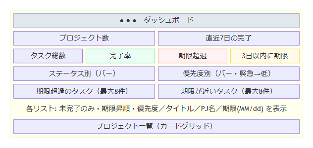

Mermaid 原本（編集用。画像の再生成は <code>node scripts/render-wireframes.mjs</code>）

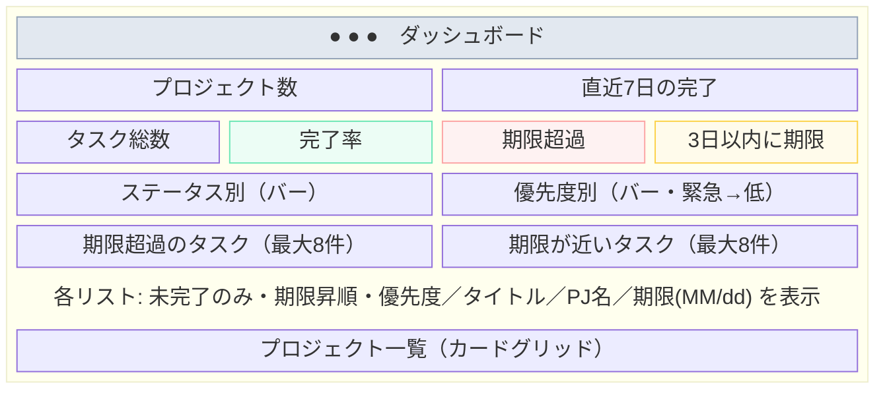

### 入出力項目一覧

| 項目ID | 項目名 | 入出力 | 種別 | 内容・制約 | データ源 |
|---|---|---|---|---|---|
| I-0101 | プロジェクト数 | 出 | カード | 非アーカイブのプロジェクト件数 | API-P1 |
| I-0102 | 直近7日の完了 | 出 | カード | `completedLast7Days` | API-ST |
| I-0103 | タスク総数 | 出 | カード | `total` | API-ST |
| I-0104 | 完了率 | 出 | カード | `completionRate`（%表示） | API-ST |
| I-0105 | 期限超過 | 出 | カード | `overdue`。1件以上で赤字 | API-ST |
| I-0106 | 3日以内に期限 | 出 | カード | `dueSoon`（`now`〜`now+3日`の未完了件数） | API-ST |
| I-0107 | ステータス別件数 | 出 | バー表示 | ステータスごとの件数と構成比バー | API-ST, API-S1 |
| I-0108 | 優先度別件数 | 出 | バー表示 | 緊急→高→中→低の降順 | API-ST |
| I-0109 | 期限超過リスト | 出 | リスト | 未完了(isDoneでない)かつ期限が過去。期限昇順・最大8件。優先度バッジ・タイトル・PJ名・期限(MM/dd 赤字) | API-T1, API-S1 |
| I-0110 | 期限が近いリスト | 出 | リスト | 未完了かつ期限が未来。期限昇順・最大8件 | API-T1, API-S1 |
| I-0111 | プロジェクトカード | 出 | リンクカード | 色ドット・名称・タスク件数。0件時は案内文 | API-P1 |

> **注1（解消済み）**: 旧版ではカードのラベルが「7日以内に期限」で、サーバーの `dueSoon` 集計（**3日以内**）および要件 FR-D4（「未完了かつ3日以内」）と不一致だった。**3日に統一**する方針で、ラベルを「3日以内に期限」へ修正済み（`client/src/components/StatsCards.tsx`）。要件定義 §5.2 業務フロー図の「今後7日」も「今後3日」へ合わせた。

### 画面アクション定義

| アクションID | トリガー | 処理概要 | 使用API | 結果・遷移 |
|---|---|---|---|---|
| AC-0101 | 画面表示 | 統計・プロジェクト・タスク・ステータスを取得し描画 | API-ST, API-P1, API-T1, API-S1 | — |
| AC-0102 | プロジェクトカード クリック | — | — | SCR-03 へ遷移 |

---

## SCR-02 プロジェクト一覧

パス `/projects`。プロジェクトの一覧・追加・編集・アーカイブ／復元・削除。

### 画面レイアウト

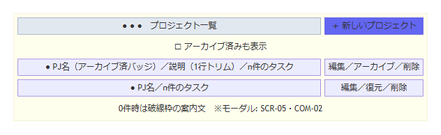

Mermaid 原本（編集用。画像の再生成は <code>node scripts/render-wireframes.mjs</code>）

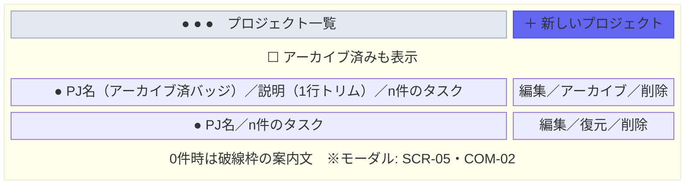

### 入出力項目一覧

| 項目ID | 項目名 | 入出力 | 種別 | 内容・制約 | データ源 |
|---|---|---|---|---|---|
| I-0201 | 新しいプロジェクト | 入 | ボタン | SCR-05（作成モード）を開く | — |
| I-0202 | アーカイブ済みも表示 | 入出 | チェック | ON で `includeArchived=true` 再取得。既定 OFF | API-P1 |
| I-0203 | プロジェクト行 | 出 | 行 | 色ドット・名称（リンク）・説明・タスク件数。アーカイブ済みは半透明＋バッジ | API-P1 |
| I-0204 | 編集 | 入 | ボタン | SCR-05（編集モード）を開く | — |
| I-0205 | アーカイブ／復元 | 入 | ボタン | `archived` をトグル（アーカイブ済みなら「復元」表示） | API-P4 |
| I-0206 | 削除 | 入 | ボタン | COM-02 を開く（配下タスクも削除される旨を表示） | — |

### 画面アクション定義

| アクションID | トリガー | 処理概要 | 使用API | 結果・遷移 |
|---|---|---|---|---|
| AC-0201 | 画面表示 | プロジェクト一覧を取得（既定は非アーカイブ） | API-P1 | — |
| AC-0202 | I-0202 変更 | `includeArchived` を切り替えて再取得 | API-P1 | 一覧更新 |
| AC-0203 | 名称リンク クリック | — | — | SCR-03 へ遷移 |
| AC-0204 | SCR-05 で保存（作成） | プロジェクト作成 → 一覧再取得 | API-P2 | モーダル閉、一覧更新 |
| AC-0205 | SCR-05 で保存（編集） | プロジェクト更新 → 一覧再取得 | API-P4 | モーダル閉、一覧更新 |
| AC-0206 | I-0205 クリック | `{archived: !archived}` で更新 | API-P4 | 一覧更新（非表示化/再表示） |
| AC-0207 | COM-02 で確認 | プロジェクト削除（配下タスク連鎖削除） | API-P6 | ダイアログ閉、一覧更新 |

---

## SCR-03 プロジェクト詳細

パス `/projects/:id`。1プロジェクトのタスクをツリー／カンバン／ガントで表示・編集する。

### 画面レイアウト

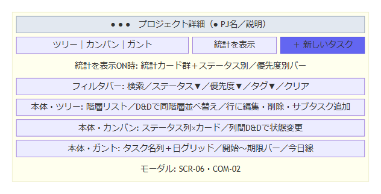

Mermaid 原本（編集用。画像の再生成は <code>node scripts/render-wireframes.mjs</code>）

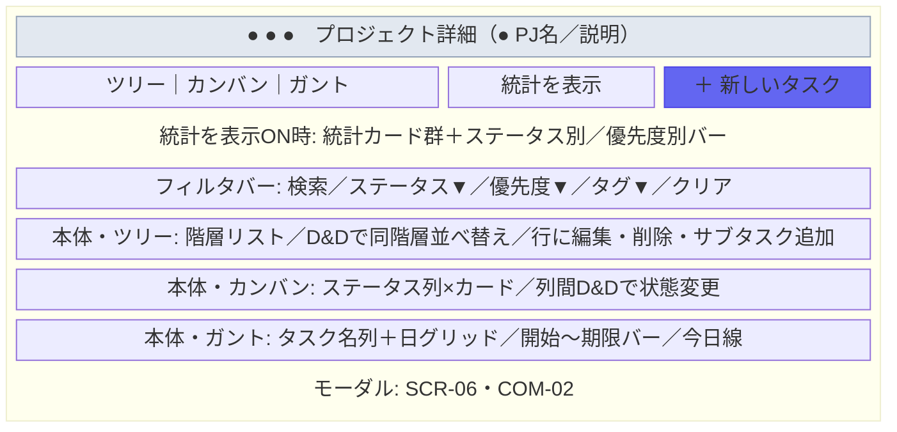

### 入出力項目一覧

| 項目ID | 項目名 | 入出力 | 種別 | 内容・制約 | データ源 |
|---|---|---|---|---|---|
| I-0301 | プロジェクト情報 | 出 | ヘッダー | 色ドット・名称・説明 | API-P1 |
| I-0302 | ビュー切替 | 入出 | トグルボタン | ツリー／カンバン／ガント。既定はツリー | — |
| I-0303 | 統計を表示/隠す | 入出 | トグルボタン | ON で StatsCards を表示。既定 OFF | API-ST |
| I-0304 | 新しいタスク | 入 | ボタン | SCR-06（作成モード・親なし）を開く | — |
| I-0305 | 検索 | 入 | テキスト | title/description 部分一致 | API-T1 |
| I-0306 | ステータス絞り込み | 入 | セレクト | 「すべてのステータス」＋Status一覧 | API-S1 |
| I-0307 | 優先度絞り込み | 入 | セレクト | 「すべての優先度」＋低/中/高/緊急 | — |
| I-0308 | タグ絞り込み | 入 | セレクト | 「すべてのタグ」＋#タグ名一覧 | API-G1 |
| I-0309 | クリア | 入 | ボタン | いずれかのフィルタ指定時のみ表示。全条件リセット | — |
| I-0310 | タスク表示領域 | 出 | ツリー/カンバン/ガント | フィルタ未指定時=全件ツリー構造維持、指定時=一致フラットリスト | API-T1 |

### 画面アクション定義

| アクションID | トリガー | 処理概要 | 使用API | 結果・遷移 |
|---|---|---|---|---|
| AC-0301 | 画面表示 | プロジェクト・タスク（全件＋フィルタ済）・タグ・統計を取得 | API-P1, API-T1, API-G1, API-ST | — |
| AC-0302 | I-0302 クリック | 選択ビューへ再描画（データ再取得なし） | — | 表示切替 |
| AC-0303 | フィルタ変更 | フィルタ済み一覧を再取得し、フラットリスト表示へ切替 | API-T1 | 一覧更新 |
| AC-0304 | ツリー: 行のステータス変更 | `{status}` で更新 | API-T4 | 行更新 |
| AC-0305 | ツリー: D&D（同一階層） | 新しい並びで `order` を一括更新（親跨ぎは無効） | API-T6 | 並び替え反映 |
| AC-0306 | ツリー: サブタスク追加 | SCR-06（作成モード・親=当該タスク）を開く | — | モーダル表示 |
| AC-0307 | カンバン: D&D（別列） | `{status}` 更新＋挿入位置で `order` 一括更新 | API-T4, API-T6 | カード移動が永続化 |
| AC-0308 | カンバン: D&D（同一列） | `order` のみ一括更新 | API-T6 | 並び替え反映 |
| AC-0309 | タスク/ガントバー クリック | SCR-06（編集モード）を開く | — | モーダル表示 |
| AC-0310 | SCR-06 で保存（作成） | 日付を ISO8601 化してタスク作成 | API-T2 | モーダル閉、一覧更新 |
| AC-0311 | SCR-06 で保存（編集） | タスク更新（説明が空なら null） | API-T4 | モーダル閉、一覧更新 |
| AC-0312 | 削除 → COM-02 で確認 | タスク削除（サブタスク連鎖削除） | API-T7 | ダイアログ閉、一覧更新 |

---

## SCR-04 設定（ステータス）

パス `/settings`。ステータスの追加・編集・並べ替え・削除。

### 画面レイアウト

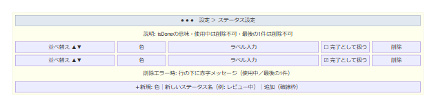

Mermaid 原本（編集用。画像の再生成は <code>node scripts/render-wireframes.mjs</code>）

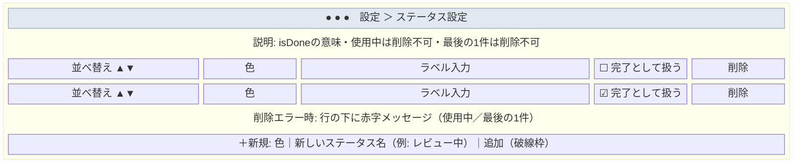

### 入出力項目一覧

| 項目ID | 項目名 | 入出力 | 種別 | 内容・制約 | データ源 |
|---|---|---|---|---|---|
| I-0401 | ステータス行 | 出 | 行 | `order` 昇順で表示 | API-S1 |
| I-0402 | ▲／▼ | 入 | ボタン | 1つ上／下と入れ替え。先頭の▲・末尾の▼は無効 | API-S4 |
| I-0403 | カラー | 入出 | カラーピッカー | 変更で即時保存 | API-S3 |
| I-0404 | ラベル | 入出 | テキスト | blur または Enter で保存。空・未変更なら元に戻す（1〜50文字はサーバー検証） | API-S3 |
| I-0405 | 完了として扱う | 入出 | チェック | `isDone` を即時保存 | API-S3 |
| I-0406 | 削除 | 入 | ボタン | 使用中(409)・最後の1件(409)はエラーメッセージを行下に表示 | API-S5 |
| I-0407 | 新規カラー | 入 | カラーピッカー | 既定 `#f59e0b` | — |
| I-0408 | 新規ラベル | 入 | テキスト | 空白のみは追加不可。Enter でも追加 | — |
| I-0409 | 追加 | 入 | ボタン | ステータス作成（order は末尾） | API-S2 |

### 画面アクション定義

| アクションID | トリガー | 処理概要 | 使用API | 結果・遷移 |
|---|---|---|---|---|
| AC-0401 | 画面表示 | ステータス一覧を取得 | API-S1 | — |
| AC-0402 | I-0402 クリック | id 配列を入れ替えて一括再採番 | API-S4 | 並び替え反映 |
| AC-0403 | I-0403〜I-0405 変更 | 当該項目のみ PATCH | API-S3 | 行更新 |
| AC-0404 | I-0406 クリック | 削除を実行。409 はエラー表示（画面遷移なし） | API-S5 | 行削除 or エラー表示 |
| AC-0405 | I-0409 クリック / Enter | ラベルをトリムして作成。入力欄クリア | API-S2 | 行追加 |

---

## SCR-05 プロジェクト作成/編集モーダル

SCR-02・COM-01 から開く。プロジェクトの作成・編集。

### 画面レイアウト

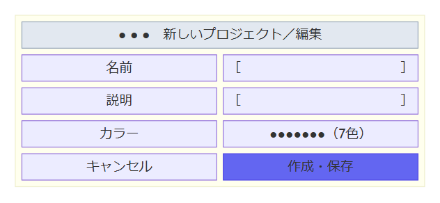

Mermaid 原本（編集用。画像の再生成は <code>node scripts/render-wireframes.mjs</code>）

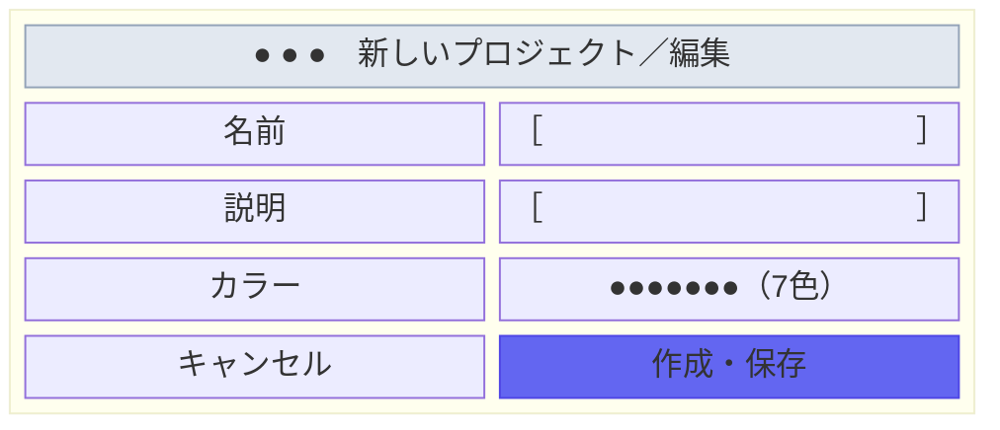

### 入出力項目一覧

| 項目ID | 項目名 | 入出力 | 種別 | 必須 | 内容・制約 |
|---|---|---|---|---|---|
| I-0501 | 名前 | 入出 | テキスト | ○ | 空白のみは送信不可（クライアント）。1〜200文字（サーバー zod）。オートフォーカス |
| I-0502 | 説明 | 入出 | テキストエリア | − | ≤2000文字（サーバー zod） |
| I-0503 | カラー | 入出 | 色ボタン群 | − | 7色から択一。既定 `#6366f1`。選択中は外周リング表示 |
| I-0504 | 作成／保存 | 入 | ボタン | − | 作成モード=「作成」、編集モード=「保存」 |
| I-0505 | キャンセル | 入 | ボタン | − | 変更を破棄して閉じる |

### 画面アクション定義

| アクションID | トリガー | 処理概要 | 使用API | 結果・遷移 |
|---|---|---|---|---|
| AC-0501 | モーダル表示 | `initial`（編集時は既存値）でフォーム初期化 | — | — |
| AC-0502 | I-0504 クリック | `name.trim()` が空なら何もしない。値を親へ渡す（作成/更新は呼出元） | （API-P2 / API-P4） | モーダル閉 |
| AC-0503 | I-0505 クリック | 破棄して閉じる | — | モーダル閉 |

---

## SCR-06 タスク作成/編集モーダル

SCR-03 から開く。タスクの作成・編集。

### 画面レイアウト

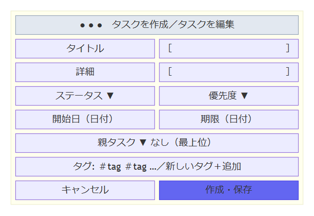

Mermaid 原本（編集用。画像の再生成は <code>node scripts/render-wireframes.mjs</code>）

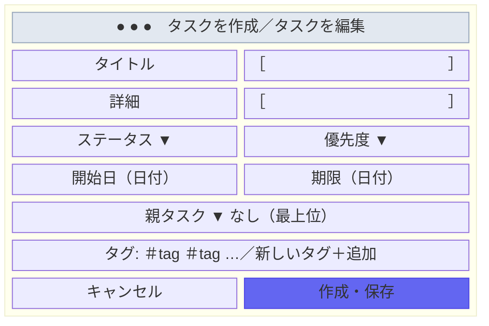

### 入出力項目一覧

| 項目ID | 項目名 | 入出力 | 種別 | 必須 | 内容・制約 |
|---|---|---|---|---|---|
| I-0601 | タイトル | 入出 | テキスト | ○ | 空白のみは送信不可（クライアント）。1〜300文字（サーバー zod）。オートフォーカス |
| I-0602 | 詳細 | 入出 | テキストエリア | − | ≤5000文字（サーバー zod）。編集保存時、空は null |
| I-0603 | ステータス | 入出 | セレクト | − | Status 一覧（`order` 昇順）。未選択時は先頭 | 
| I-0604 | 優先度 | 入出 | セレクト | − | 低/中/高/緊急。既定は中(MEDIUM) |
| I-0605 | 開始日 | 入出 | 日付 | − | YYYY-MM-DD。送信時に ISO8601 へ変換、空は null |
| I-0606 | 期限 | 入出 | 日付 | − | 同上 |
| I-0607 | 親タスク | 入出 | セレクト | − | 「なし（最上位）」＋深さインデント付き一覧。編集時は自分自身を除外 |
| I-0608 | タグ | 入出 | トグルピル | − | クリックで付与/解除（選択中はリング表示） |
| I-0609 | 新しいタグ | 入 | テキスト＋ボタン | − | 追加（Enter 可）でタグ作成し自動付与。1〜50文字（サーバー zod） |
| I-0610 | 作成／保存 | 入 | ボタン | − | 作成モード=「作成」、編集モード=「保存」 |
| I-0611 | キャンセル | 入 | ボタン | − | 変更を破棄して閉じる |

### 画面アクション定義

| アクションID | トリガー | 処理概要 | 使用API | 結果・遷移 |
|---|---|---|---|---|
| AC-0601 | モーダル表示 | `initial` でフォーム初期化（編集時は `taskToFormValue` で日付を YYYY-MM-DD に切出し） | API-G1, API-S1 | — |
| AC-0602 | I-0608 クリック | `tagIds` に付与/解除をトグル | — | 表示更新 |
| AC-0603 | I-0609 追加 | タグを作成し、作成したタグを選択状態にする | API-G2 | ピル追加 |
| AC-0604 | I-0610 クリック | `title.trim()` が空なら何もしない。値を親へ渡す（作成/更新は呼出元） | （API-T2 / API-T4） | モーダル閉 |
| AC-0605 | I-0611 クリック | 破棄して閉じる | — | モーダル閉 |

---

## COM-01 サイドバー

全画面共通の左ナビゲーション。

### 画面レイアウト

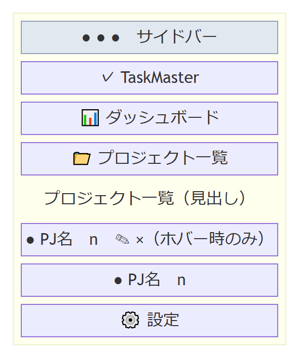

Mermaid 原本（編集用。画像の再生成は <code>node scripts/render-wireframes.mjs</code>）

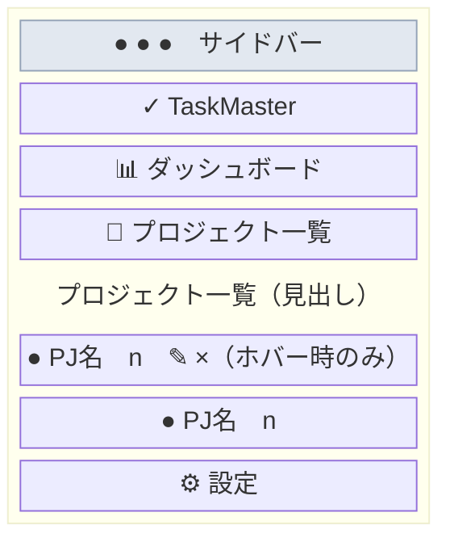

### 入出力項目一覧

| 項目ID | 項目名 | 入出力 | 種別 | 内容・制約 | データ源 |
|---|---|---|---|---|---|
| I-C101 | ロゴ | 出 | テキスト | 「✓ TaskMaster」 | — |
| I-C102 | ダッシュボード | 入 | リンク | アクティブ時ハイライト | — |
| I-C103 | プロジェクト一覧 | 入 | リンク | 同上 | — |
| I-C104 | プロジェクトリンク | 入出 | リンク | 色ドット・名称・タスク件数。非アーカイブのみ | API-P1 |
| I-C105 | ✎（編集）／×（削除） | 入 | ボタン | 行ホバー時のみ表示。SCR-05／COM-02 を開く | — |
| I-C106 | 設定 | 入 | リンク | アクティブ時ハイライト | — |

### 画面アクション定義

| アクションID | トリガー | 処理概要 | 使用API | 結果・遷移 |
|---|---|---|---|---|
| AC-C101 | I-C102〜C104, C106 クリック | — | — | 各画面へ遷移 |
| AC-C102 | ✎ クリック → SCR-05 保存 | プロジェクト更新 | API-P4 | モーダル閉、表示更新 |
| AC-C103 | × クリック → COM-02 確認 | プロジェクト削除（配下タスク連鎖削除） | API-P6 | ダイアログ閉、表示更新 |

---

## COM-02 確認ダイアログ

破壊的操作（プロジェクト削除・タスク削除）の確認に共通で使うモーダル。

### 画面レイアウト

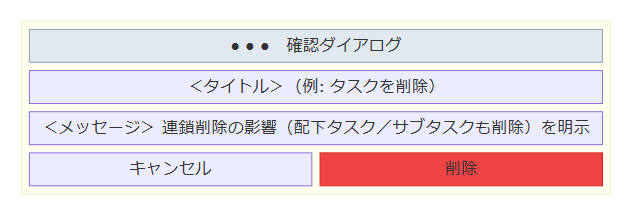

Mermaid 原本（編集用。画像の再生成は <code>node scripts/render-wireframes.mjs</code>）

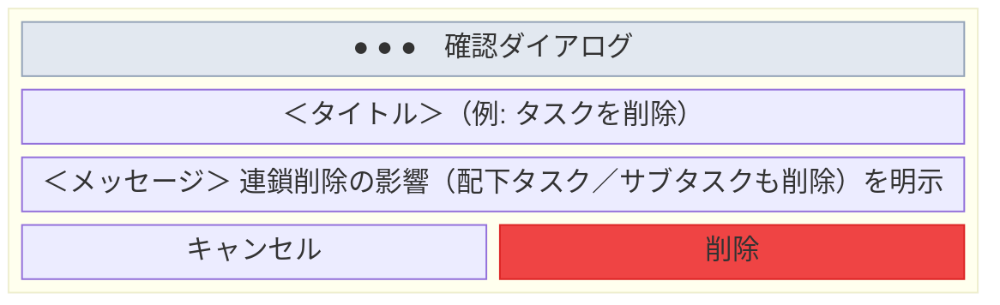

### 入出力項目一覧

| 項目ID | 項目名 | 入出力 | 種別 | 内容・制約 |
|---|---|---|---|---|
| I-C201 | タイトル | 出 | テキスト | 例:「プロジェクトを削除」「タスクを削除」 |
| I-C202 | メッセージ | 出 | テキスト | 連鎖削除の影響（配下タスク／サブタスクも削除）を明示 |
| I-C203 | 確定 | 入 | ボタン | 呼出元の削除処理を実行 |
| I-C204 | キャンセル | 入 | ボタン | 何もせず閉じる |

### 画面アクション定義

| アクションID | トリガー | 処理概要 | 結果・遷移 |
|---|---|---|---|
| AC-C201 | I-C203 クリック | `onConfirm` を実行（削除 API は呼出元が発行） | ダイアログ閉 |
| AC-C202 | I-C204 クリック | `onCancel` を実行 | ダイアログ閉 |

---

> 画面一覧・遷移図・入力チェック方針・API 詳細は `docs/BASIC_DESIGN.md`（§4・§5）を参照。
