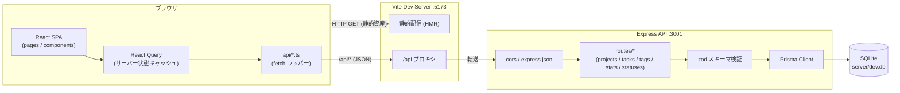
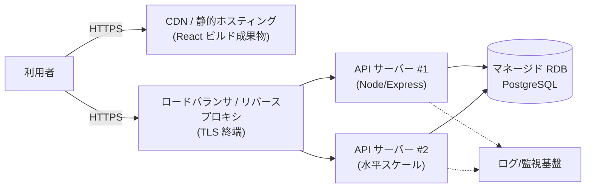
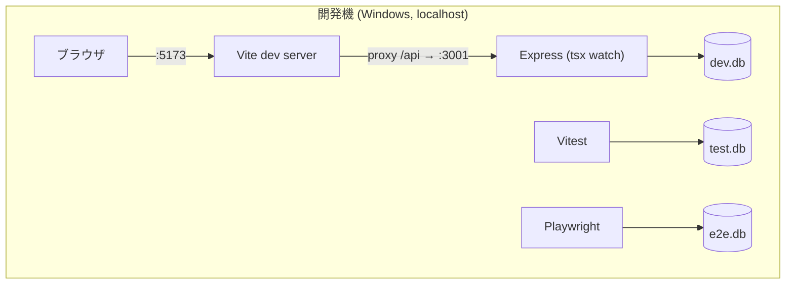
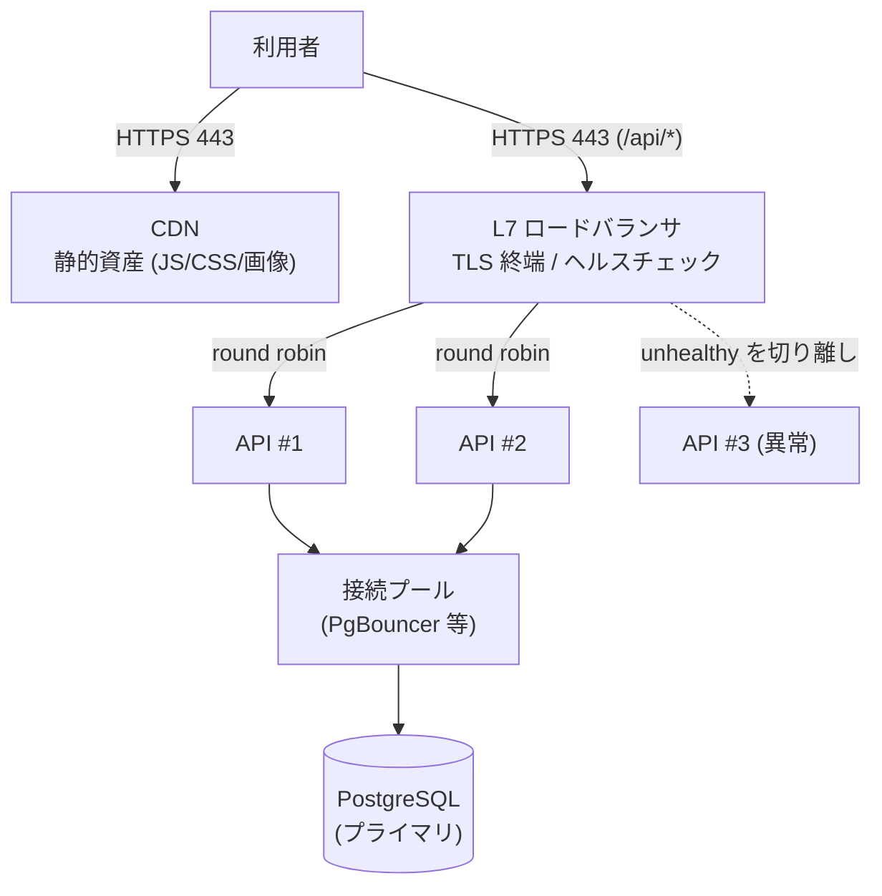
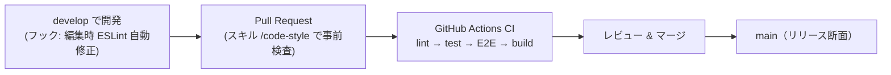

# システム方式・非機能設計書 — TaskMaster

本書は、これから開発する TaskMaster のシステムアーキテクチャ、インフラ・ネットワーク構成、セキュリティ・権限管理、性能・拡張性、運用・保守・可用性の設計を定義する。業務フローは要件定義書（`docs/REQUIREMENTS.md` §5）、機能・画面・API・データの設計は基本設計書（`docs/BASIC_DESIGN.md`）を参照。

開発は 2 フェーズで段階的に進める。本書の各章はこの区分で記述する。

| フェーズ | 位置づけ | 構成 |
|---|---|---|
| フェーズ 1 | 初期リリース（単一利用者・ローカル利用） | 単一マシン・単一プロセス構成 |
| フェーズ 2 | 本番公開（マルチユーザー・外部公開） | 冗長化・負荷分散・認証を追加 |

- 状態: ドラフト
- 最終更新: 2026-07-20
- 関連文書: `docs/REQUIREMENTS.md` / `docs/BASIC_DESIGN.md` / `docs/SCREEN_DESIGN.md` / `docs/TEST_DESIGN.md` / `docs/STATIC_ANALYSIS.md` / `.claude/PERMISSIONS.md`

## 目次

1. [システムアーキテクチャ](#1-システムアーキテクチャ)
2. [インフラ・ネットワーク構成](#2-インフラネットワーク構成)
3. [セキュリティ・権限管理設計](#3-セキュリティ権限管理設計)
4. [性能・拡張性設計](#4-性能拡張性設計)
5. [運用・保守・可用性設計](#5-運用保守可用性設計)

---

## 1. システムアーキテクチャ

### 1.1 全体アーキテクチャ図（フェーズ 1）

Web ブラウザ上の SPA と REST API サーバーで構成する。

### 1.2 レイヤー構成と責務

| レイヤー | 配置 | 責務 |
|---|---|---|
| プレゼンテーション | `client/src/pages` `components` | 画面描画・操作（tree/kanban/Gantt/統計） |
| クライアント状態 | React Query | サーバー状態のキャッシュ・再取得・楽観更新 |
| API クライアント | `client/src/api/*.ts` | fetch ラッパー、リソース別フック |
| API | `server/src/routes/*.ts` | ルーティング、zod による入力検証、HTTP 応答 |
| ドメインロジック | 各ルート内 + `client/src/utils` | 循環参照チェック、並び順、木構造変換（クライアント側） |
| データアクセス | Prisma（`server/src/db.ts` singleton） | ORM、トランザクション制御 |
| データストア | SQLite（フェーズ 1）→ PostgreSQL（フェーズ 2） | 永続化 |

### 1.3 主要な処理方式（アーキテクチャ上の決定）

- **SPA + REST JSON とする**: サーバーはフラットな行を返し、木構造の組み立てはクライアント（`utils/tree.ts`）で行う。サーバー側の応答を単純に保ち、表示形態（tree/kanban/Gantt）の追加をクライアントだけで完結させるため
- **状態はすべてサーバーを正とする**: クライアントに独自の永続状態を持たせない（React Query キャッシュのみ）
- **DB は用途ごとに分離する**: `dev.db`（開発）/ `test.db`（API 統合テスト）/ `e2e.db`（E2E）。テストが開発データを壊さないようにする
- **バリデーションは API 境界で一元化する**: zod スキーマ（`server/src/schemas.ts`）に集約。DB 制約（FK・onDelete）を最終防衛線とする
- **一括更新はトランザクションで行う**: 並び替え（reorder）は `$transaction` で全件を原子的に更新し、部分更新を防ぐ

### 1.4 全体アーキテクチャ図（フェーズ 2）

- 静的資産（`client/dist`）は CDN 配信、API はステートレスな Node プロセスとして複数台化する
- DB は SQLite から PostgreSQL へ移行する（Prisma を採用するため、datasource 変更 + マイグレーションで移行する。SQLite は enum 非対応のため priority を String で持つが、移行時に DB enum 化を再検討する）
- 負荷分散の詳細設計は [4.4 負荷分散設計](#44-負荷分散設計フェーズ-2) を参照

---

## 2. インフラ・ネットワーク構成

### 2.1 フェーズ 1（開発・ローカル利用）

| 項目 | 設計 |
|---|---|
| 実行環境 | Windows / Mac / Linux の単一マシン（Node.js 18 以上、LTS 推奨） |
| プロセス（開発） | Vite dev server（:5173）と Express（:3001、tsx watch）の 2 プロセス |
| プロセス（本番・個人利用） | Express（:3001）の **1 プロセス**。ビルド済みの画面（`client/dist`）と API を同じサーバーから配信する（`createApp({ staticDir })`）。`/api` 以外のパスは `index.html` を返し、画面側のルーティングに任せる。別途 Web サーバーは不要 |
| 起動方法（本番・個人利用） | 起動スクリプト（Windows `start.cmd`、Mac `start.command`、Linux `start.sh`）。依存パッケージのインストール・DB の作成・ビルド・起動・ブラウザの自動オープンを行う。手動では `npm run build` → `npm start` |
| ネットワーク | すべて `localhost` 内に閉じる。外部公開しない |
| ポート | 5173（クライアント）/ 3001（API）。`client/vite.config.ts` で `/api/*` を 3001 へプロキシする |
| DNS/TLS | 使用しない（http://localhost のみ） |
| データ | `server/dev.db`（SQLite 単一ファイル。git 管理外とする） |

### 2.2 フェーズ 2（本番公開）

| 項目 | 設計 |
|---|---|
| 配置 | 静的資産: CDN。API: コンテナ（Docker）or PaaS。DB: マネージド PostgreSQL |
| ネットワーク境界 | 外部→LB は 443 のみ開放。API→DB はプライベートネットワーク内に限定（DB を公開しない） |
| TLS | LB / リバースプロキシで終端。HTTP は HTTPS へリダイレクト |
| 環境分離 | dev / staging / production の 3 面。DB・シークレットは環境ごとに分離 |
| 構成管理 | 環境変数（`PORT` / `DATABASE_URL` 等）で注入。`.env` は git 管理外とする |

---

## 3. セキュリティ・権限管理設計

### 3.1 フェーズ方針

- **フェーズ 1**: 単一利用者・localhost 閉域を前提とし、認証・認可は実装しない。ネットワーク境界（localhost）をセキュリティ境界とする。**この構成のまま外部公開してはならない**
- **フェーズ 2**: 外部公開・マルチユーザー化にあたり、3.4 の対策一式を実装する

### 3.2 アプリケーションの基本対策（フェーズ 1 から実装）

| 分類 | 方式 | 内容 |
|---|---|---|
| 入力検証 | zod（全 API） | 型・必須・列挙値（priority 等）を API 境界で検証する。失敗は 400 を返す |
| SQL インジェクション | Prisma | クエリはすべて Prisma API 経由（パラメタライズ）とする。`$queryRaw` は使用しない |
| XSS | React | JSX の自動エスケープに委ね、`dangerouslySetInnerHTML` は使用しない（ESLint `no-unsanitized` で強制） |
| 整合性 | DB 制約 + アプリ検証 | FK、`onDelete: Cascade/Restrict`、親子移動時の循環参照チェック |
| CORS | `cors()` | フェーズ 1 は開発用に全許可。フェーズ 2 でオリジン限定に変更する（3.4） |
| 不可視コード混入（GlassWorm 対策） | 隠し Unicode の検出（lint / CI） | ソースや依存に埋め込まれる不可視 Unicode（ゼロ幅文字・変異セレクタ・双方向制御文字）を検出して拒否する。VS Code / OpenVSX 拡張を悪用し不可視文字でコードを隠す自己増殖型ワーム **GlassWorm**、および Trojan Source（bidi）攻撃への対策。あわせて依存パッケージ・エディタ拡張の出所と権限を検証する |

### 3.3 開発プロセスの統制

アプリ本体と別に、開発環境のガバナンスを以下の方針で運用する:

| 層 | 仕組み | 参照 |
|---|---|---|
| AI 開発権限 | Claude Code 権限の 2 レイヤー（managed = 強制 deny / settings.json = allowlist + defaultMode: ask）。秘密ファイル読取・破壊的操作を deny する | `.claude/PERMISSIONS.md` |
| 静的解析（SAST 一次） | `eslint-plugin-security`（server）+ `no-unsanitized`（client）+ 型情報つきルール | `docs/STATIC_ANALYSIS.md` |
| レビュー | code-reviewer サブエージェント（読み取り専用・OWASP 観点）、debugger の脆弱性監査モード | `.claude/agents/README.md` |
| CI | GitHub Actions で lint → test → build を実行する | `.github/workflows/ci.yml` |

### 3.4 フェーズ 2 で実装する対策（優先順）

| # | 対策 | 方針 |
|---|---|---|
| 1 | 認証 | セッション（HttpOnly + SameSite Cookie）または OIDC。パスワードは Argon2/bcrypt |
| 2 | 認可（データ分離） | `User` テーブルを追加し、Project に `ownerId`。全クエリを所有者スコープで絞る |
| 3 | CORS 限定 | `cors({ origin: [本番オリジン] })` に変更 |
| 4 | セキュリティヘッダ | helmet 導入（CSP / X-Content-Type-Options 等） |
| 5 | レートリミット | `express-rate-limit` 等で API 全体 + 認証系を強めに |
| 6 | シークレット管理 | 環境変数 + シークレットストア。`.env` をコミットしない（AI 開発権限でも deny） |
| 7 | 監査ログ | 変更系 API の操作ログ（誰が・いつ・何を） |

### 3.5 権限管理モデル（フェーズ 2）

フェーズ 1 はロール無し（全操作可能）。マルチユーザー化する際の RBAC を以下とする。
Owner / Member / Viewer は**自分が所属するプロジェクトの範囲**に限定され、システム管理者のみが利用者横断（全テナント）の権限を持つ。

| ロール | 適用範囲 | プロジェクト | タスク | ステータス定義 | 統計 | 利用者・システム管理 |
|---|---|---|---|---|---|---|
| システム管理者 | 全体（横断） | 全データ CRUD | 全データ CRUD | CRUD | 全体閲覧 | 利用者・ロール管理、全テナント参照、運用操作 |
| Owner | 自プロジェクト | CRUD・アーカイブ | CRUD | CRUD | 閲覧 | 該当プロジェクトのメンバー招待・ロール割当 |
| Member | 所属プロジェクト | 閲覧 | CRUD | 閲覧 | 閲覧 | なし |
| Viewer | 所属プロジェクト | 閲覧 | 閲覧 | 閲覧 | 閲覧 | なし |

- 実装は Express ミドルウェア（認証 → ロール解決 → ルートごとの要求ロール検査）を `routes/*` の前段に挿入する方式とする
- **システム管理者**は「利用者・ロールの管理」「全プロジェクト横断の参照・是正」「運用操作（後述の 5 章の運用系機能）」を担うアプリケーション上の最上位ロール。データ所有スコープ（`ownerId`）による絞り込みを**バイパスできる唯一のロール**とし、監査ログ（3.4-7）の対象を管理者操作にも必ず含める
- システム管理者は付与を最小限にし、初期は 1〜数名に限定する（過剰付与を避ける）
- 本ロールは**アプリケーション上の管理者**であり、インフラ/OS の管理者権限（サーバー・DB の運用）や、開発時の Claude Code 権限（`.claude/PERMISSIONS.md`）とは別の概念として扱う

---

## 4. 性能・拡張性設計

### 4.1 設計上の性能考慮点

| 項目 | 設計 | 理由 |
|---|---|---|
| 想定規模（フェーズ 1） | 単一利用者 / 数プロジェクト / 数百タスク | ローカル用途の初期目標 |
| データ取得 | タスクは project 単位で全件取得し、クライアントで木構築する | 応答を単純化。フェーズ 1 の規模ではページネーション不要 |
| N+1 回避 | タグは `include`（join）で 1 クエリ取得する | タスク件数分のクエリ発行を防ぐ |
| 循環参照チェック | 親子移動時のみ子孫を再帰探索する | 実行頻度の低い操作に限定し、通常操作に影響させない |
| 一括並び替え | `$transaction` で原子的に更新する | 部分更新による順序破壊を防ぐ |
| 統計 | 集計クエリをサーバー側で実行する | 全行転送を避ける |

### 4.2 性能目標（フェーズ 2）

| 指標 | 目標 |
|---|---|
| API 応答（95%ile） | 300ms 以内（一覧系）/ 500ms 以内（統計） |
| 同時ユーザー | 100（初期）→ 水平スケールで拡張 |
| データ規模 | 1 プロジェクト 1 万タスクまで劣化なく操作可能 |

### 4.3 拡張性設計（スケール戦略）

1. **DB**: SQLite（書き込み単一ロック）→ PostgreSQL。Prisma のため接続先変更 + マイグレーションで移行する。`priority` の DB enum 化は移行時に決定する
2. **API**: ステートレス（セッションを持たない or 外部ストア化）を維持し、LB 配下で水平スケールする
3. **クエリ**: 大規模化で必要になる順に (a) tasks へのページネーション/仮想スクロール、(b) `parentId`・`projectId`・`status` への複合インデックス、(c) 循環参照チェックの再帰 CTE 化（PostgreSQL `WITH RECURSIVE` で 1 クエリに）を導入する
4. **フロント**: React Query のキャッシュを基本とし、大量タスクの tree/Gantt は仮想化（react-window 等）を導入する
5. **キャッシュ**: 統計 API は短 TTL のサーバーキャッシュ候補とする（更新頻度が低いため）

### 4.4 負荷分散設計（フェーズ 2）

フェーズ 1 は単一プロセスのため負荷分散を行わない。フェーズ 2 の設計を以下に定義する。

#### 4.4.1 分散の全体方針

| レイヤー | 分散方式 | 理由 |
|---|---|---|
| 静的資産 | CDN（エッジ配信） | LB/API に静的トラフィックを流さない。API と分離することで API 台数はデータ処理量だけで決められる |
| API | L7 LB + ラウンドロビン | API はステートレスなため最も単純な方式で十分。必要になったら least-connections へ変更する |
| DB | 単一プライマリ + 接続プール | まずは接続プール（PgBouncer 等）で接続数を制御する。読み負荷が支配的になったらリードレプリカを追加し、統計 API（`GET /api/stats`）など読み取り専用ルートから振り分ける |

#### 4.4.2 セッションと sticky session

- **sticky session（セッション維持）は使わない**。API サーバーはメモリ上にユーザー状態を持たない設計とする
- 認証導入時（3.4）もセッションストアを外部化（Redis 等）または JWT とし、どのインスタンスでも同一リクエストを処理できるようにする
- これにより、スケールイン/アウト・ローリングデプロイ時にセッション断が発生しない

#### 4.4.3 ヘルスチェックと切り離し

- API に `GET /api/health` を実装し、LB のヘルスチェックに使用する
- 「DB 接続まで確認する deep check」（`SELECT 1` 実行）を `/api/health?deep=true` として用意し、LB には軽量版・監視には deep 版を使い分ける
- 失敗しきい値（例: 3 回連続失敗で切り離し、2 回成功で復帰）を設定し、フラッピングを防ぐ

#### 4.4.4 スケーリングポリシー

| 項目 | 方針 |
|---|---|
| 指標 | CPU 使用率（>70% でスケールアウト）と p95 レイテンシ（>500ms でアラート→増台判断） |
| 最小構成 | API 2 台（1 台では LB の意味がなく、デプロイ時に無停止にできない） |
| デプロイ連携 | ローリング時は LB から draining（新規振り分け停止→処理中リクエスト完了待ち→入替）。Express 側は SIGTERM での graceful shutdown（新規受付停止→処理中完了→終了）を実装する |
| DB 接続数 | 「API 台数 × プールサイズ ≤ PostgreSQL max_connections − 予約分」を上限式として管理する。台数が増える場合は PgBouncer を挟み集約する |

#### 4.4.5 制約・注意

- **SQLite のままでは負荷分散できない**（単一ファイル・単一ライターのため複数 API から共有不可）。負荷分散の前提として PostgreSQL 移行（4.3-1）が必須
- reorder の `$transaction` はインスタンス間で競合し得るが、行ロックで直列化されるため設計変更は不要とする（楽観ロックの導入はタスク編集の同時実行が問題になった時点で検討する）

---

## 5. 運用・保守・可用性設計

### 5.1 フェーズ 1 の運用設計（開発・ローカル利用）

| 項目 | 設計 |
|---|---|
| 起動/停止 | `npm run dev:server` / `npm run dev:client` |
| ヘルスチェック | `GET /api/health`（`{ ok: true }` を返す） |
| バックアップ | `server/dev.db` のファイルコピー（利用者の任意タイミング） |
| データ再生成 | `npm run seed`（破壊的: 全行削除→サンプル投入。開発 DB 専用） |
| ログ | console 出力 |
| 監視 | なし（ローカル用途のため） |

### 5.2 リリース・保守プロセス

- ブランチ運用: `develop`（デフォルト）で開発し、`main` へ PR でマージする。CI は両ブランチの push/PR で実行する
- 品質ゲート: ESLint → Vitest（server 統合 + client 単体）→ Playwright E2E → build の順とする（`docs/TEST_DESIGN.md` / `docs/STATIC_ANALYSIS.md`）
- 依存更新: Dependabot / `npm audit` の CI ゲート化を検討する

### 5.3 可用性設計

**フェーズ 1**: 単一プロセス・単一マシン。プロセス停止＝サービス停止を許容する（ローカル用途）。

**フェーズ 2**:

| 項目 | 方針 |
|---|---|
| 冗長化 | API 2 台以上 + LB ヘルスチェック（4.4.3）。DB はマネージドのマルチ AZ |
| 目標値（初期目安） | 可用性 99.5% / RPO 24h（日次バックアップ）→ 重要化に応じて PITR で RPO ≒ 0 |
| バックアップ | PostgreSQL: 日次スナップショット + WAL による PITR。復旧手順を runbook 化し、定期的にリストア演習を行う |
| 障害検知 | ヘルスチェック監視 + エラー率/レイテンシのアラート。構造化ログ（pino 等）+ 集約基盤 |
| デプロイ | CI 通過成果物をローリング（or Blue-Green）で無停止デプロイ（4.4.4 の draining と併用）。マイグレーションは後方互換を保ち先行適用する |
| 障害対応 | 一次切り分けフロー: LB → API ログ → DB 接続 → 直近デプロイのロールバック |

### 5.4 運用上の禁止・注意事項

- `npm run seed` は**全データ削除**を伴う。本番系では実行禁止（開発 DB 専用）
- `dev.db` / `test.db` / `e2e.db` の用途を混在させない（テストは dev.db に触れない設計を維持する）
- 認証を実装しないまま外部ネットワークへ公開しない（3 章）

---

## 改訂履歴

| 日付 | 版 | 内容 |
|---|---|---|
| 2026-07-20 | 0.1 | 初版 |
| 2026-07-20 | 0.2 | 業務フロー章と負荷分散設計を追加 |
| 2026-07-20 | 0.3 | 業務フロー章を要件定義書 §5 へ移管 |
| 2026-07-20 | 0.4 | 「実装済み/現状」の記載を廃し、フェーズ 1（初期リリース）/ フェーズ 2（本番公開）の段階設計として全面改稿 |
| 2026-07-20 | 0.5 | 権限管理モデルにシステム管理者を追加、GlassWorm 対策を §3.2 に追加 |
| 2026-07-20 | 0.6 | 体制図を要件定義書（§1.3）へ移管。§5 の章番号を戻す |
| 2026-07-20 | 0.7 | §3 をアプリケーションのみの対象に整理（開発プロセスの統制を要件定義書 §11.1 へ移管） |
| 2026-07-20 | 0.8 | 開発プロセスの統制を §3.3 として本書へ復帰（0.7 を取り消し） |
